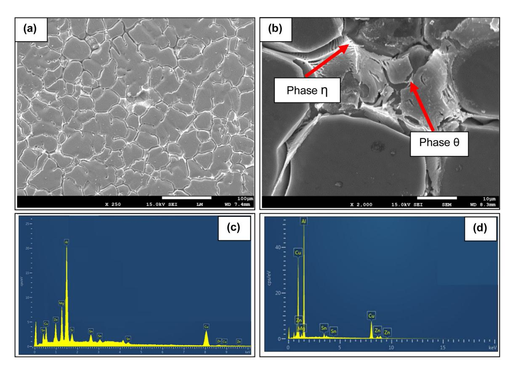
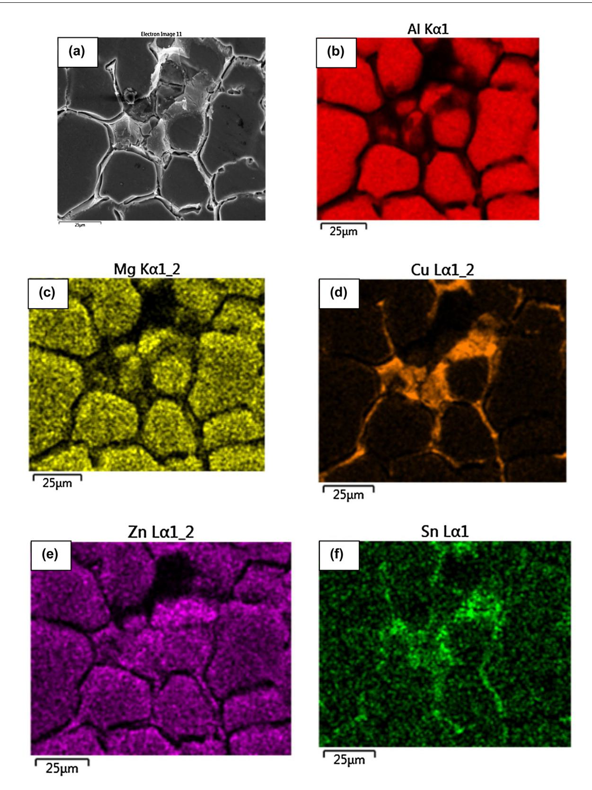
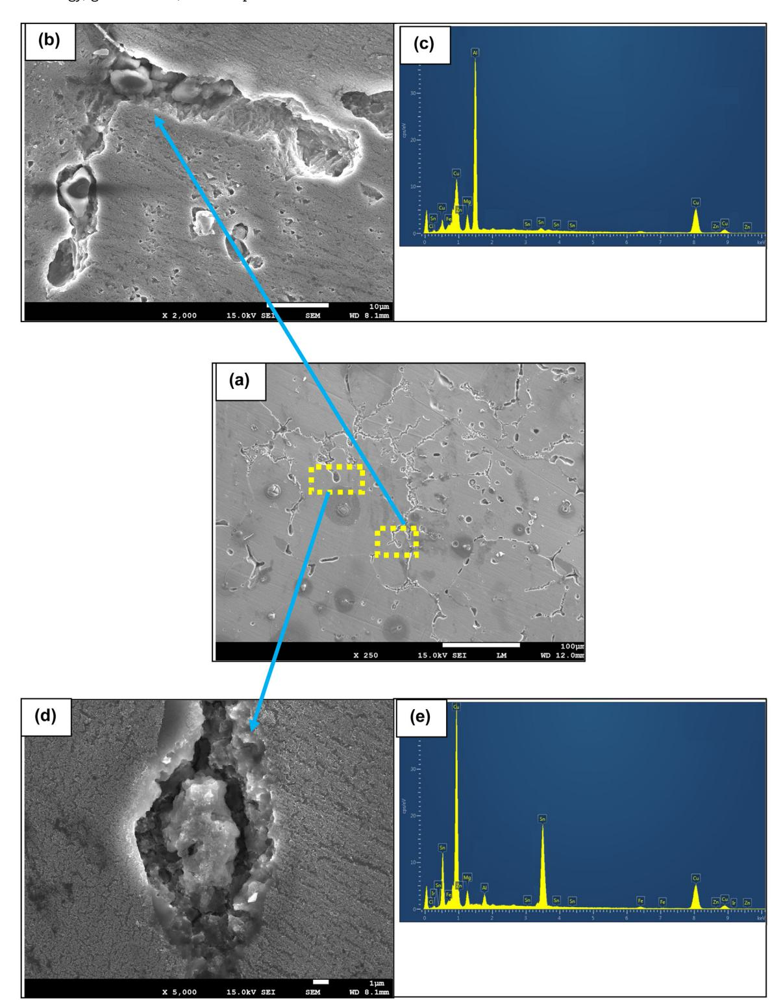
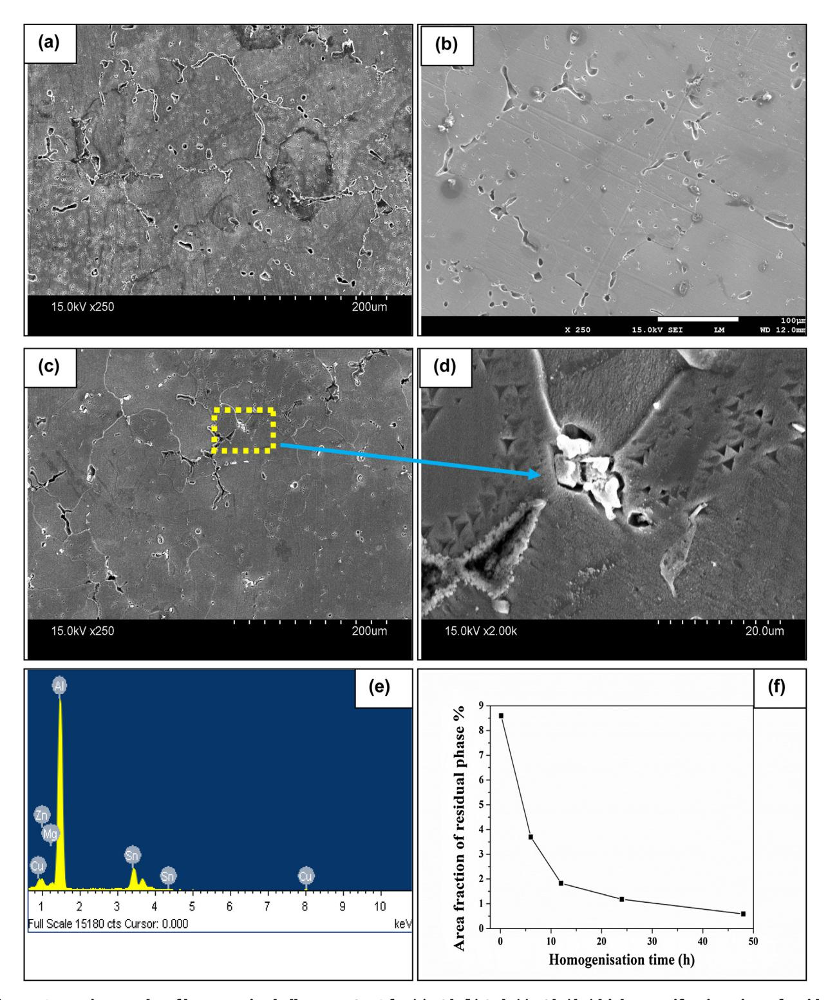
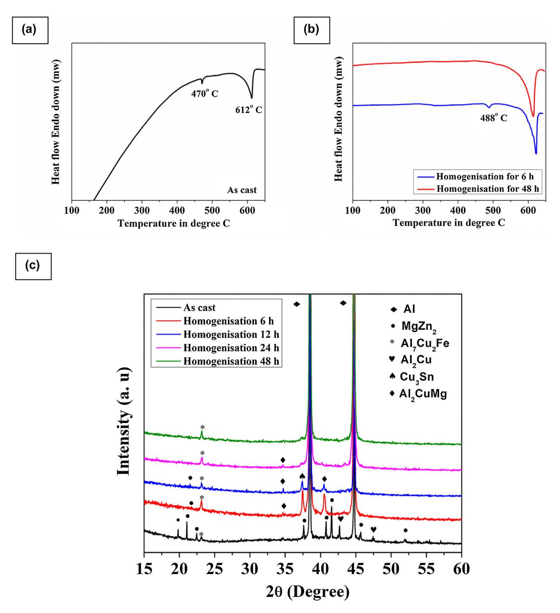
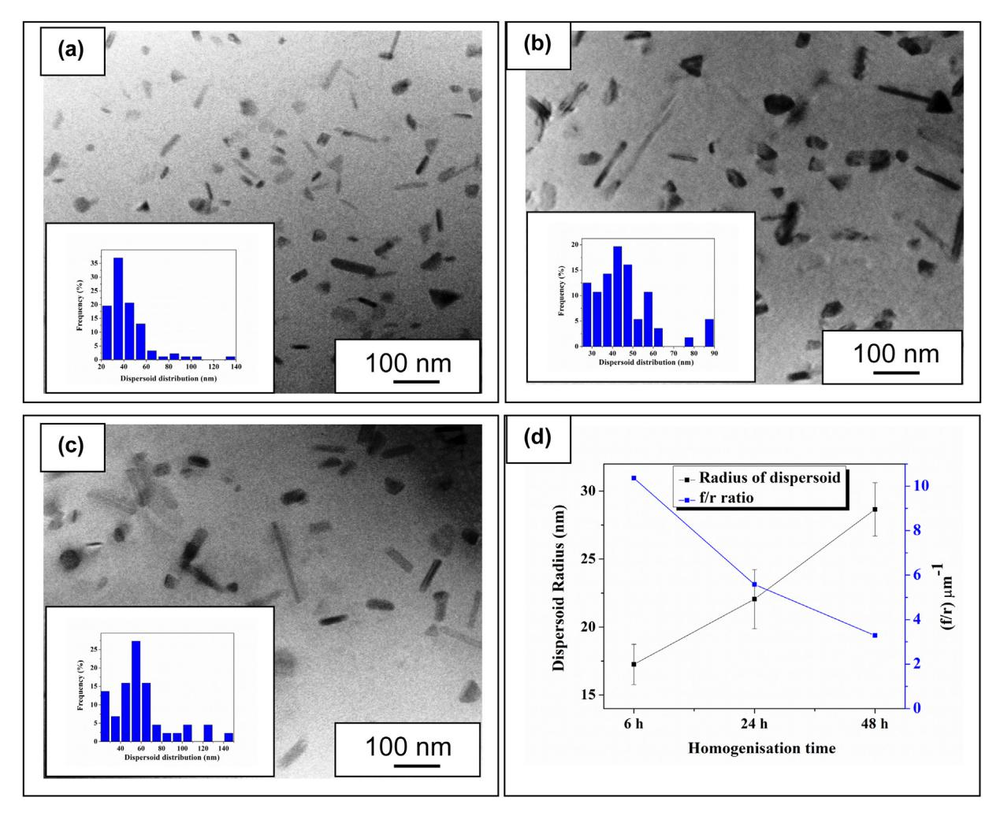
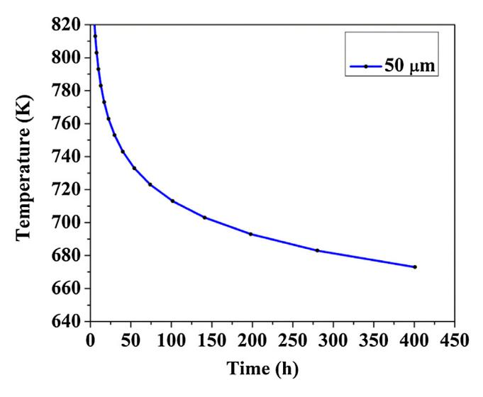
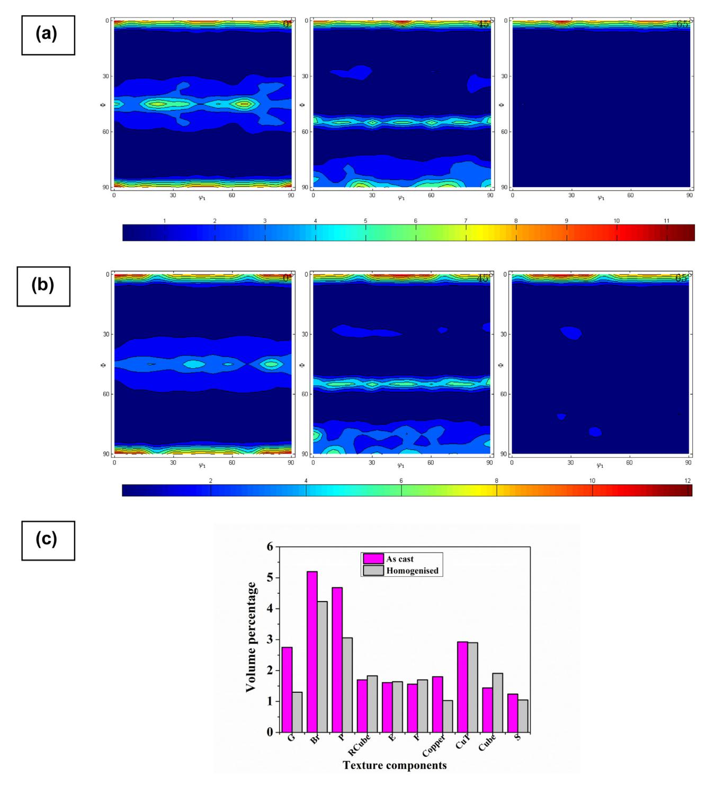

# [www.jmrt.com.br](http://www.jmrt.com.br) Available online at [www.sciencedirect.com](http://www.sciencedirect.com/science/journal/00000000)

# **Original Article**

# **Phase transformation and dispersoid evolution for Al-Zn-Mg-Cu alloy containing Sn during homogenisation**

*Abhishek Ghosha***,∗***, Manojit Ghosha***,∗***, Asiful H. Seikhb***,∗***, Nabeel H. Alharthi c*

- a *Department of Metallurgy and Materials Engineering, Indian Institute of Engineering Science and Technology, Howrah -711103, India*
- b *Centre of Excellence for Research in Engineering Materials, King Saud University, P.O. Box - 800, Riyadh 11421, Saudi Arabia*
- c *Mechanical Engineering Department, College of Engineering, King Saud University, P.O. Box-800, Riyadh 11421, Saudi Arabia*

#### a r t i c l e i n f o

*Article history:* Received 16 May 2019 Accepted 31 August 2019 Available online 7 October 2019

*Keywords:* Homogenisation Intermetallic phases Dispersoids Zener pinning pressure Crystallographic texture

#### a b s t r a c t

Optical microscope (OM), field emission scanning electron microscope (FESEM), energy dispersive X-ray Spectroscopy (EDS), transmission electron microscope (TEM) differential scanning calorimetry (DSC) and X-ray diffraction (XRD) were employed to investigate the evolution of intermetallic phases during homogenisation at 465 ◦C for 0–48h for Al-Zn-Mg-Cu-Sn alloy. Evidentially, casting is accompanied by severe dendritic segregation. The primary phases appeared during casting consisted of - (Al), eutectic mixture of (Mg (Zn, Cu, Al)2), (Al2Cu) and coarse Al7Cu2Fe particles. After 6h of homogenisation, two eutectic phases namely S (Al2CuMg) and Cu3Sn were formed. The appearance of dendrites and their consequent dissolution with the progress of homogenisation time was modelled using a kinetic equation taking interdendritic spacing and temperature as two variants. TEM micrographs revealed the presence of high density of fine dispersoids after 6h of homogenisation following almost complete dissolution of the dendrites into the matrix after 48h of homogenisation. Coarsening ofthe said dispersoids was observed with further homogenisation treatment following Ostwald ripening mechanism and consequently lowering of Zener pinning pressure (ZPP). Crystallographic texture analysis revealed the formation of strong fibre in both cast and homogenised samples. However, strong fibre along with Goss, Brass, P, and Copper components was also noticed in the cast sample.

© 2019 The Authors. Published by Elsevier B.V. This is an open access article under the CC BY-NC-ND license ([http://creativecommons.org/licenses/by-nc-nd/4.0/\)](http://creativecommons.org/licenses/by-nc-nd/4.0/).

∗ *Corresponding authors*.

# **1. Introduction**

In recent years, the 7xxx series aluminium (Al) alloys are being widely used in automobile, aircraftindustries, and space applications due to their attractive properties such as high strength to low weight ratio, adequate toughness and stress corrosion cracking (SCC) resistance [\[1–3\].](#page-10-0) The most acceptable precipitation mechanism in 7xxx can be described by chronological appearance of supersaturated solid solution (SSSS) - GP zone - metastable ' - stable (MgZn2) [\[4\].](#page-10-0) The main strengthening phase ' (fine precipitates of Zn and Mg-rich metastable MgZn2 phase) is coherent with the Al matrix. The present research trend explores to extend the strength of the alloy along with a realistic value of ductility and toughness by addition of a small amount of trace elements like Zr, Sc, Ag, rare earth, and / or Misch metals [\[5,6\].](#page-10-0) However, the costs of these elements remained the main bottleneck for their frequent industrial use. To improve the age hardenability response of Al-Cu alloy, Sankaran et al. [\[7\],](#page-10-0) in the year 1974, probably for the first time, reported the beneficial effect of Sn addition as a trace element. Recently, researchers reported [\[8,9\]](#page-10-0) that minor addition of Sn can refine the grain structure and also improve the mechanical properties by forming sparsely distributed precipitates at the vicinity of the grain boundary area and held responsible for the reduction in the precipitate free zone (PFZ). In general, Sn has been considered as an effective element which can interact with the vacancies present in Al matrix and also expected to change the precipitate morphology near the grain boundaries by influencing the precipitate density and interfacial energy between the precipitate and the matrix. Presence of small sized and highly dense dispersoids improvised by the minor addition of alloying elements can improve the strength of Al alloys [\[10\].](#page-10-0) Stability in grain structure is composed by delaying the recrystallization and pinning the grain boundaries by the dispersoids, so appeared. Therefore, there has been a strong motivation in adding Sn to 7075 alloy to alter the dispersoids distribution pattern and as a consequence retard the recrystallization process. Additionally, the secondary phases (like , T (Al2Mg3Zn3), S, , (Al7Cu2Fe),) formed during casting, may subsequently develop microsegregation [\[11–13\].](#page-11-0) The addition of alloying elements may also cause the generation of more eutectic phases in the alloys. Presence of high amount of coarse residual phases is proved to be detrimental for toughness, fatigue strength, and (SCC) resistance properties for the alloy [\[14–16\].](#page-11-0)

Restricting the formation of dendritic structure and promoting the dissolution of the coarse residual constituents are accompanied by the homogenisation treatment [\[1,13\].](#page-10-0) Additionally, this process improves the ductility of the as-cast alloy by enhancement of the plastic domain before failure. Development of crystallographic texture or in other words orientation of the grains becomes inevitable due to possible recrystallization or grain growth phenomenon associated with the homogenisation treatment [\[17–19\].](#page-11-0) Furthermore, phase transformation and formation of different eutectic phases also alter crystallographic texture [\[20\].](#page-11-0) Therefore, bulk texture analysis by laboratory X-ray machine equipped with a texture goniometer becomes essential for in-depth understanding of the texture [\[21–23\].](#page-11-0)

| Table 1 – Chemical compositions of the investigated alloy (in wt.%). |      |      |      |      |      |       |      |      |
|-------------------------------------------------------------------------|------|------|------|------|------|-------|------|------|
| Zn                                                                      | Mg   | Cu   | Cr   | Fe   | Si   | Mn    | Sn   | Al   |
| 5.18                                                                    | 2.37 | 1.62 | 0.12 | 0.18 | 0.14 | 0.023 | 0.32 | Bal. |

A high density of fine dispersoids can be formed during homogenisation treatment which has a great effect on grain size, recrystallization, and mechanical properties. The main effect of dispersoids is to obstruct the recrystallization behaviour during thermo-mechanical treatment. The effectiveness of the dispersoids can be calculated by ZPP (Eq. 1) which is a good indicator for measuring the influence of a dispersoid on materials properties:

$$Z = k \left(\frac{fy}{r}\right) \tag{1}$$

Where k is a scalling factor, f is a volume fraction of dispersoids particles, y is the boundary energy, r is the average radius of the dispersoids. The value of ZPP can be tailored either by volume fractions and radius of dispersoids. Recrystallisation will be accompanied for regions with local fluctuations of (f/r) ratio that falls below the critical value and vice versa [\[24\].](#page-11-0) The ZPP value will be enough at a critical value of (f/r) ratio to stabilize the microstructure by overcoming the driving force for grain boundary migration and delay in the recrystallization process. Ling [\[10\]](#page-10-0) explored that, the regions in microstructure where the values for local (f/r) ratio falls below the critical value, will recrystallized. By contrast, the regions where the local (f/r) ratio goes beyond the critical value will not recrystallized. The size and distribution of dispersoids are very much affected by homogenisation time and temperature.

The reasons stated above laid the foundation for examining the evolution of eutectic phases, dispersoids distribution, and homogenisation mechanism. The article also aims at investigating the microstructural and crystallographic texture development for Al-Zn-Mg-Cu alloy containing a minor amount of Sn during the cast and homogenised conditions. The distribution of the dispersoids and the change of (f/r) value with homogenisation time has been evaluated by TEM. The formation of different eutectic phases during casting and homogenisation of this alloy were also investigated by different characterizing tools.

# **2. Materials and methods**

The investigated alloy prepared by the chill casting method bears the chemical composition given in Table 1. The temperature for homogenisation was selected according to the results obtained from DSC analysis. Cast samples were homogenised at 465 ◦C for 0–48h followed by quenching in air. The heating rate and the accuracy of the temperature for the homogenisation process were maintained by a PID controller (±1 ◦C). DSC (Pyris Diamond, USA) was used with a constant heating rate of 10 ◦Cmin−1 to identify the melting temperatures of the intermetallic phases. Specimens used for DSC investigation were mechanically thinned to reduce the weight to 11mg. High purity Cu pans were used as the reference pan. Microstructure and phase observation were jointly performed by OM and FESEM. The chemical composition of the intermetallic phases was revealed by FESEM based EDS. Specimens for OM and SEM were polished following the traditional metallographic process and subsequently etched by Keller's reagent [\[9\].](#page-10-0) In SEM, the secondary electron (SE) mode has been used with JEOL JSM-7600F FESEM and HITACHI S-3400N, operated at 15 kV.

The morphology of the dispersoids and their frequency distribution were measured by TEM. For TEM investigations, samples were mechanically thinned down to 70m and then 3mm diameter disc was extracted from the thin foils. The TEM samples were electro-polished by using 30% HNO3 in methanol solution kept at −25 ◦C, operated at a voltage of 35 kV. TEM samples were examined by JEM2200FS/Cs, operated at 200 kV. The identification of the eutectic phases of the cast and homogenized samples has been done by (XRD-Bruker D8 advance), operated at 35 kV/25mA combinations and at a scan rate of 0.02◦/s under Cu K radiations. A texture goniometer (Bruker D8 Discover) with CuK radiation was incorporated for bulk texture measurement. The details of the texture measurement and description of the sample orientations have been mentioned elsewhere [\[25\].](#page-11-0)

## **3. Results and discussion**

# *3.1. Microstructure after casting*

Exhibition of (Fig.1a, b) serious dendritic segregation due to non-equilibrium solidification has been the most common and widely reported phenomenon that occurs after casting. The average grain size of the cast samples was calculated from FESEM micrographs and recorded as 45m (±3m). Lamellar shaped low melting eutectic phases (Fig. 1b) were also revealed in this material. Between the two kinds of eutectic phases noticed in the cast sample, the chemical composition of the white portion of the eutectic phase exhibited a nominal composition of (in at %) Al-43.86, Mg-18.54, Zn-15.74, Cu-12.23, which is close to () Mg (Zn, Cu, Al)2 phase (Fig. 1c) [\[26,27\],](#page-11-0) revealed by FESEM-EDS. Interestingly, the Mg (Zn, Cu, Al)2 phase has the same crystallographic prototype as (MgZn)2 [\[23,28\].](#page-11-0) The grey portion of the eutectic structure of Al2Cu ( phase) [\[23,25\]](#page-11-0) bearing composition (at %) Al-59.82, Cu-33.81, Mg-2.75, Zn-2.34, Sn-1.28 was shown in (Fig. 1d). Therefore, it can be concluded that, as-cast alloy microstructure consisted of a primary solid solution of - (Al) and mainly two kinds of eutectic phases (a) white portion consisting of () Mg (Zn, Cu, Al)2 and (b) copper-rich grey portion made of Al2Cu (). However, available literature revealed the presence of some other kinds of intermetallic phases like- Al7Cu2Fe, T (Al2Mg3Zn3), Mg2Si, Mg32(Al Zn)49 depending on the chemical compositions, solidification rates, and variation of casting process for the same alloy [\[1,11,13\].](#page-10-0) From the composition elemental maps of the Cu, Sn, Zn to Mg [\(Fig.](#page-3-0) 2) in as-cast material it can be observed that the concentrations of the elements were mainly coagulated close to the grain boundary with a gradual decrease towards the grain interior. During the homogenisation process, the atoms are diffused across the concentration gradient under the influence of thermal energy. The relation-

**Fig. 1 – SEM micrographs of the as-cast microstructure (a) low magnification (b) high magnification and corresponding their EDS results of the eutectic phases (c) Mg (Zn,Cu,Al)2 (d) Al2Cu.**

**Fig. 2 – SEM microstructure and main chemical elemental distribution maps in cast condition (a) back scattered image (b) Al (c) Cu (d) Zn (e) Mg (f) Sn.**

ship between diffusion coefficient and temperature can be written as [\[17\],](#page-11-0)

$$D=D_0 \exp\left(\frac{Q}{RT}\right) \tag{2}$$

Where D0, Q, R, and T are diffusion co-efficient, diffusion activation energy, gas constant, and temperature in absolute scale, respectively. It is well known that the homogenisation temperature has the most intense effect on the diffusion rate and its co-efficient. The necessity for optimizing the homogenisation temperature lies in the fact that too high a temperature may initiate burning of the cast sample.

**Fig. 3 – SEM images of homogenised alloys at 465 ◦C for (a) 6h (b,c) high magnification view of the area of S phase and its EDS spectrum and (d,e) Cu3Sn phase and its EDS spectrum.**

**Fig. 4 – SEM micrographs of homogenised alloys at 465 ◦C for (a) 12h (b) 24h (c) 48h (d,e) high magnification view of residual phase and EDS spectrum (f) variation in the area fraction of eutectic phase with homogenisation time.**

#### *3.2. Phase transformations during homogenisation*

The FESEM images using secondary electron (SE) and corresponding EDS for 6h homogenised alloys were represented in [Fig.](#page-4-0) 3(a–e). Two distinct eutectic phases were formed after 6h of homogenisation. The first of its kind was enriched with Cu and Mg, bearing composition (at%) of Al-46.61, Mg-18.46, Cu-22.46, Zn-2.39, Sn-1.08 ([Fig.](#page-4-0) 3b, c) and its stoichiometry was close to Al2CuMg (S phase) (marked in arrow). The second eutectic phase containing a high amount of Sn and Cu,

**Fig. 5 – DSC curves of (a) as the cast and (b) homogenised alloy (c) XRD patterns of the alloy under as cast and different homogenized conditions.**

bearing composition (at%) of Cu-63.61, Sn- 22.46, Mg-3.73 Al-2.38, Zn-1.08 ([Fig.](#page-4-0) 3d,e) and close to Cu3Sn (marked in arrow). Interestingly, the S and Cu3Sn phases were absent in the cast material. A phase transformation from to S phase was reported in the homogenised (6h) sample [\[13,25\].](#page-11-0) It can be seen from [Fig.](#page-3-0) 2 that a high amount of different solute segregation has occurred in the inter-dendritic eutectic zone populated with Cu, Mg, Zn, Sn elements at the time of casting. The solute atoms exhibited preferential diffusion from the eutectic phase towards the Al matrix. Among all the solute atoms, the diffusion rate of Cu is the lowest compared to that of Zn, Mg, or Sn, which understandably developed a concentrated pool of Cu in this region. Cu being the slowest diffusion species and hence rate-controlling, it became responsible for nucleation of the S phase [\[13,29\].](#page-11-0) Therefore, the driving force for the phase transformation from to S has been supersaturation of Cu and subsequent development of stable S phase [\[30\].](#page-11-0) The amount of Zn in the S phase was less compared to the primary phase indicating the fact that Zn atoms diffused faster from phase after 6h of homogenisation [Fig.](#page-4-0) 3(c) [\[13,28\].](#page-11-0) It can also be notated that S phase grew along with the phase and the growth of S phase is dependent mainly on the diffusivity of Cu and, Mg atoms and inter-diffusion between the phase and the Al-matrix. On the other hand, a high concentration of Sn along the grain boundary was also held responsible for the formation of Cu3Sn phase ([Fig.](#page-4-0) 3d, e).

**Fig. 6 – TEM microstructures of the alloys homogenised for different time intervals (a) 6h (b) 24h (c) 48h (d) size evolution of dispersoids and (f/r) ratio during different time for homogenisation.**

After 6h of homogenisation, both S and Cu3Sn phases gradually grew in size and after 12h of homogenisation, both phases finally converted to round or elliptical morphology [Fig.](#page-5-0) 4(a). This was due to ripening and subsequent coalescence of S and Cu3Sn phase. With a further length of homogenisation (24h), the eutectic phases were gradually dissolved into the matrix [\[11\]](#page-11-0) [Fig.](#page-5-0) 4(b) and finally heading towards a stage (48h) where all the intermetallic phases were almost dissolved into the matrix making the coarse particles extremely fine and dispersed ([Fig.](#page-5-0) 4c, d) all over. The particles formed at this stage bears the chemical composition (at %) Al-87.54, Mg-1.48, Zn-2.48, Cu-2.69, Sn-5.81 [\(Fig.](#page-5-0) 4e). It can be seen that fractions of residual phases were gradually reduced with increasing the homogenisation time [\(Fig.](#page-5-0) 4f).

## *3.3. Intermetallic phase analysis through XRD and DSC*

[Fig.5\(a](#page-6-0),b) illustrated the DSC curves responses for as-cast and homogenized alloys. The two endothermic peaks appeared at 470◦ and 612 ◦C for the as-cast sample indicated the melting points of the eutectic phases and that of the alloy respectively [\(Fig.](#page-6-0) 5a). This result suggested that the homogenisation temperature should not exceed 470 ◦C to avoid possible danger of crossing non-equilibrium solidus temperature [\[25\].](#page-11-0) The disappearance of the peak at 470 ◦C after homogenisation for 6h suggested the dissolution of the non-equilibrium phase into the matrix ([Fig.](#page-6-0) 5b). The appearance of a new endothermic peak at 488 ◦C may be attributed due to the presence of Cu-rich non-equilibrium intermetallic phase S (Al2CuMg) after homogenisation for 6h [\[13,25\].](#page-11-0) The results were further corroborated by XRD and FESEM analysis. After 48h of homogenization treatment, the absence of any endothermic peak bore the signature of complete dissolution of the eutectic phases. Final homogenisation for 48h almost completely dissolved the non-equilibrium eutectic phases into the matrix, generated during casting and also evident from DSC plot ([Fig.](#page-6-0) 5b).

XRD patterns of the as-cast and homogenised alloys (0–48h) were presented in [Fig.](#page-6-0) 5(c). The intermetallic phases in the as-cast sample mainly consisted of - (Al), (MgZn2), Al7Cu2Fe, (Al2Cu) phases. The small amount of Al7Cu2Fe phase was not detected from FESEM microstructures due to its non-uniform presence throughout the Al matrix. After 6h of homogenization treatment, a phase transformation from  $\eta$ (MgZn2) to mainly Cu and Mg-enriched non-equilibrium aluminides S (Al2CuMg) was noticed. These results were very much consistent with the earlier reports [14,15,31]. It was important to note that the intensities of the other peaks for  $\eta$ ,  $\theta$ phases were reduced and the phase  $\theta$  completely disappeared after 6 h heat treatment. The eutectic phases of S (Al2CuMg) and (Cu3Sn) were still present even after 12 h of homogenization treatment. The dissolution of intermetallic phases gained momentum after 24h of homogenisation, and the process reached nearing completion at 48 h, leaving only the peaks of Al7Cu2Fe and α (Al). The phase Al7Cu2Fe remained unchanged during the whole homogenization treatment, which is indication of small dissolvability of Fe rich particles in the Al matrix. Therefore, the homogenization treatment did not leave a significant effect on the size and morphology of Fe-bearing secondary phases, a similar report has been presented in the work of Fan et al. [13].

# 3.4. Effect of homogenisation on dispersoids distribution

Presence of uniformly distributed dispersoid particles during homogenisation is well known for their role in delaying recrystallization [10,23]. Undoubtedly, the shape, size, and distributions of the dispersoids are greatly affected by homogenisation temperature and time [17]. TEM images of dispersoids particles (MgZn2) within the grains after different time intervals of homogenisation (6-48 h) [32] were shown in Fig. 6(a-c). It was clearly indicated that with increasing the homogenisation time, the average size of the dispersoids was increased. During homogenisation, solute-rich atoms were diffused towards the solute lean regions, increasing the diffusion rate of the solute atoms with time. After 6h of homogenisation, fine dispersoids with high density were formed as shown in Fig. 6(a). Further, homogenization would decrease the volume fractions of the dispersoids and increased the average particle size following Ostwald ripening mechanism (Fig. 6b,c). Fig. 6(d) exhibited dispersoids sizes and (f/r) ratio for different homogenisation durations. ZPP has remained an important parameter or indicator for (f/r) ratio, which controls the pinning force on the grain and the subgrain boundaries [10]. Higher homogenisation time accelerated the coarsening of the dispersoids and simultaneously lowered the value of ZPP.

#### 3.5. Estimation of homogenisation kinetics

Periodic arrangements of the main chemical elements along the interdendritic regions [25] invited the necessity for the evolution of diffusion kinetics, with respects to each elements, during homogenisation. Fourier series components as a cosine function are popularly used to express the initial concentration of the alloying elements: [31,33]

$$C(x) = \bar{C} + A_0 \cos \frac{2\pi x}{L} \tag{3}$$

Where, C: average concentration of the elements L: interdendritic spacing

Fig. 7 - Curves showing homogenisation kinetics.

A0: initial amplitude of the composition segregation and

$$A_0 = \frac{1}{2} (C_{max} - C_{min}) = \frac{1}{2} \Delta C_0$$
 (4)

The boundary conditions [A(t)] imposed by Fick's second law is as follows [31]:

$$A (t) = A_0 \exp\left(-\frac{4\pi^2 Dt}{L^2}\right)$$
 (5)

Combining Eq. (2) and Eq. (5):

A (t) = 
$$\left[A_0 \exp\left(-\frac{4\pi^2 D_0 t}{L^2} \exp\left(-\frac{Q}{RT}\right)\right)\right]$$
 (6)

Assuming that the elements are homogeneously distributed with their segregation level as low as 1% [34], i.e.,

$$\frac{A(t)}{A_0} = \frac{1}{100} \tag{7}$$

Then.

$$\left[A_0 \exp\left(-\frac{4\pi^2 D_0 t}{L^2} \exp\left(-\frac{Q}{RT}\right)\right)\right] = \frac{1}{100}$$
 (8)

Further simplification of Eq. (8) leads to,

$$\frac{1}{T} = \frac{R}{Q} \ln \left( \frac{4\pi^2 D_0 t}{4.6 L^2} \right) \tag{9}$$

Assuming,  $A = \frac{R}{Q}$ ,  $B = \left(\frac{4.6}{4\pi^2 D_0}\right)$ ,

$$\frac{1}{T} = A \ln \left( \frac{t}{BL^2} \right) \tag{10}$$

Eq. (10) is universally known as the homogenisation kinetics equation. The homogenisation curves can be obtained with the help of other parameters during casting. As Cu

**Fig. 8 – 2 = 0◦,45◦,65◦ sections of ODFs of (a) as cast (b) homogenised sample for 48h (c) volume fraction of different texture components.**

being the slowest diffusing species among all elements under investigation, the diffusion co efficient of Cu becomes ratecontrolling [\[26,34\].](#page-11-0) The homogenisation kinetic curves for Al-Zn-Cu-Mg-Sn sample can be achieved ([Fig.](#page-8-0) 7) using D0 (Cu) = 0.084 cm2/s, Q (Cu) = 136.8 KJ/mol and R = 8.314 J/mol. K in Eq. [\(10\).](#page-8-0) It revealed that the holding time was decreased significantly with increasing the homogenization temperature, especially when the temperature goes beyond 450 ◦C. Therefore, there were two paths to reduce the homogenisation time i.e. (a) increasing the homogenisation temperature or (b) refining the grain size. The most effective way to minimize the homogenisation time is to reduce the grain size by the addition of Sn in 7075 alloys, bearing the threat of overburning (as predicted by DSC results for cast sample) in mind. In the present study, the average dendritic spacing (L) was measured using quantitative metallography of the SEM micrographs and the value was found to be 50m. The kinetic model generated the optimum values for temperature (465 ◦C) and soaking time (46.5h), which commensurate with the experimental results.

# *3.6. Development of texture during casting and homogenisation of the alloy*

The crystallographic textures of the as-cast and homogenised specimens were studied by laboratory-based X-ray fitted with a texture goniometer. It was obvious form orientation distribution functions (ODFs) [\(Fig.](#page-9-0) 8a,b) that the cast samples possessed relatively strong - (spread from Goss to rotated Goss) fibre compared to that for the homogenised sample. However,the intensity of fibre was high and remained almost unchanged for both conditions. The volume fractions of different texture components for both samples were shown in the histogram ([Fig.](#page-9-0) 8c). It was clear that, Goss {011} <100 > , Brass {011} <211 > , P {011} <111 > , S {123} <634 > , CuT {552} <115> and Copper {112} <111> were the main components in the cast sample. On the contrary, homogenised materials contained strong Cube {100} <001>, rotated Cube {110} <011> and moderate E, and F components [\[35\].](#page-11-0) The combined effect of high temperature and stress fields were held responsible for the formation of Brass, S and CuT texture components for the as-cast sample [\[25\].](#page-11-0) Formation of P-type of orientation, during casting, carried the footprint of the interaction between slip dislocation and particles which subsequently create strain field throughout the matrix [3,36]. However, the matrix strain has been reduced after 48h of homogenisation, indicating that the dislocation strain field and particles were weak [\[37,38\].](#page-11-0) The origin of Goss texture suggested the presence of the high energy grain boundaries in the as-cast samples [\[23,25\].](#page-11-0) The development of strong Cube component in the homogenised material was formed as recovery progressed and grains became larger [\[36\].](#page-11-0) From the whole texture analysis, it was indicated that strong were intensified for both as-cast and homogenised conditions suggesting the higher ductility of the material [\[18\].](#page-11-0) The addition of a small amount of Sn in the alloy significantly improved the formability ofthe alloy even in as-cast condition, which was well consistent with the earlier works [9,39,40].

# **4. Conclusions**

- 1 Exhibition of serious dendritic segregation and formation of secondary eutectic phases in the form of Mg (Zn, Cu, Al)2, Al2Cu and coarse Al7Cu2Fe during casting has been formed and gradually dissolved with the course of homogenisation.
- 2 The homogenisation kinetic model corroborated strongly with the experimental results in terms of the distribution of the intermetallic phases homogenized at 465 ◦C for 48h.
- 3 Homogenisation for 6h revealed the presence of two eutectic phases, namely S (Al2CuMg) and Cu3Sn. The transformation from to S was mainly controlled by Cu due to it is higher concentration and lower diffusion rate compared to the other diffusing species.
- 4 TEM micrographs revealed that fine dispersoids with higher volume fraction were formed after 6h of homogenisation. By increasing the homogenisation time, small size dispersoids dissolved into the matrix and the average size of other

- dispersoids were increased. Higher homogenisation time accelerated to the coarsening of dispersoids with increasing the average dispersoids sizes and lowering the ZPP.
- 5 Crystallographic texture analysis demonstrated the presence of strong fibre in both samples. Additionally, grains were affected by local deformation due to high temperature and stress fields that prevailed during the casting process and led to the formation of strong Goss, Brass, P, CuT and Cu components.

# **Conflicts of interest**

The authors declare no conflicts of interest.

# **Acknowledgment**

The authors would like to extend their sincere appreciation to the Deanship of Scientific Research at King Saud University for its funding of this research through the Research Group Project No. RG-1439-029. The authors are also thankful to Mr. Badal Das for the casting of the samples.

#### r e f e r enc e s

- [1] [Mondal](http://refhub.elsevier.com/S2238-7854(19)30623-4/sbref0005) [C,](http://refhub.elsevier.com/S2238-7854(19)30623-4/sbref0005) [Mukhopadhyay](http://refhub.elsevier.com/S2238-7854(19)30623-4/sbref0005) [AK.](http://refhub.elsevier.com/S2238-7854(19)30623-4/sbref0005) [On](http://refhub.elsevier.com/S2238-7854(19)30623-4/sbref0005) [the](http://refhub.elsevier.com/S2238-7854(19)30623-4/sbref0005) [nature](http://refhub.elsevier.com/S2238-7854(19)30623-4/sbref0005) [of](http://refhub.elsevier.com/S2238-7854(19)30623-4/sbref0005) [T\(Al2Mg3Zn3\)](http://refhub.elsevier.com/S2238-7854(19)30623-4/sbref0005) [and](http://refhub.elsevier.com/S2238-7854(19)30623-4/sbref0005) [S\(Al2CuMg\)](http://refhub.elsevier.com/S2238-7854(19)30623-4/sbref0005) [phases](http://refhub.elsevier.com/S2238-7854(19)30623-4/sbref0005) [present](http://refhub.elsevier.com/S2238-7854(19)30623-4/sbref0005) [in](http://refhub.elsevier.com/S2238-7854(19)30623-4/sbref0005) [as-cast](http://refhub.elsevier.com/S2238-7854(19)30623-4/sbref0005) [and](http://refhub.elsevier.com/S2238-7854(19)30623-4/sbref0005) [annealed](http://refhub.elsevier.com/S2238-7854(19)30623-4/sbref0005) [7055](http://refhub.elsevier.com/S2238-7854(19)30623-4/sbref0005) [aluminum](http://refhub.elsevier.com/S2238-7854(19)30623-4/sbref0005) [alloy.](http://refhub.elsevier.com/S2238-7854(19)30623-4/sbref0005) [Mater](http://refhub.elsevier.com/S2238-7854(19)30623-4/sbref0005) [Sci](http://refhub.elsevier.com/S2238-7854(19)30623-4/sbref0005) [Eng](http://refhub.elsevier.com/S2238-7854(19)30623-4/sbref0005) [A](http://refhub.elsevier.com/S2238-7854(19)30623-4/sbref0005) [2005;391:367–76.](http://refhub.elsevier.com/S2238-7854(19)30623-4/sbref0005)
- [2] [Bayazid](http://refhub.elsevier.com/S2238-7854(19)30623-4/sbref0010) [SM,](http://refhub.elsevier.com/S2238-7854(19)30623-4/sbref0010) [Farhangi](http://refhub.elsevier.com/S2238-7854(19)30623-4/sbref0010) [H,](http://refhub.elsevier.com/S2238-7854(19)30623-4/sbref0010) [Asgharzadeh](http://refhub.elsevier.com/S2238-7854(19)30623-4/sbref0010) [H,](http://refhub.elsevier.com/S2238-7854(19)30623-4/sbref0010) [Radan](http://refhub.elsevier.com/S2238-7854(19)30623-4/sbref0010) [L,](http://refhub.elsevier.com/S2238-7854(19)30623-4/sbref0010) [Ghahramani](http://refhub.elsevier.com/S2238-7854(19)30623-4/sbref0010) [A,](http://refhub.elsevier.com/S2238-7854(19)30623-4/sbref0010) [Mirhaji](http://refhub.elsevier.com/S2238-7854(19)30623-4/sbref0010) [A.](http://refhub.elsevier.com/S2238-7854(19)30623-4/sbref0010) [Effect](http://refhub.elsevier.com/S2238-7854(19)30623-4/sbref0010) [of](http://refhub.elsevier.com/S2238-7854(19)30623-4/sbref0010) [cyclic](http://refhub.elsevier.com/S2238-7854(19)30623-4/sbref0010) [solution](http://refhub.elsevier.com/S2238-7854(19)30623-4/sbref0010) [treatment](http://refhub.elsevier.com/S2238-7854(19)30623-4/sbref0010) [on](http://refhub.elsevier.com/S2238-7854(19)30623-4/sbref0010) [microstructure](http://refhub.elsevier.com/S2238-7854(19)30623-4/sbref0010) [and](http://refhub.elsevier.com/S2238-7854(19)30623-4/sbref0010) [mechanical](http://refhub.elsevier.com/S2238-7854(19)30623-4/sbref0010) [Properties](http://refhub.elsevier.com/S2238-7854(19)30623-4/sbref0010) [of](http://refhub.elsevier.com/S2238-7854(19)30623-4/sbref0010) [friction](http://refhub.elsevier.com/S2238-7854(19)30623-4/sbref0010) [stir](http://refhub.elsevier.com/S2238-7854(19)30623-4/sbref0010) [welded](http://refhub.elsevier.com/S2238-7854(19)30623-4/sbref0010) [7075](http://refhub.elsevier.com/S2238-7854(19)30623-4/sbref0010) [Al](http://refhub.elsevier.com/S2238-7854(19)30623-4/sbref0010) [alloy.](http://refhub.elsevier.com/S2238-7854(19)30623-4/sbref0010) [Mater](http://refhub.elsevier.com/S2238-7854(19)30623-4/sbref0010) [Sci](http://refhub.elsevier.com/S2238-7854(19)30623-4/sbref0010) [Eng](http://refhub.elsevier.com/S2238-7854(19)30623-4/sbref0010) [A](http://refhub.elsevier.com/S2238-7854(19)30623-4/sbref0010) [2016;649:293](http://refhub.elsevier.com/S2238-7854(19)30623-4/sbref0010)–[300.](http://refhub.elsevier.com/S2238-7854(19)30623-4/sbref0010)
- [3] [Chatterjee](http://refhub.elsevier.com/S2238-7854(19)30623-4/sbref0015) [S,](http://refhub.elsevier.com/S2238-7854(19)30623-4/sbref0015) [Ghosh](http://refhub.elsevier.com/S2238-7854(19)30623-4/sbref0015) [A,](http://refhub.elsevier.com/S2238-7854(19)30623-4/sbref0015) [Mallick](http://refhub.elsevier.com/S2238-7854(19)30623-4/sbref0015) [AB.](http://refhub.elsevier.com/S2238-7854(19)30623-4/sbref0015) [Understanding](http://refhub.elsevier.com/S2238-7854(19)30623-4/sbref0015) [the](http://refhub.elsevier.com/S2238-7854(19)30623-4/sbref0015) [evolution](http://refhub.elsevier.com/S2238-7854(19)30623-4/sbref0015) [of](http://refhub.elsevier.com/S2238-7854(19)30623-4/sbref0015) [microstructural](http://refhub.elsevier.com/S2238-7854(19)30623-4/sbref0015) [features](http://refhub.elsevier.com/S2238-7854(19)30623-4/sbref0015) [in](http://refhub.elsevier.com/S2238-7854(19)30623-4/sbref0015) [the](http://refhub.elsevier.com/S2238-7854(19)30623-4/sbref0015) [in-situ](http://refhub.elsevier.com/S2238-7854(19)30623-4/sbref0015) [intermetallic](http://refhub.elsevier.com/S2238-7854(19)30623-4/sbref0015) [phase](http://refhub.elsevier.com/S2238-7854(19)30623-4/sbref0015) [reinforced](http://refhub.elsevier.com/S2238-7854(19)30623-4/sbref0015) [Al/Al3Ti](http://refhub.elsevier.com/S2238-7854(19)30623-4/sbref0015) [nanocomposite.](http://refhub.elsevier.com/S2238-7854(19)30623-4/sbref0015) [Mater](http://refhub.elsevier.com/S2238-7854(19)30623-4/sbref0015) [Today](http://refhub.elsevier.com/S2238-7854(19)30623-4/sbref0015) [2018;5:10118](http://refhub.elsevier.com/S2238-7854(19)30623-4/sbref0015)–[30.](http://refhub.elsevier.com/S2238-7854(19)30623-4/sbref0015)
- [4] [Deshpande](http://refhub.elsevier.com/S2238-7854(19)30623-4/sbref0020) [NU,](http://refhub.elsevier.com/S2238-7854(19)30623-4/sbref0020) [Gokhale](http://refhub.elsevier.com/S2238-7854(19)30623-4/sbref0020) [AM,](http://refhub.elsevier.com/S2238-7854(19)30623-4/sbref0020) [Denzer](http://refhub.elsevier.com/S2238-7854(19)30623-4/sbref0020) [DK,](http://refhub.elsevier.com/S2238-7854(19)30623-4/sbref0020) [Liu](http://refhub.elsevier.com/S2238-7854(19)30623-4/sbref0020) [J.](http://refhub.elsevier.com/S2238-7854(19)30623-4/sbref0020) [Relationship](http://refhub.elsevier.com/S2238-7854(19)30623-4/sbref0020) [between](http://refhub.elsevier.com/S2238-7854(19)30623-4/sbref0020) [fracture](http://refhub.elsevier.com/S2238-7854(19)30623-4/sbref0020) [toughness,](http://refhub.elsevier.com/S2238-7854(19)30623-4/sbref0020) [fracture](http://refhub.elsevier.com/S2238-7854(19)30623-4/sbref0020) [path,](http://refhub.elsevier.com/S2238-7854(19)30623-4/sbref0020) [and](http://refhub.elsevier.com/S2238-7854(19)30623-4/sbref0020) [microstructure](http://refhub.elsevier.com/S2238-7854(19)30623-4/sbref0020) [of](http://refhub.elsevier.com/S2238-7854(19)30623-4/sbref0020) [7050](http://refhub.elsevier.com/S2238-7854(19)30623-4/sbref0020) [aluminum](http://refhub.elsevier.com/S2238-7854(19)30623-4/sbref0020) [alloy:](http://refhub.elsevier.com/S2238-7854(19)30623-4/sbref0020) [part](http://refhub.elsevier.com/S2238-7854(19)30623-4/sbref0020) [I.](http://refhub.elsevier.com/S2238-7854(19)30623-4/sbref0020) [Quantitative](http://refhub.elsevier.com/S2238-7854(19)30623-4/sbref0020) [characterization.](http://refhub.elsevier.com/S2238-7854(19)30623-4/sbref0020) [Metall](http://refhub.elsevier.com/S2238-7854(19)30623-4/sbref0020) [Mater](http://refhub.elsevier.com/S2238-7854(19)30623-4/sbref0020) [Trans](http://refhub.elsevier.com/S2238-7854(19)30623-4/sbref0020) [A](http://refhub.elsevier.com/S2238-7854(19)30623-4/sbref0020) [1998;29:1191](http://refhub.elsevier.com/S2238-7854(19)30623-4/sbref0020)–[201.](http://refhub.elsevier.com/S2238-7854(19)30623-4/sbref0020)
- [5] [Liu](http://refhub.elsevier.com/S2238-7854(19)30623-4/sbref0025) [J,](http://refhub.elsevier.com/S2238-7854(19)30623-4/sbref0025) [Yao](http://refhub.elsevier.com/S2238-7854(19)30623-4/sbref0025) [P,](http://refhub.elsevier.com/S2238-7854(19)30623-4/sbref0025) [Zhao](http://refhub.elsevier.com/S2238-7854(19)30623-4/sbref0025) [N,](http://refhub.elsevier.com/S2238-7854(19)30623-4/sbref0025) [Shi](http://refhub.elsevier.com/S2238-7854(19)30623-4/sbref0025) [C,](http://refhub.elsevier.com/S2238-7854(19)30623-4/sbref0025) [Li](http://refhub.elsevier.com/S2238-7854(19)30623-4/sbref0025) [H,](http://refhub.elsevier.com/S2238-7854(19)30623-4/sbref0025) [Li](http://refhub.elsevier.com/S2238-7854(19)30623-4/sbref0025) [X,](http://refhub.elsevier.com/S2238-7854(19)30623-4/sbref0025) [et](http://refhub.elsevier.com/S2238-7854(19)30623-4/sbref0025) [al.](http://refhub.elsevier.com/S2238-7854(19)30623-4/sbref0025) [Effect](http://refhub.elsevier.com/S2238-7854(19)30623-4/sbref0025) [of](http://refhub.elsevier.com/S2238-7854(19)30623-4/sbref0025) [minor](http://refhub.elsevier.com/S2238-7854(19)30623-4/sbref0025) [Sc](http://refhub.elsevier.com/S2238-7854(19)30623-4/sbref0025) [and](http://refhub.elsevier.com/S2238-7854(19)30623-4/sbref0025) [Zr](http://refhub.elsevier.com/S2238-7854(19)30623-4/sbref0025) [on](http://refhub.elsevier.com/S2238-7854(19)30623-4/sbref0025) [recrystallization](http://refhub.elsevier.com/S2238-7854(19)30623-4/sbref0025) [behavior](http://refhub.elsevier.com/S2238-7854(19)30623-4/sbref0025) [and](http://refhub.elsevier.com/S2238-7854(19)30623-4/sbref0025) [mechanical](http://refhub.elsevier.com/S2238-7854(19)30623-4/sbref0025) [properties](http://refhub.elsevier.com/S2238-7854(19)30623-4/sbref0025) [of](http://refhub.elsevier.com/S2238-7854(19)30623-4/sbref0025) [novel](http://refhub.elsevier.com/S2238-7854(19)30623-4/sbref0025) [Al-Zn-Mg-Cu](http://refhub.elsevier.com/S2238-7854(19)30623-4/sbref0025) [alloys.](http://refhub.elsevier.com/S2238-7854(19)30623-4/sbref0025) [J](http://refhub.elsevier.com/S2238-7854(19)30623-4/sbref0025) [Alloys](http://refhub.elsevier.com/S2238-7854(19)30623-4/sbref0025) [Compd](http://refhub.elsevier.com/S2238-7854(19)30623-4/sbref0025) [2016;657:717–25.](http://refhub.elsevier.com/S2238-7854(19)30623-4/sbref0025)
- [6] [Lin](http://refhub.elsevier.com/S2238-7854(19)30623-4/sbref0030) [L,](http://refhub.elsevier.com/S2238-7854(19)30623-4/sbref0030) [Liu](http://refhub.elsevier.com/S2238-7854(19)30623-4/sbref0030) [Z,](http://refhub.elsevier.com/S2238-7854(19)30623-4/sbref0030) [Liu](http://refhub.elsevier.com/S2238-7854(19)30623-4/sbref0030) [W,](http://refhub.elsevier.com/S2238-7854(19)30623-4/sbref0030) [Zhou](http://refhub.elsevier.com/S2238-7854(19)30623-4/sbref0030) [Y,](http://refhub.elsevier.com/S2238-7854(19)30623-4/sbref0030) [Huang](http://refhub.elsevier.com/S2238-7854(19)30623-4/sbref0030) [T.](http://refhub.elsevier.com/S2238-7854(19)30623-4/sbref0030) [Effects](http://refhub.elsevier.com/S2238-7854(19)30623-4/sbref0030) [of](http://refhub.elsevier.com/S2238-7854(19)30623-4/sbref0030) [Ag](http://refhub.elsevier.com/S2238-7854(19)30623-4/sbref0030) [Addition](http://refhub.elsevier.com/S2238-7854(19)30623-4/sbref0030) [on](http://refhub.elsevier.com/S2238-7854(19)30623-4/sbref0030) [precipitation](http://refhub.elsevier.com/S2238-7854(19)30623-4/sbref0030) [and](http://refhub.elsevier.com/S2238-7854(19)30623-4/sbref0030) [fatigue](http://refhub.elsevier.com/S2238-7854(19)30623-4/sbref0030) [crack](http://refhub.elsevier.com/S2238-7854(19)30623-4/sbref0030) [propagation](http://refhub.elsevier.com/S2238-7854(19)30623-4/sbref0030) [behavior](http://refhub.elsevier.com/S2238-7854(19)30623-4/sbref0030) [of](http://refhub.elsevier.com/S2238-7854(19)30623-4/sbref0030) [a](http://refhub.elsevier.com/S2238-7854(19)30623-4/sbref0030) [medium-strength](http://refhub.elsevier.com/S2238-7854(19)30623-4/sbref0030) [Al–Zn–Mg](http://refhub.elsevier.com/S2238-7854(19)30623-4/sbref0030) [Alloy.](http://refhub.elsevier.com/S2238-7854(19)30623-4/sbref0030) [J](http://refhub.elsevier.com/S2238-7854(19)30623-4/sbref0030) [Mater](http://refhub.elsevier.com/S2238-7854(19)30623-4/sbref0030) [Sci](http://refhub.elsevier.com/S2238-7854(19)30623-4/sbref0030) [Technol](http://refhub.elsevier.com/S2238-7854(19)30623-4/sbref0030) [2018;34:534–40.](http://refhub.elsevier.com/S2238-7854(19)30623-4/sbref0030)
- [7] [Sankaran](http://refhub.elsevier.com/S2238-7854(19)30623-4/sbref0035) [R,](http://refhub.elsevier.com/S2238-7854(19)30623-4/sbref0035) [Laird](http://refhub.elsevier.com/S2238-7854(19)30623-4/sbref0035) [C.](http://refhub.elsevier.com/S2238-7854(19)30623-4/sbref0035) [Effect](http://refhub.elsevier.com/S2238-7854(19)30623-4/sbref0035) [of](http://refhub.elsevier.com/S2238-7854(19)30623-4/sbref0035) [trace](http://refhub.elsevier.com/S2238-7854(19)30623-4/sbref0035) [additions](http://refhub.elsevier.com/S2238-7854(19)30623-4/sbref0035) [Cd,](http://refhub.elsevier.com/S2238-7854(19)30623-4/sbref0035) [In](http://refhub.elsevier.com/S2238-7854(19)30623-4/sbref0035) [and](http://refhub.elsevier.com/S2238-7854(19)30623-4/sbref0035) [Sn](http://refhub.elsevier.com/S2238-7854(19)30623-4/sbref0035) [on](http://refhub.elsevier.com/S2238-7854(19)30623-4/sbref0035) [the](http://refhub.elsevier.com/S2238-7854(19)30623-4/sbref0035) [interfacial](http://refhub.elsevier.com/S2238-7854(19)30623-4/sbref0035) [structure](http://refhub.elsevier.com/S2238-7854(19)30623-4/sbref0035) [and](http://refhub.elsevier.com/S2238-7854(19)30623-4/sbref0035) [kinetics](http://refhub.elsevier.com/S2238-7854(19)30623-4/sbref0035) [of](http://refhub.elsevier.com/S2238-7854(19)30623-4/sbref0035) [growth](http://refhub.elsevier.com/S2238-7854(19)30623-4/sbref0035) [of](http://refhub.elsevier.com/S2238-7854(19)30623-4/sbref0035) ['](http://refhub.elsevier.com/S2238-7854(19)30623-4/sbref0035) [plates](http://refhub.elsevier.com/S2238-7854(19)30623-4/sbref0035) [in](http://refhub.elsevier.com/S2238-7854(19)30623-4/sbref0035) [AI-Cu](http://refhub.elsevier.com/S2238-7854(19)30623-4/sbref0035) [alloy.](http://refhub.elsevier.com/S2238-7854(19)30623-4/sbref0035) [Mater](http://refhub.elsevier.com/S2238-7854(19)30623-4/sbref0035) [Sci](http://refhub.elsevier.com/S2238-7854(19)30623-4/sbref0035) [Eng](http://refhub.elsevier.com/S2238-7854(19)30623-4/sbref0035) [1974;14:271–9.](http://refhub.elsevier.com/S2238-7854(19)30623-4/sbref0035)
- [8] [Ogura](http://refhub.elsevier.com/S2238-7854(19)30623-4/sbref0040) [T,](http://refhub.elsevier.com/S2238-7854(19)30623-4/sbref0040) [Hirosawa](http://refhub.elsevier.com/S2238-7854(19)30623-4/sbref0040) [S,](http://refhub.elsevier.com/S2238-7854(19)30623-4/sbref0040) [Hirose](http://refhub.elsevier.com/S2238-7854(19)30623-4/sbref0040) [A,](http://refhub.elsevier.com/S2238-7854(19)30623-4/sbref0040) [Sato](http://refhub.elsevier.com/S2238-7854(19)30623-4/sbref0040) [T.](http://refhub.elsevier.com/S2238-7854(19)30623-4/sbref0040) [Effects](http://refhub.elsevier.com/S2238-7854(19)30623-4/sbref0040) [of](http://refhub.elsevier.com/S2238-7854(19)30623-4/sbref0040) [microalloying](http://refhub.elsevier.com/S2238-7854(19)30623-4/sbref0040) [tin](http://refhub.elsevier.com/S2238-7854(19)30623-4/sbref0040) [and](http://refhub.elsevier.com/S2238-7854(19)30623-4/sbref0040) [combined](http://refhub.elsevier.com/S2238-7854(19)30623-4/sbref0040) [addition](http://refhub.elsevier.com/S2238-7854(19)30623-4/sbref0040) [of](http://refhub.elsevier.com/S2238-7854(19)30623-4/sbref0040) [silver](http://refhub.elsevier.com/S2238-7854(19)30623-4/sbref0040) [and](http://refhub.elsevier.com/S2238-7854(19)30623-4/sbref0040) [tin](http://refhub.elsevier.com/S2238-7854(19)30623-4/sbref0040) [on](http://refhub.elsevier.com/S2238-7854(19)30623-4/sbref0040) [the](http://refhub.elsevier.com/S2238-7854(19)30623-4/sbref0040) [formation](http://refhub.elsevier.com/S2238-7854(19)30623-4/sbref0040) [of](http://refhub.elsevier.com/S2238-7854(19)30623-4/sbref0040) [precipitate](http://refhub.elsevier.com/S2238-7854(19)30623-4/sbref0040) [free](http://refhub.elsevier.com/S2238-7854(19)30623-4/sbref0040) [zones](http://refhub.elsevier.com/S2238-7854(19)30623-4/sbref0040) [and](http://refhub.elsevier.com/S2238-7854(19)30623-4/sbref0040) [mechanical](http://refhub.elsevier.com/S2238-7854(19)30623-4/sbref0040) [properties](http://refhub.elsevier.com/S2238-7854(19)30623-4/sbref0040) [in](http://refhub.elsevier.com/S2238-7854(19)30623-4/sbref0040) [Al-Zn-Mg](http://refhub.elsevier.com/S2238-7854(19)30623-4/sbref0040) [Alloys.](http://refhub.elsevier.com/S2238-7854(19)30623-4/sbref0040) [Mater](http://refhub.elsevier.com/S2238-7854(19)30623-4/sbref0040) [Trans](http://refhub.elsevier.com/S2238-7854(19)30623-4/sbref0040) [2011;52:900](http://refhub.elsevier.com/S2238-7854(19)30623-4/sbref0040)–[5.](http://refhub.elsevier.com/S2238-7854(19)30623-4/sbref0040)
- [9] [Ghosh](http://refhub.elsevier.com/S2238-7854(19)30623-4/sbref0045) [A,](http://refhub.elsevier.com/S2238-7854(19)30623-4/sbref0045) [Ghosh](http://refhub.elsevier.com/S2238-7854(19)30623-4/sbref0045) [M,](http://refhub.elsevier.com/S2238-7854(19)30623-4/sbref0045) [Shankar](http://refhub.elsevier.com/S2238-7854(19)30623-4/sbref0045) [G.](http://refhub.elsevier.com/S2238-7854(19)30623-4/sbref0045) [On](http://refhub.elsevier.com/S2238-7854(19)30623-4/sbref0045) [the](http://refhub.elsevier.com/S2238-7854(19)30623-4/sbref0045) [role](http://refhub.elsevier.com/S2238-7854(19)30623-4/sbref0045) [of](http://refhub.elsevier.com/S2238-7854(19)30623-4/sbref0045) [precipitates](http://refhub.elsevier.com/S2238-7854(19)30623-4/sbref0045) [in](http://refhub.elsevier.com/S2238-7854(19)30623-4/sbref0045) [controlling](http://refhub.elsevier.com/S2238-7854(19)30623-4/sbref0045) [microstructure](http://refhub.elsevier.com/S2238-7854(19)30623-4/sbref0045) [and](http://refhub.elsevier.com/S2238-7854(19)30623-4/sbref0045) [mechanical](http://refhub.elsevier.com/S2238-7854(19)30623-4/sbref0045) [properties](http://refhub.elsevier.com/S2238-7854(19)30623-4/sbref0045) [of](http://refhub.elsevier.com/S2238-7854(19)30623-4/sbref0045) [Ag](http://refhub.elsevier.com/S2238-7854(19)30623-4/sbref0045) [and](http://refhub.elsevier.com/S2238-7854(19)30623-4/sbref0045) [Sn](http://refhub.elsevier.com/S2238-7854(19)30623-4/sbref0045) [added](http://refhub.elsevier.com/S2238-7854(19)30623-4/sbref0045) [7075](http://refhub.elsevier.com/S2238-7854(19)30623-4/sbref0045) [alloys](http://refhub.elsevier.com/S2238-7854(19)30623-4/sbref0045) [during](http://refhub.elsevier.com/S2238-7854(19)30623-4/sbref0045) [artificial](http://refhub.elsevier.com/S2238-7854(19)30623-4/sbref0045) [ageing.](http://refhub.elsevier.com/S2238-7854(19)30623-4/sbref0045) [Mater](http://refhub.elsevier.com/S2238-7854(19)30623-4/sbref0045) [Sci](http://refhub.elsevier.com/S2238-7854(19)30623-4/sbref0045) [Eng](http://refhub.elsevier.com/S2238-7854(19)30623-4/sbref0045) [A](http://refhub.elsevier.com/S2238-7854(19)30623-4/sbref0045) [2018;738:399–411.](http://refhub.elsevier.com/S2238-7854(19)30623-4/sbref0045)
- [10] [Wu](http://refhub.elsevier.com/S2238-7854(19)30623-4/sbref0050) [LM,](http://refhub.elsevier.com/S2238-7854(19)30623-4/sbref0050) [Wang](http://refhub.elsevier.com/S2238-7854(19)30623-4/sbref0050) [WH,](http://refhub.elsevier.com/S2238-7854(19)30623-4/sbref0050) [Hsu](http://refhub.elsevier.com/S2238-7854(19)30623-4/sbref0050) [YF,](http://refhub.elsevier.com/S2238-7854(19)30623-4/sbref0050) [Trong](http://refhub.elsevier.com/S2238-7854(19)30623-4/sbref0050) [S.](http://refhub.elsevier.com/S2238-7854(19)30623-4/sbref0050) [Effects](http://refhub.elsevier.com/S2238-7854(19)30623-4/sbref0050) [of](http://refhub.elsevier.com/S2238-7854(19)30623-4/sbref0050) [homogenization](http://refhub.elsevier.com/S2238-7854(19)30623-4/sbref0050) [treatment](http://refhub.elsevier.com/S2238-7854(19)30623-4/sbref0050) [on](http://refhub.elsevier.com/S2238-7854(19)30623-4/sbref0050) [recrystallization](http://refhub.elsevier.com/S2238-7854(19)30623-4/sbref0050) [behaviour](http://refhub.elsevier.com/S2238-7854(19)30623-4/sbref0050) [and](http://refhub.elsevier.com/S2238-7854(19)30623-4/sbref0050) [dispersoid](http://refhub.elsevier.com/S2238-7854(19)30623-4/sbref0050) [distribution](http://refhub.elsevier.com/S2238-7854(19)30623-4/sbref0050) [in](http://refhub.elsevier.com/S2238-7854(19)30623-4/sbref0050) [an](http://refhub.elsevier.com/S2238-7854(19)30623-4/sbref0050) [Al](http://refhub.elsevier.com/S2238-7854(19)30623-4/sbref0050)–[Zn](http://refhub.elsevier.com/S2238-7854(19)30623-4/sbref0050)–[Mg–Sc](http://refhub.elsevier.com/S2238-7854(19)30623-4/sbref0050)–[Zr](http://refhub.elsevier.com/S2238-7854(19)30623-4/sbref0050) [alloy.](http://refhub.elsevier.com/S2238-7854(19)30623-4/sbref0050) [J](http://refhub.elsevier.com/S2238-7854(19)30623-4/sbref0050) [Alloys](http://refhub.elsevier.com/S2238-7854(19)30623-4/sbref0050) [Compd](http://refhub.elsevier.com/S2238-7854(19)30623-4/sbref0050) [2008;456:163–9.](http://refhub.elsevier.com/S2238-7854(19)30623-4/sbref0050)

- [11] [Abolhasani](http://refhub.elsevier.com/S2238-7854(19)30623-4/sbref0055) [A,](http://refhub.elsevier.com/S2238-7854(19)30623-4/sbref0055) [Zareihanzaki](http://refhub.elsevier.com/S2238-7854(19)30623-4/sbref0055) [A,](http://refhub.elsevier.com/S2238-7854(19)30623-4/sbref0055) [Abedi](http://refhub.elsevier.com/S2238-7854(19)30623-4/sbref0055) [HR,](http://refhub.elsevier.com/S2238-7854(19)30623-4/sbref0055) [Rokni](http://refhub.elsevier.com/S2238-7854(19)30623-4/sbref0055) [MR.](http://refhub.elsevier.com/S2238-7854(19)30623-4/sbref0055) [The](http://refhub.elsevier.com/S2238-7854(19)30623-4/sbref0055) [room](http://refhub.elsevier.com/S2238-7854(19)30623-4/sbref0055) [temperature](http://refhub.elsevier.com/S2238-7854(19)30623-4/sbref0055) [mechanical](http://refhub.elsevier.com/S2238-7854(19)30623-4/sbref0055) [properties](http://refhub.elsevier.com/S2238-7854(19)30623-4/sbref0055) [of](http://refhub.elsevier.com/S2238-7854(19)30623-4/sbref0055) [hot](http://refhub.elsevier.com/S2238-7854(19)30623-4/sbref0055) [rolled](http://refhub.elsevier.com/S2238-7854(19)30623-4/sbref0055) [7075](http://refhub.elsevier.com/S2238-7854(19)30623-4/sbref0055) [aluminum](http://refhub.elsevier.com/S2238-7854(19)30623-4/sbref0055) [alloy.](http://refhub.elsevier.com/S2238-7854(19)30623-4/sbref0055) [Mater](http://refhub.elsevier.com/S2238-7854(19)30623-4/sbref0055) [Des](http://refhub.elsevier.com/S2238-7854(19)30623-4/sbref0055) [2012;34:631–6.](http://refhub.elsevier.com/S2238-7854(19)30623-4/sbref0055)
- [12] [Robson](http://refhub.elsevier.com/S2238-7854(19)30623-4/sbref0060) [JD.](http://refhub.elsevier.com/S2238-7854(19)30623-4/sbref0060) [Microstructural](http://refhub.elsevier.com/S2238-7854(19)30623-4/sbref0060) [evolution](http://refhub.elsevier.com/S2238-7854(19)30623-4/sbref0060) [in](http://refhub.elsevier.com/S2238-7854(19)30623-4/sbref0060) [aluminium](http://refhub.elsevier.com/S2238-7854(19)30623-4/sbref0060) [alloy](http://refhub.elsevier.com/S2238-7854(19)30623-4/sbref0060) [7050](http://refhub.elsevier.com/S2238-7854(19)30623-4/sbref0060) [during](http://refhub.elsevier.com/S2238-7854(19)30623-4/sbref0060) [processing.](http://refhub.elsevier.com/S2238-7854(19)30623-4/sbref0060) [Mater](http://refhub.elsevier.com/S2238-7854(19)30623-4/sbref0060) [Sci](http://refhub.elsevier.com/S2238-7854(19)30623-4/sbref0060) [Eng](http://refhub.elsevier.com/S2238-7854(19)30623-4/sbref0060) [A](http://refhub.elsevier.com/S2238-7854(19)30623-4/sbref0060) [2004;382:112–21.](http://refhub.elsevier.com/S2238-7854(19)30623-4/sbref0060)
- [13] [Fan](http://refhub.elsevier.com/S2238-7854(19)30623-4/sbref0065) [X,](http://refhub.elsevier.com/S2238-7854(19)30623-4/sbref0065) [Jiang](http://refhub.elsevier.com/S2238-7854(19)30623-4/sbref0065) [D,](http://refhub.elsevier.com/S2238-7854(19)30623-4/sbref0065) [Meng](http://refhub.elsevier.com/S2238-7854(19)30623-4/sbref0065) [Q,](http://refhub.elsevier.com/S2238-7854(19)30623-4/sbref0065) [Zhong](http://refhub.elsevier.com/S2238-7854(19)30623-4/sbref0065) [L.](http://refhub.elsevier.com/S2238-7854(19)30623-4/sbref0065) [The](http://refhub.elsevier.com/S2238-7854(19)30623-4/sbref0065) [microstructural](http://refhub.elsevier.com/S2238-7854(19)30623-4/sbref0065) [evolution](http://refhub.elsevier.com/S2238-7854(19)30623-4/sbref0065) [of](http://refhub.elsevier.com/S2238-7854(19)30623-4/sbref0065) [an](http://refhub.elsevier.com/S2238-7854(19)30623-4/sbref0065) [Al–Zn–Mg–Cu](http://refhub.elsevier.com/S2238-7854(19)30623-4/sbref0065) [alloy](http://refhub.elsevier.com/S2238-7854(19)30623-4/sbref0065) [during](http://refhub.elsevier.com/S2238-7854(19)30623-4/sbref0065) [homogenization.](http://refhub.elsevier.com/S2238-7854(19)30623-4/sbref0065) [Mater](http://refhub.elsevier.com/S2238-7854(19)30623-4/sbref0065) [Lett](http://refhub.elsevier.com/S2238-7854(19)30623-4/sbref0065) [2006;60:1475–9.](http://refhub.elsevier.com/S2238-7854(19)30623-4/sbref0065)
- [14] [Liu](http://refhub.elsevier.com/S2238-7854(19)30623-4/sbref0070) [T,](http://refhub.elsevier.com/S2238-7854(19)30623-4/sbref0070) [He](http://refhub.elsevier.com/S2238-7854(19)30623-4/sbref0070) [C,](http://refhub.elsevier.com/S2238-7854(19)30623-4/sbref0070) [Li](http://refhub.elsevier.com/S2238-7854(19)30623-4/sbref0070) [G,](http://refhub.elsevier.com/S2238-7854(19)30623-4/sbref0070) [Meng](http://refhub.elsevier.com/S2238-7854(19)30623-4/sbref0070) [X,](http://refhub.elsevier.com/S2238-7854(19)30623-4/sbref0070) [Shi](http://refhub.elsevier.com/S2238-7854(19)30623-4/sbref0070) [C,](http://refhub.elsevier.com/S2238-7854(19)30623-4/sbref0070) [Zhao](http://refhub.elsevier.com/S2238-7854(19)30623-4/sbref0070) [N.](http://refhub.elsevier.com/S2238-7854(19)30623-4/sbref0070) [Microstructural](http://refhub.elsevier.com/S2238-7854(19)30623-4/sbref0070) [evolution](http://refhub.elsevier.com/S2238-7854(19)30623-4/sbref0070) [in](http://refhub.elsevier.com/S2238-7854(19)30623-4/sbref0070) [Al–Zn–Mg–Cu–Sc–Zr](http://refhub.elsevier.com/S2238-7854(19)30623-4/sbref0070) [alloys](http://refhub.elsevier.com/S2238-7854(19)30623-4/sbref0070) [during](http://refhub.elsevier.com/S2238-7854(19)30623-4/sbref0070) [short-time](http://refhub.elsevier.com/S2238-7854(19)30623-4/sbref0070) [homogenization.](http://refhub.elsevier.com/S2238-7854(19)30623-4/sbref0070) [Int](http://refhub.elsevier.com/S2238-7854(19)30623-4/sbref0070) [J](http://refhub.elsevier.com/S2238-7854(19)30623-4/sbref0070) [Miner](http://refhub.elsevier.com/S2238-7854(19)30623-4/sbref0070) [Metall](http://refhub.elsevier.com/S2238-7854(19)30623-4/sbref0070) [Mater](http://refhub.elsevier.com/S2238-7854(19)30623-4/sbref0070) [2015;22:516–23.](http://refhub.elsevier.com/S2238-7854(19)30623-4/sbref0070)
- [15] [Ii](http://refhub.elsevier.com/S2238-7854(19)30623-4/sbref0075) [Y,](http://refhub.elsevier.com/S2238-7854(19)30623-4/sbref0075) [Li](http://refhub.elsevier.com/S2238-7854(19)30623-4/sbref0075) [P,](http://refhub.elsevier.com/S2238-7854(19)30623-4/sbref0075) [Zhao](http://refhub.elsevier.com/S2238-7854(19)30623-4/sbref0075) [G,](http://refhub.elsevier.com/S2238-7854(19)30623-4/sbref0075) [Liu](http://refhub.elsevier.com/S2238-7854(19)30623-4/sbref0075) [X,](http://refhub.elsevier.com/S2238-7854(19)30623-4/sbref0075) [Cui](http://refhub.elsevier.com/S2238-7854(19)30623-4/sbref0075) [J.](http://refhub.elsevier.com/S2238-7854(19)30623-4/sbref0075) [The](http://refhub.elsevier.com/S2238-7854(19)30623-4/sbref0075) [constituents](http://refhub.elsevier.com/S2238-7854(19)30623-4/sbref0075) [in](http://refhub.elsevier.com/S2238-7854(19)30623-4/sbref0075) [Al–10Zn](http://refhub.elsevier.com/S2238-7854(19)30623-4/sbref0075)–[2.5Mg–2.5Cu](http://refhub.elsevier.com/S2238-7854(19)30623-4/sbref0075) [aluminum](http://refhub.elsevier.com/S2238-7854(19)30623-4/sbref0075) [alloy.](http://refhub.elsevier.com/S2238-7854(19)30623-4/sbref0075) [Mater](http://refhub.elsevier.com/S2238-7854(19)30623-4/sbref0075) [Sci](http://refhub.elsevier.com/S2238-7854(19)30623-4/sbref0075) [Eng](http://refhub.elsevier.com/S2238-7854(19)30623-4/sbref0075) [A](http://refhub.elsevier.com/S2238-7854(19)30623-4/sbref0075) [2005;397:204](http://refhub.elsevier.com/S2238-7854(19)30623-4/sbref0075)–[8.](http://refhub.elsevier.com/S2238-7854(19)30623-4/sbref0075)
- [16] [Robinson](http://refhub.elsevier.com/S2238-7854(19)30623-4/sbref0080) [JS.](http://refhub.elsevier.com/S2238-7854(19)30623-4/sbref0080) [Influence](http://refhub.elsevier.com/S2238-7854(19)30623-4/sbref0080) [of](http://refhub.elsevier.com/S2238-7854(19)30623-4/sbref0080) [retrogression](http://refhub.elsevier.com/S2238-7854(19)30623-4/sbref0080) [and](http://refhub.elsevier.com/S2238-7854(19)30623-4/sbref0080) [reaging](http://refhub.elsevier.com/S2238-7854(19)30623-4/sbref0080) [on](http://refhub.elsevier.com/S2238-7854(19)30623-4/sbref0080) [fracture](http://refhub.elsevier.com/S2238-7854(19)30623-4/sbref0080) [toughness](http://refhub.elsevier.com/S2238-7854(19)30623-4/sbref0080) [of](http://refhub.elsevier.com/S2238-7854(19)30623-4/sbref0080) [7010](http://refhub.elsevier.com/S2238-7854(19)30623-4/sbref0080) [aluminium](http://refhub.elsevier.com/S2238-7854(19)30623-4/sbref0080) [alloy.](http://refhub.elsevier.com/S2238-7854(19)30623-4/sbref0080) [J](http://refhub.elsevier.com/S2238-7854(19)30623-4/sbref0080) [Mater](http://refhub.elsevier.com/S2238-7854(19)30623-4/sbref0080) [Sci](http://refhub.elsevier.com/S2238-7854(19)30623-4/sbref0080) [Technol](http://refhub.elsevier.com/S2238-7854(19)30623-4/sbref0080) [2003;19:1697](http://refhub.elsevier.com/S2238-7854(19)30623-4/sbref0080)–[704.](http://refhub.elsevier.com/S2238-7854(19)30623-4/sbref0080)
- [17] [Callister](http://refhub.elsevier.com/S2238-7854(19)30623-4/sbref0085) [WD,](http://refhub.elsevier.com/S2238-7854(19)30623-4/sbref0085) [Rethwisch](http://refhub.elsevier.com/S2238-7854(19)30623-4/sbref0085) [DG.](http://refhub.elsevier.com/S2238-7854(19)30623-4/sbref0085) [Materials](http://refhub.elsevier.com/S2238-7854(19)30623-4/sbref0085) [science](http://refhub.elsevier.com/S2238-7854(19)30623-4/sbref0085) [and](http://refhub.elsevier.com/S2238-7854(19)30623-4/sbref0085) [engineering.](http://refhub.elsevier.com/S2238-7854(19)30623-4/sbref0085) [8th.](http://refhub.elsevier.com/S2238-7854(19)30623-4/sbref0085) [ed.](http://refhub.elsevier.com/S2238-7854(19)30623-4/sbref0085) [John](http://refhub.elsevier.com/S2238-7854(19)30623-4/sbref0085) [Wiley](http://refhub.elsevier.com/S2238-7854(19)30623-4/sbref0085) [&](http://refhub.elsevier.com/S2238-7854(19)30623-4/sbref0085) [Sons;](http://refhub.elsevier.com/S2238-7854(19)30623-4/sbref0085) [2010.](http://refhub.elsevier.com/S2238-7854(19)30623-4/sbref0085)
- [18] [Tewary](http://refhub.elsevier.com/S2238-7854(19)30623-4/sbref0090) [NK,](http://refhub.elsevier.com/S2238-7854(19)30623-4/sbref0090) [Ghosh](http://refhub.elsevier.com/S2238-7854(19)30623-4/sbref0090) [SK,](http://refhub.elsevier.com/S2238-7854(19)30623-4/sbref0090) [Chatterjee](http://refhub.elsevier.com/S2238-7854(19)30623-4/sbref0090) [S,](http://refhub.elsevier.com/S2238-7854(19)30623-4/sbref0090) [Ghosh](http://refhub.elsevier.com/S2238-7854(19)30623-4/sbref0090) [A.](http://refhub.elsevier.com/S2238-7854(19)30623-4/sbref0090) [Deformation](http://refhub.elsevier.com/S2238-7854(19)30623-4/sbref0090) [and](http://refhub.elsevier.com/S2238-7854(19)30623-4/sbref0090) [annealing](http://refhub.elsevier.com/S2238-7854(19)30623-4/sbref0090) [behaviour](http://refhub.elsevier.com/S2238-7854(19)30623-4/sbref0090) [of](http://refhub.elsevier.com/S2238-7854(19)30623-4/sbref0090) [dual](http://refhub.elsevier.com/S2238-7854(19)30623-4/sbref0090) [phase](http://refhub.elsevier.com/S2238-7854(19)30623-4/sbref0090) [TWIP](http://refhub.elsevier.com/S2238-7854(19)30623-4/sbref0090) [steel](http://refhub.elsevier.com/S2238-7854(19)30623-4/sbref0090) [from](http://refhub.elsevier.com/S2238-7854(19)30623-4/sbref0090) [the](http://refhub.elsevier.com/S2238-7854(19)30623-4/sbref0090) [perspective](http://refhub.elsevier.com/S2238-7854(19)30623-4/sbref0090) [of](http://refhub.elsevier.com/S2238-7854(19)30623-4/sbref0090) [residual](http://refhub.elsevier.com/S2238-7854(19)30623-4/sbref0090) [stress,](http://refhub.elsevier.com/S2238-7854(19)30623-4/sbref0090) [faults,](http://refhub.elsevier.com/S2238-7854(19)30623-4/sbref0090) [microstructures](http://refhub.elsevier.com/S2238-7854(19)30623-4/sbref0090) [and](http://refhub.elsevier.com/S2238-7854(19)30623-4/sbref0090) [mechanical](http://refhub.elsevier.com/S2238-7854(19)30623-4/sbref0090) [properties.](http://refhub.elsevier.com/S2238-7854(19)30623-4/sbref0090) [Mater](http://refhub.elsevier.com/S2238-7854(19)30623-4/sbref0090) [Sci](http://refhub.elsevier.com/S2238-7854(19)30623-4/sbref0090) [Eng](http://refhub.elsevier.com/S2238-7854(19)30623-4/sbref0090) [A](http://refhub.elsevier.com/S2238-7854(19)30623-4/sbref0090) [2018;733:43](http://refhub.elsevier.com/S2238-7854(19)30623-4/sbref0090)–[58.](http://refhub.elsevier.com/S2238-7854(19)30623-4/sbref0090)
- [19] [Suwas](http://refhub.elsevier.com/S2238-7854(19)30623-4/sbref0095) [S,](http://refhub.elsevier.com/S2238-7854(19)30623-4/sbref0095) [Ray](http://refhub.elsevier.com/S2238-7854(19)30623-4/sbref0095) [RK.](http://refhub.elsevier.com/S2238-7854(19)30623-4/sbref0095) [Crystallographic](http://refhub.elsevier.com/S2238-7854(19)30623-4/sbref0095) [texture](http://refhub.elsevier.com/S2238-7854(19)30623-4/sbref0095) [of](http://refhub.elsevier.com/S2238-7854(19)30623-4/sbref0095) [materials.](http://refhub.elsevier.com/S2238-7854(19)30623-4/sbref0095) [1st.](http://refhub.elsevier.com/S2238-7854(19)30623-4/sbref0095) [ed.](http://refhub.elsevier.com/S2238-7854(19)30623-4/sbref0095) [London:](http://refhub.elsevier.com/S2238-7854(19)30623-4/sbref0095) [Springer-Verlag;](http://refhub.elsevier.com/S2238-7854(19)30623-4/sbref0095) [2014.](http://refhub.elsevier.com/S2238-7854(19)30623-4/sbref0095)
- [20] [Gras](http://refhub.elsevier.com/S2238-7854(19)30623-4/sbref0100) [C,](http://refhub.elsevier.com/S2238-7854(19)30623-4/sbref0100) [Meredith](http://refhub.elsevier.com/S2238-7854(19)30623-4/sbref0100) [M,](http://refhub.elsevier.com/S2238-7854(19)30623-4/sbref0100) [Hunt](http://refhub.elsevier.com/S2238-7854(19)30623-4/sbref0100) [JD.](http://refhub.elsevier.com/S2238-7854(19)30623-4/sbref0100) [Microstructure](http://refhub.elsevier.com/S2238-7854(19)30623-4/sbref0100) [and](http://refhub.elsevier.com/S2238-7854(19)30623-4/sbref0100) [texture](http://refhub.elsevier.com/S2238-7854(19)30623-4/sbref0100) [evolution](http://refhub.elsevier.com/S2238-7854(19)30623-4/sbref0100) [after](http://refhub.elsevier.com/S2238-7854(19)30623-4/sbref0100) [twin](http://refhub.elsevier.com/S2238-7854(19)30623-4/sbref0100) [roll](http://refhub.elsevier.com/S2238-7854(19)30623-4/sbref0100) [casting](http://refhub.elsevier.com/S2238-7854(19)30623-4/sbref0100) [and](http://refhub.elsevier.com/S2238-7854(19)30623-4/sbref0100) [subsequent](http://refhub.elsevier.com/S2238-7854(19)30623-4/sbref0100) [cold](http://refhub.elsevier.com/S2238-7854(19)30623-4/sbref0100) [rolling](http://refhub.elsevier.com/S2238-7854(19)30623-4/sbref0100) [of](http://refhub.elsevier.com/S2238-7854(19)30623-4/sbref0100) [Al–Mg–Mn](http://refhub.elsevier.com/S2238-7854(19)30623-4/sbref0100) [aluminium](http://refhub.elsevier.com/S2238-7854(19)30623-4/sbref0100) [alloys.](http://refhub.elsevier.com/S2238-7854(19)30623-4/sbref0100) [J](http://refhub.elsevier.com/S2238-7854(19)30623-4/sbref0100) [Mater](http://refhub.elsevier.com/S2238-7854(19)30623-4/sbref0100) [Process](http://refhub.elsevier.com/S2238-7854(19)30623-4/sbref0100) [Technol](http://refhub.elsevier.com/S2238-7854(19)30623-4/sbref0100) [2005;169:156–63.](http://refhub.elsevier.com/S2238-7854(19)30623-4/sbref0100)
- [21] [Daaland](http://refhub.elsevier.com/S2238-7854(19)30623-4/sbref0105) [O,](http://refhub.elsevier.com/S2238-7854(19)30623-4/sbref0105) [Nes](http://refhub.elsevier.com/S2238-7854(19)30623-4/sbref0105) [E.](http://refhub.elsevier.com/S2238-7854(19)30623-4/sbref0105) [Recrystallization](http://refhub.elsevier.com/S2238-7854(19)30623-4/sbref0105) [texture](http://refhub.elsevier.com/S2238-7854(19)30623-4/sbref0105) [developments](http://refhub.elsevier.com/S2238-7854(19)30623-4/sbref0105) [in](http://refhub.elsevier.com/S2238-7854(19)30623-4/sbref0105) [commercial](http://refhub.elsevier.com/S2238-7854(19)30623-4/sbref0105) [Al–Mn–Mg](http://refhub.elsevier.com/S2238-7854(19)30623-4/sbref0105) [alloys.](http://refhub.elsevier.com/S2238-7854(19)30623-4/sbref0105) [Acta](http://refhub.elsevier.com/S2238-7854(19)30623-4/sbref0105) [Mater](http://refhub.elsevier.com/S2238-7854(19)30623-4/sbref0105) [1996;44:1443–535.](http://refhub.elsevier.com/S2238-7854(19)30623-4/sbref0105)
- [22] [Humphreys](http://refhub.elsevier.com/S2238-7854(19)30623-4/sbref0110) [FJ,](http://refhub.elsevier.com/S2238-7854(19)30623-4/sbref0110) [Katherly](http://refhub.elsevier.com/S2238-7854(19)30623-4/sbref0110) [M.](http://refhub.elsevier.com/S2238-7854(19)30623-4/sbref0110) [Recrystallization](http://refhub.elsevier.com/S2238-7854(19)30623-4/sbref0110) [and](http://refhub.elsevier.com/S2238-7854(19)30623-4/sbref0110) [related](http://refhub.elsevier.com/S2238-7854(19)30623-4/sbref0110) [annealing](http://refhub.elsevier.com/S2238-7854(19)30623-4/sbref0110) [phenomena.](http://refhub.elsevier.com/S2238-7854(19)30623-4/sbref0110) [2nd.](http://refhub.elsevier.com/S2238-7854(19)30623-4/sbref0110) [ed.](http://refhub.elsevier.com/S2238-7854(19)30623-4/sbref0110) [Oxford:](http://refhub.elsevier.com/S2238-7854(19)30623-4/sbref0110) [Pergamon;](http://refhub.elsevier.com/S2238-7854(19)30623-4/sbref0110) [2004.](http://refhub.elsevier.com/S2238-7854(19)30623-4/sbref0110)
- [23] [Ghosh](http://refhub.elsevier.com/S2238-7854(19)30623-4/sbref0115) [A,](http://refhub.elsevier.com/S2238-7854(19)30623-4/sbref0115) [Ghosh](http://refhub.elsevier.com/S2238-7854(19)30623-4/sbref0115) [M,](http://refhub.elsevier.com/S2238-7854(19)30623-4/sbref0115) [Kalsar](http://refhub.elsevier.com/S2238-7854(19)30623-4/sbref0115) [R.](http://refhub.elsevier.com/S2238-7854(19)30623-4/sbref0115) [Influence](http://refhub.elsevier.com/S2238-7854(19)30623-4/sbref0115) [of](http://refhub.elsevier.com/S2238-7854(19)30623-4/sbref0115) [homogenisation](http://refhub.elsevier.com/S2238-7854(19)30623-4/sbref0115) [time](http://refhub.elsevier.com/S2238-7854(19)30623-4/sbref0115) [on](http://refhub.elsevier.com/S2238-7854(19)30623-4/sbref0115) [evolution](http://refhub.elsevier.com/S2238-7854(19)30623-4/sbref0115) [of](http://refhub.elsevier.com/S2238-7854(19)30623-4/sbref0115) [eutectic](http://refhub.elsevier.com/S2238-7854(19)30623-4/sbref0115) [phases,](http://refhub.elsevier.com/S2238-7854(19)30623-4/sbref0115) [dispersoid](http://refhub.elsevier.com/S2238-7854(19)30623-4/sbref0115) [behaviour](http://refhub.elsevier.com/S2238-7854(19)30623-4/sbref0115) [and](http://refhub.elsevier.com/S2238-7854(19)30623-4/sbref0115) [crystallographic](http://refhub.elsevier.com/S2238-7854(19)30623-4/sbref0115) [texture](http://refhub.elsevier.com/S2238-7854(19)30623-4/sbref0115) [for](http://refhub.elsevier.com/S2238-7854(19)30623-4/sbref0115) [Al–Zn–Mg–Cu–Ag](http://refhub.elsevier.com/S2238-7854(19)30623-4/sbref0115) [alloy.](http://refhub.elsevier.com/S2238-7854(19)30623-4/sbref0115) [J](http://refhub.elsevier.com/S2238-7854(19)30623-4/sbref0115) [Alloys](http://refhub.elsevier.com/S2238-7854(19)30623-4/sbref0115) [Compd](http://refhub.elsevier.com/S2238-7854(19)30623-4/sbref0115) [2019;802:276–89.](http://refhub.elsevier.com/S2238-7854(19)30623-4/sbref0115)
- [24] [Robson](http://refhub.elsevier.com/S2238-7854(19)30623-4/sbref0120) [JD.](http://refhub.elsevier.com/S2238-7854(19)30623-4/sbref0120) [Optimizing](http://refhub.elsevier.com/S2238-7854(19)30623-4/sbref0120) [the](http://refhub.elsevier.com/S2238-7854(19)30623-4/sbref0120) [homogenization](http://refhub.elsevier.com/S2238-7854(19)30623-4/sbref0120) [of](http://refhub.elsevier.com/S2238-7854(19)30623-4/sbref0120) [zirconium](http://refhub.elsevier.com/S2238-7854(19)30623-4/sbref0120) [containing](http://refhub.elsevier.com/S2238-7854(19)30623-4/sbref0120) [commercial](http://refhub.elsevier.com/S2238-7854(19)30623-4/sbref0120) [aluminium](http://refhub.elsevier.com/S2238-7854(19)30623-4/sbref0120) [alloys](http://refhub.elsevier.com/S2238-7854(19)30623-4/sbref0120) [using](http://refhub.elsevier.com/S2238-7854(19)30623-4/sbref0120) [a](http://refhub.elsevier.com/S2238-7854(19)30623-4/sbref0120) [novel](http://refhub.elsevier.com/S2238-7854(19)30623-4/sbref0120) [process](http://refhub.elsevier.com/S2238-7854(19)30623-4/sbref0120) [model.](http://refhub.elsevier.com/S2238-7854(19)30623-4/sbref0120) [Mater](http://refhub.elsevier.com/S2238-7854(19)30623-4/sbref0120) [Sci](http://refhub.elsevier.com/S2238-7854(19)30623-4/sbref0120) [Eng](http://refhub.elsevier.com/S2238-7854(19)30623-4/sbref0120) [A](http://refhub.elsevier.com/S2238-7854(19)30623-4/sbref0120) [2002;338:219](http://refhub.elsevier.com/S2238-7854(19)30623-4/sbref0120)–[29.](http://refhub.elsevier.com/S2238-7854(19)30623-4/sbref0120)
- [25] [Ghosh](http://refhub.elsevier.com/S2238-7854(19)30623-4/sbref0125) [A,](http://refhub.elsevier.com/S2238-7854(19)30623-4/sbref0125) [Ghosh](http://refhub.elsevier.com/S2238-7854(19)30623-4/sbref0125) [M.](http://refhub.elsevier.com/S2238-7854(19)30623-4/sbref0125) [Microstructure](http://refhub.elsevier.com/S2238-7854(19)30623-4/sbref0125) [and](http://refhub.elsevier.com/S2238-7854(19)30623-4/sbref0125) [texture](http://refhub.elsevier.com/S2238-7854(19)30623-4/sbref0125) [development](http://refhub.elsevier.com/S2238-7854(19)30623-4/sbref0125) [of](http://refhub.elsevier.com/S2238-7854(19)30623-4/sbref0125) [7075](http://refhub.elsevier.com/S2238-7854(19)30623-4/sbref0125) [alloy](http://refhub.elsevier.com/S2238-7854(19)30623-4/sbref0125) [during](http://refhub.elsevier.com/S2238-7854(19)30623-4/sbref0125) [homogenisation.](http://refhub.elsevier.com/S2238-7854(19)30623-4/sbref0125) [Philos](http://refhub.elsevier.com/S2238-7854(19)30623-4/sbref0125) [Mag](http://refhub.elsevier.com/S2238-7854(19)30623-4/sbref0125) [2018;98:1470](http://refhub.elsevier.com/S2238-7854(19)30623-4/sbref0125)–[90.](http://refhub.elsevier.com/S2238-7854(19)30623-4/sbref0125)
- [26] [Wenbin](http://refhub.elsevier.com/S2238-7854(19)30623-4/sbref0130) [LI,](http://refhub.elsevier.com/S2238-7854(19)30623-4/sbref0130) [Qinglin](http://refhub.elsevier.com/S2238-7854(19)30623-4/sbref0130) [PA,](http://refhub.elsevier.com/S2238-7854(19)30623-4/sbref0130) [Yanping](http://refhub.elsevier.com/S2238-7854(19)30623-4/sbref0130) [X,](http://refhub.elsevier.com/S2238-7854(19)30623-4/sbref0130) [Yunbin](http://refhub.elsevier.com/S2238-7854(19)30623-4/sbref0130) [HE,](http://refhub.elsevier.com/S2238-7854(19)30623-4/sbref0130) [Xiaoyan](http://refhub.elsevier.com/S2238-7854(19)30623-4/sbref0130) [LU.](http://refhub.elsevier.com/S2238-7854(19)30623-4/sbref0130) [Microstructural](http://refhub.elsevier.com/S2238-7854(19)30623-4/sbref0130) [evolution](http://refhub.elsevier.com/S2238-7854(19)30623-4/sbref0130) [of](http://refhub.elsevier.com/S2238-7854(19)30623-4/sbref0130) [ultra-high](http://refhub.elsevier.com/S2238-7854(19)30623-4/sbref0130) [strength](http://refhub.elsevier.com/S2238-7854(19)30623-4/sbref0130) [Al-Zn-Cu-Mg-Zr](http://refhub.elsevier.com/S2238-7854(19)30623-4/sbref0130) [alloy](http://refhub.elsevier.com/S2238-7854(19)30623-4/sbref0130) [containing](http://refhub.elsevier.com/S2238-7854(19)30623-4/sbref0130) [Sc](http://refhub.elsevier.com/S2238-7854(19)30623-4/sbref0130) [during](http://refhub.elsevier.com/S2238-7854(19)30623-4/sbref0130) [homogenization.](http://refhub.elsevier.com/S2238-7854(19)30623-4/sbref0130) [Trans](http://refhub.elsevier.com/S2238-7854(19)30623-4/sbref0130) [Nonferrous](http://refhub.elsevier.com/S2238-7854(19)30623-4/sbref0130) [Met](http://refhub.elsevier.com/S2238-7854(19)30623-4/sbref0130) [Soc](http://refhub.elsevier.com/S2238-7854(19)30623-4/sbref0130) [China](http://refhub.elsevier.com/S2238-7854(19)30623-4/sbref0130) [2011;21:2127](http://refhub.elsevier.com/S2238-7854(19)30623-4/sbref0130)–[33.](http://refhub.elsevier.com/S2238-7854(19)30623-4/sbref0130)

- [27] [Deng](http://refhub.elsevier.com/S2238-7854(19)30623-4/sbref0135) [YL,](http://refhub.elsevier.com/S2238-7854(19)30623-4/sbref0135) [Wan](http://refhub.elsevier.com/S2238-7854(19)30623-4/sbref0135) [LI,](http://refhub.elsevier.com/S2238-7854(19)30623-4/sbref0135) [Wu](http://refhub.elsevier.com/S2238-7854(19)30623-4/sbref0135) [LH,](http://refhub.elsevier.com/S2238-7854(19)30623-4/sbref0135) [Zhang](http://refhub.elsevier.com/S2238-7854(19)30623-4/sbref0135) [YY,](http://refhub.elsevier.com/S2238-7854(19)30623-4/sbref0135) [Zhang](http://refhub.elsevier.com/S2238-7854(19)30623-4/sbref0135) [XM.](http://refhub.elsevier.com/S2238-7854(19)30623-4/sbref0135) [Microstructural](http://refhub.elsevier.com/S2238-7854(19)30623-4/sbref0135) [evolution](http://refhub.elsevier.com/S2238-7854(19)30623-4/sbref0135) [of](http://refhub.elsevier.com/S2238-7854(19)30623-4/sbref0135) [Al–Zn–Mg–Cu](http://refhub.elsevier.com/S2238-7854(19)30623-4/sbref0135) [alloy](http://refhub.elsevier.com/S2238-7854(19)30623-4/sbref0135) [during](http://refhub.elsevier.com/S2238-7854(19)30623-4/sbref0135) [homogenization.](http://refhub.elsevier.com/S2238-7854(19)30623-4/sbref0135) [J](http://refhub.elsevier.com/S2238-7854(19)30623-4/sbref0135) [Mater](http://refhub.elsevier.com/S2238-7854(19)30623-4/sbref0135) [Sci](http://refhub.elsevier.com/S2238-7854(19)30623-4/sbref0135) [2011;46:875–81.](http://refhub.elsevier.com/S2238-7854(19)30623-4/sbref0135)
- [28] [Xigang](http://refhub.elsevier.com/S2238-7854(19)30623-4/sbref0140) [F,](http://refhub.elsevier.com/S2238-7854(19)30623-4/sbref0140) [Daming](http://refhub.elsevier.com/S2238-7854(19)30623-4/sbref0140) [J,](http://refhub.elsevier.com/S2238-7854(19)30623-4/sbref0140) [Qingchang](http://refhub.elsevier.com/S2238-7854(19)30623-4/sbref0140) [M,](http://refhub.elsevier.com/S2238-7854(19)30623-4/sbref0140) [Niankui](http://refhub.elsevier.com/S2238-7854(19)30623-4/sbref0140) [LI,](http://refhub.elsevier.com/S2238-7854(19)30623-4/sbref0140) [Zhaoxia](http://refhub.elsevier.com/S2238-7854(19)30623-4/sbref0140) [S.](http://refhub.elsevier.com/S2238-7854(19)30623-4/sbref0140) [Evolution](http://refhub.elsevier.com/S2238-7854(19)30623-4/sbref0140) [of](http://refhub.elsevier.com/S2238-7854(19)30623-4/sbref0140) [intermetallic](http://refhub.elsevier.com/S2238-7854(19)30623-4/sbref0140) [phases](http://refhub.elsevier.com/S2238-7854(19)30623-4/sbref0140) [of](http://refhub.elsevier.com/S2238-7854(19)30623-4/sbref0140) [Al–Zn–Mg–Cu](http://refhub.elsevier.com/S2238-7854(19)30623-4/sbref0140) [alloy](http://refhub.elsevier.com/S2238-7854(19)30623-4/sbref0140) [during](http://refhub.elsevier.com/S2238-7854(19)30623-4/sbref0140) [heat](http://refhub.elsevier.com/S2238-7854(19)30623-4/sbref0140) [treatment.](http://refhub.elsevier.com/S2238-7854(19)30623-4/sbref0140) [Trans](http://refhub.elsevier.com/S2238-7854(19)30623-4/sbref0140) [Nonferrous](http://refhub.elsevier.com/S2238-7854(19)30623-4/sbref0140) [Met](http://refhub.elsevier.com/S2238-7854(19)30623-4/sbref0140) [Soc](http://refhub.elsevier.com/S2238-7854(19)30623-4/sbref0140) [China](http://refhub.elsevier.com/S2238-7854(19)30623-4/sbref0140) [2006;16:1247–50.](http://refhub.elsevier.com/S2238-7854(19)30623-4/sbref0140)
- [29] [Gang](http://refhub.elsevier.com/S2238-7854(19)30623-4/sbref0145) [FX,](http://refhub.elsevier.com/S2238-7854(19)30623-4/sbref0145) [Ming](http://refhub.elsevier.com/S2238-7854(19)30623-4/sbref0145) [JD,](http://refhub.elsevier.com/S2238-7854(19)30623-4/sbref0145) [Qingchang](http://refhub.elsevier.com/S2238-7854(19)30623-4/sbref0145) [M,](http://refhub.elsevier.com/S2238-7854(19)30623-4/sbref0145) [You](http://refhub.elsevier.com/S2238-7854(19)30623-4/sbref0145) [ZB,](http://refhub.elsevier.com/S2238-7854(19)30623-4/sbref0145) [Tao](http://refhub.elsevier.com/S2238-7854(19)30623-4/sbref0145) [W.](http://refhub.elsevier.com/S2238-7854(19)30623-4/sbref0145) [Evolution](http://refhub.elsevier.com/S2238-7854(19)30623-4/sbref0145) [of](http://refhub.elsevier.com/S2238-7854(19)30623-4/sbref0145) [eutectic](http://refhub.elsevier.com/S2238-7854(19)30623-4/sbref0145) [structures](http://refhub.elsevier.com/S2238-7854(19)30623-4/sbref0145) [in](http://refhub.elsevier.com/S2238-7854(19)30623-4/sbref0145) [Al-Zn-Mg-Cu](http://refhub.elsevier.com/S2238-7854(19)30623-4/sbref0145) [alloys](http://refhub.elsevier.com/S2238-7854(19)30623-4/sbref0145) [during](http://refhub.elsevier.com/S2238-7854(19)30623-4/sbref0145) [heat](http://refhub.elsevier.com/S2238-7854(19)30623-4/sbref0145) [treatment.](http://refhub.elsevier.com/S2238-7854(19)30623-4/sbref0145) [Trans](http://refhub.elsevier.com/S2238-7854(19)30623-4/sbref0145) [Nonferrous](http://refhub.elsevier.com/S2238-7854(19)30623-4/sbref0145) [Met](http://refhub.elsevier.com/S2238-7854(19)30623-4/sbref0145) [Soc](http://refhub.elsevier.com/S2238-7854(19)30623-4/sbref0145) [China](http://refhub.elsevier.com/S2238-7854(19)30623-4/sbref0145) [2006;16:577–81.](http://refhub.elsevier.com/S2238-7854(19)30623-4/sbref0145)
- [30] [Nayan](http://refhub.elsevier.com/S2238-7854(19)30623-4/sbref0150) [N,](http://refhub.elsevier.com/S2238-7854(19)30623-4/sbref0150) [Narayanamurty](http://refhub.elsevier.com/S2238-7854(19)30623-4/sbref0150) [SYS,](http://refhub.elsevier.com/S2238-7854(19)30623-4/sbref0150) [Mittal](http://refhub.elsevier.com/S2238-7854(19)30623-4/sbref0150) [MC,](http://refhub.elsevier.com/S2238-7854(19)30623-4/sbref0150) [Sinha](http://refhub.elsevier.com/S2238-7854(19)30623-4/sbref0150) [PP.](http://refhub.elsevier.com/S2238-7854(19)30623-4/sbref0150) [Optimization](http://refhub.elsevier.com/S2238-7854(19)30623-4/sbref0150) [of](http://refhub.elsevier.com/S2238-7854(19)30623-4/sbref0150) [homogenizing](http://refhub.elsevier.com/S2238-7854(19)30623-4/sbref0150) [mode](http://refhub.elsevier.com/S2238-7854(19)30623-4/sbref0150) [for](http://refhub.elsevier.com/S2238-7854(19)30623-4/sbref0150) [aluminum](http://refhub.elsevier.com/S2238-7854(19)30623-4/sbref0150) [alloy](http://refhub.elsevier.com/S2238-7854(19)30623-4/sbref0150) [AA](http://refhub.elsevier.com/S2238-7854(19)30623-4/sbref0150) [7075](http://refhub.elsevier.com/S2238-7854(19)30623-4/sbref0150) [using](http://refhub.elsevier.com/S2238-7854(19)30623-4/sbref0150) [calorimetric](http://refhub.elsevier.com/S2238-7854(19)30623-4/sbref0150) [and](http://refhub.elsevier.com/S2238-7854(19)30623-4/sbref0150) [microstructural](http://refhub.elsevier.com/S2238-7854(19)30623-4/sbref0150) [studies.](http://refhub.elsevier.com/S2238-7854(19)30623-4/sbref0150) [Met](http://refhub.elsevier.com/S2238-7854(19)30623-4/sbref0150) [Sci](http://refhub.elsevier.com/S2238-7854(19)30623-4/sbref0150) [Heat](http://refhub.elsevier.com/S2238-7854(19)30623-4/sbref0150) [Treat](http://refhub.elsevier.com/S2238-7854(19)30623-4/sbref0150) [2009;51:7](http://refhub.elsevier.com/S2238-7854(19)30623-4/sbref0150)–[8.](http://refhub.elsevier.com/S2238-7854(19)30623-4/sbref0150)
- [31] [Deng](http://refhub.elsevier.com/S2238-7854(19)30623-4/sbref0155) [Y,](http://refhub.elsevier.com/S2238-7854(19)30623-4/sbref0155) [Yin](http://refhub.elsevier.com/S2238-7854(19)30623-4/sbref0155) [Z,](http://refhub.elsevier.com/S2238-7854(19)30623-4/sbref0155) [Cong](http://refhub.elsevier.com/S2238-7854(19)30623-4/sbref0155) [F.](http://refhub.elsevier.com/S2238-7854(19)30623-4/sbref0155) [Intermetallic](http://refhub.elsevier.com/S2238-7854(19)30623-4/sbref0155) [phase](http://refhub.elsevier.com/S2238-7854(19)30623-4/sbref0155) [evolution](http://refhub.elsevier.com/S2238-7854(19)30623-4/sbref0155) [of](http://refhub.elsevier.com/S2238-7854(19)30623-4/sbref0155) [7050](http://refhub.elsevier.com/S2238-7854(19)30623-4/sbref0155) [aluminum](http://refhub.elsevier.com/S2238-7854(19)30623-4/sbref0155) [alloy](http://refhub.elsevier.com/S2238-7854(19)30623-4/sbref0155) [during](http://refhub.elsevier.com/S2238-7854(19)30623-4/sbref0155) [homogenization.](http://refhub.elsevier.com/S2238-7854(19)30623-4/sbref0155) [Intermetallics](http://refhub.elsevier.com/S2238-7854(19)30623-4/sbref0155) [2012;26:114](http://refhub.elsevier.com/S2238-7854(19)30623-4/sbref0155)–[21.](http://refhub.elsevier.com/S2238-7854(19)30623-4/sbref0155)
- [32] [Guo](http://refhub.elsevier.com/S2238-7854(19)30623-4/sbref0160) [W,](http://refhub.elsevier.com/S2238-7854(19)30623-4/sbref0160) [Guo](http://refhub.elsevier.com/S2238-7854(19)30623-4/sbref0160) [J,](http://refhub.elsevier.com/S2238-7854(19)30623-4/sbref0160) [Wang](http://refhub.elsevier.com/S2238-7854(19)30623-4/sbref0160) [J,](http://refhub.elsevier.com/S2238-7854(19)30623-4/sbref0160) [Yang](http://refhub.elsevier.com/S2238-7854(19)30623-4/sbref0160) [M,](http://refhub.elsevier.com/S2238-7854(19)30623-4/sbref0160) [Li](http://refhub.elsevier.com/S2238-7854(19)30623-4/sbref0160) [H,](http://refhub.elsevier.com/S2238-7854(19)30623-4/sbref0160) [Wen](http://refhub.elsevier.com/S2238-7854(19)30623-4/sbref0160) [X,](http://refhub.elsevier.com/S2238-7854(19)30623-4/sbref0160) [et](http://refhub.elsevier.com/S2238-7854(19)30623-4/sbref0160) [al.](http://refhub.elsevier.com/S2238-7854(19)30623-4/sbref0160) [Evolution](http://refhub.elsevier.com/S2238-7854(19)30623-4/sbref0160) [of](http://refhub.elsevier.com/S2238-7854(19)30623-4/sbref0160) [precipitate](http://refhub.elsevier.com/S2238-7854(19)30623-4/sbref0160) [microstructure](http://refhub.elsevier.com/S2238-7854(19)30623-4/sbref0160) [during](http://refhub.elsevier.com/S2238-7854(19)30623-4/sbref0160) [stress](http://refhub.elsevier.com/S2238-7854(19)30623-4/sbref0160) [aging](http://refhub.elsevier.com/S2238-7854(19)30623-4/sbref0160) [of](http://refhub.elsevier.com/S2238-7854(19)30623-4/sbref0160) [an](http://refhub.elsevier.com/S2238-7854(19)30623-4/sbref0160) [Al–Zn–Mg](http://refhub.elsevier.com/S2238-7854(19)30623-4/sbref0160)–[Cu](http://refhub.elsevier.com/S2238-7854(19)30623-4/sbref0160) [alloy.](http://refhub.elsevier.com/S2238-7854(19)30623-4/sbref0160) [Mater](http://refhub.elsevier.com/S2238-7854(19)30623-4/sbref0160) [Sci](http://refhub.elsevier.com/S2238-7854(19)30623-4/sbref0160) [Eng](http://refhub.elsevier.com/S2238-7854(19)30623-4/sbref0160) [A](http://refhub.elsevier.com/S2238-7854(19)30623-4/sbref0160) [2015;634:167–75.](http://refhub.elsevier.com/S2238-7854(19)30623-4/sbref0160)
- [33] [Zhang](http://refhub.elsevier.com/S2238-7854(19)30623-4/sbref0165) [F,](http://refhub.elsevier.com/S2238-7854(19)30623-4/sbref0165) [Shen](http://refhub.elsevier.com/S2238-7854(19)30623-4/sbref0165) [J,](http://refhub.elsevier.com/S2238-7854(19)30623-4/sbref0165) [Yan](http://refhub.elsevier.com/S2238-7854(19)30623-4/sbref0165) [X,](http://refhub.elsevier.com/S2238-7854(19)30623-4/sbref0165) [Sun](http://refhub.elsevier.com/S2238-7854(19)30623-4/sbref0165) [J,](http://refhub.elsevier.com/S2238-7854(19)30623-4/sbref0165) [Sun](http://refhub.elsevier.com/S2238-7854(19)30623-4/sbref0165) [X,](http://refhub.elsevier.com/S2238-7854(19)30623-4/sbref0165) [Yang](http://refhub.elsevier.com/S2238-7854(19)30623-4/sbref0165) [Y.](http://refhub.elsevier.com/S2238-7854(19)30623-4/sbref0165) [Homogenization](http://refhub.elsevier.com/S2238-7854(19)30623-4/sbref0165) [heat](http://refhub.elsevier.com/S2238-7854(19)30623-4/sbref0165) [treatment](http://refhub.elsevier.com/S2238-7854(19)30623-4/sbref0165) [of](http://refhub.elsevier.com/S2238-7854(19)30623-4/sbref0165) [2099](http://refhub.elsevier.com/S2238-7854(19)30623-4/sbref0165) [Al](http://refhub.elsevier.com/S2238-7854(19)30623-4/sbref0165)–[Li](http://refhub.elsevier.com/S2238-7854(19)30623-4/sbref0165) [alloy.](http://refhub.elsevier.com/S2238-7854(19)30623-4/sbref0165) [Rare](http://refhub.elsevier.com/S2238-7854(19)30623-4/sbref0165) [Met](http://refhub.elsevier.com/S2238-7854(19)30623-4/sbref0165) [Mater](http://refhub.elsevier.com/S2238-7854(19)30623-4/sbref0165) [Eng](http://refhub.elsevier.com/S2238-7854(19)30623-4/sbref0165) [2014;33:28–36.](http://refhub.elsevier.com/S2238-7854(19)30623-4/sbref0165)
- [34] [Liu](http://refhub.elsevier.com/S2238-7854(19)30623-4/sbref0170) [XY,](http://refhub.elsevier.com/S2238-7854(19)30623-4/sbref0170) [Pan](http://refhub.elsevier.com/S2238-7854(19)30623-4/sbref0170) [QL,](http://refhub.elsevier.com/S2238-7854(19)30623-4/sbref0170) [Fan](http://refhub.elsevier.com/S2238-7854(19)30623-4/sbref0170) [X,](http://refhub.elsevier.com/S2238-7854(19)30623-4/sbref0170) [He](http://refhub.elsevier.com/S2238-7854(19)30623-4/sbref0170) [YB,](http://refhub.elsevier.com/S2238-7854(19)30623-4/sbref0170) [Li](http://refhub.elsevier.com/S2238-7854(19)30623-4/sbref0170) [WB,](http://refhub.elsevier.com/S2238-7854(19)30623-4/sbref0170) [Liang](http://refhub.elsevier.com/S2238-7854(19)30623-4/sbref0170) [WJ.](http://refhub.elsevier.com/S2238-7854(19)30623-4/sbref0170) [Microstructural](http://refhub.elsevier.com/S2238-7854(19)30623-4/sbref0170) [evolution](http://refhub.elsevier.com/S2238-7854(19)30623-4/sbref0170) [of](http://refhub.elsevier.com/S2238-7854(19)30623-4/sbref0170) [Al–Cu–Mg–Ag](http://refhub.elsevier.com/S2238-7854(19)30623-4/sbref0170) [alloy](http://refhub.elsevier.com/S2238-7854(19)30623-4/sbref0170) [during](http://refhub.elsevier.com/S2238-7854(19)30623-4/sbref0170) [homogenization.](http://refhub.elsevier.com/S2238-7854(19)30623-4/sbref0170) [J](http://refhub.elsevier.com/S2238-7854(19)30623-4/sbref0170) [Alloys](http://refhub.elsevier.com/S2238-7854(19)30623-4/sbref0170) [Compd](http://refhub.elsevier.com/S2238-7854(19)30623-4/sbref0170) [2009;484:790–4.](http://refhub.elsevier.com/S2238-7854(19)30623-4/sbref0170)
- [35] [Madhavan](http://refhub.elsevier.com/S2238-7854(19)30623-4/sbref0175) [R,](http://refhub.elsevier.com/S2238-7854(19)30623-4/sbref0175) [Ray](http://refhub.elsevier.com/S2238-7854(19)30623-4/sbref0175) [RK,](http://refhub.elsevier.com/S2238-7854(19)30623-4/sbref0175) [Suwas](http://refhub.elsevier.com/S2238-7854(19)30623-4/sbref0175) [S.](http://refhub.elsevier.com/S2238-7854(19)30623-4/sbref0175) [Texture](http://refhub.elsevier.com/S2238-7854(19)30623-4/sbref0175) [transition](http://refhub.elsevier.com/S2238-7854(19)30623-4/sbref0175) [in](http://refhub.elsevier.com/S2238-7854(19)30623-4/sbref0175) [cold-rolled](http://refhub.elsevier.com/S2238-7854(19)30623-4/sbref0175) [nickel-40](http://refhub.elsevier.com/S2238-7854(19)30623-4/sbref0175) [wt.%](http://refhub.elsevier.com/S2238-7854(19)30623-4/sbref0175) [cobalt](http://refhub.elsevier.com/S2238-7854(19)30623-4/sbref0175) [alloy.](http://refhub.elsevier.com/S2238-7854(19)30623-4/sbref0175) [Acta](http://refhub.elsevier.com/S2238-7854(19)30623-4/sbref0175) [Mater](http://refhub.elsevier.com/S2238-7854(19)30623-4/sbref0175) [2014;74:151–64.](http://refhub.elsevier.com/S2238-7854(19)30623-4/sbref0175)
- [36] [Hirsch](http://refhub.elsevier.com/S2238-7854(19)30623-4/sbref0180) [J.](http://refhub.elsevier.com/S2238-7854(19)30623-4/sbref0180) [Texture](http://refhub.elsevier.com/S2238-7854(19)30623-4/sbref0180) [and](http://refhub.elsevier.com/S2238-7854(19)30623-4/sbref0180) [anisotropy](http://refhub.elsevier.com/S2238-7854(19)30623-4/sbref0180) [in](http://refhub.elsevier.com/S2238-7854(19)30623-4/sbref0180) [industrial](http://refhub.elsevier.com/S2238-7854(19)30623-4/sbref0180) [applications](http://refhub.elsevier.com/S2238-7854(19)30623-4/sbref0180) [of](http://refhub.elsevier.com/S2238-7854(19)30623-4/sbref0180) [Al](http://refhub.elsevier.com/S2238-7854(19)30623-4/sbref0180) [alloys.](http://refhub.elsevier.com/S2238-7854(19)30623-4/sbref0180) [Arch](http://refhub.elsevier.com/S2238-7854(19)30623-4/sbref0180) [Metall](http://refhub.elsevier.com/S2238-7854(19)30623-4/sbref0180) [Mater](http://refhub.elsevier.com/S2238-7854(19)30623-4/sbref0180) [2005;50:21–34.](http://refhub.elsevier.com/S2238-7854(19)30623-4/sbref0180)
- [37] [Singh](http://refhub.elsevier.com/S2238-7854(19)30623-4/sbref0185) [R,](http://refhub.elsevier.com/S2238-7854(19)30623-4/sbref0185) [Khatirkar](http://refhub.elsevier.com/S2238-7854(19)30623-4/sbref0185) [RK,](http://refhub.elsevier.com/S2238-7854(19)30623-4/sbref0185) [Chouhan](http://refhub.elsevier.com/S2238-7854(19)30623-4/sbref0185) [RN,](http://refhub.elsevier.com/S2238-7854(19)30623-4/sbref0185) [Sapate](http://refhub.elsevier.com/S2238-7854(19)30623-4/sbref0185) [SG.](http://refhub.elsevier.com/S2238-7854(19)30623-4/sbref0185) [Development](http://refhub.elsevier.com/S2238-7854(19)30623-4/sbref0185) [of](http://refhub.elsevier.com/S2238-7854(19)30623-4/sbref0185) [cube](http://refhub.elsevier.com/S2238-7854(19)30623-4/sbref0185) [recrystallization](http://refhub.elsevier.com/S2238-7854(19)30623-4/sbref0185) [texture](http://refhub.elsevier.com/S2238-7854(19)30623-4/sbref0185) [in](http://refhub.elsevier.com/S2238-7854(19)30623-4/sbref0185) [strip](http://refhub.elsevier.com/S2238-7854(19)30623-4/sbref0185) [cast](http://refhub.elsevier.com/S2238-7854(19)30623-4/sbref0185) [AA3004](http://refhub.elsevier.com/S2238-7854(19)30623-4/sbref0185) [aluminium](http://refhub.elsevier.com/S2238-7854(19)30623-4/sbref0185) [alloy.](http://refhub.elsevier.com/S2238-7854(19)30623-4/sbref0185) [Trans](http://refhub.elsevier.com/S2238-7854(19)30623-4/sbref0185) [Indian](http://refhub.elsevier.com/S2238-7854(19)30623-4/sbref0185) [Inst](http://refhub.elsevier.com/S2238-7854(19)30623-4/sbref0185) [Met](http://refhub.elsevier.com/S2238-7854(19)30623-4/sbref0185) [2016;69:1833–41.](http://refhub.elsevier.com/S2238-7854(19)30623-4/sbref0185)
- [38] [Wang](http://refhub.elsevier.com/S2238-7854(19)30623-4/sbref0190) [XF,](http://refhub.elsevier.com/S2238-7854(19)30623-4/sbref0190) [Guo](http://refhub.elsevier.com/S2238-7854(19)30623-4/sbref0190) [MX,](http://refhub.elsevier.com/S2238-7854(19)30623-4/sbref0190) [Cao](http://refhub.elsevier.com/S2238-7854(19)30623-4/sbref0190) [LY,](http://refhub.elsevier.com/S2238-7854(19)30623-4/sbref0190) [Wang](http://refhub.elsevier.com/S2238-7854(19)30623-4/sbref0190) [F,](http://refhub.elsevier.com/S2238-7854(19)30623-4/sbref0190) [Zhang](http://refhub.elsevier.com/S2238-7854(19)30623-4/sbref0190) [J,](http://refhub.elsevier.com/S2238-7854(19)30623-4/sbref0190) [Zhuang](http://refhub.elsevier.com/S2238-7854(19)30623-4/sbref0190) [LZ.](http://refhub.elsevier.com/S2238-7854(19)30623-4/sbref0190) [Effect](http://refhub.elsevier.com/S2238-7854(19)30623-4/sbref0190) [of](http://refhub.elsevier.com/S2238-7854(19)30623-4/sbref0190) [rolling](http://refhub.elsevier.com/S2238-7854(19)30623-4/sbref0190) [geometry](http://refhub.elsevier.com/S2238-7854(19)30623-4/sbref0190) [on](http://refhub.elsevier.com/S2238-7854(19)30623-4/sbref0190) [the](http://refhub.elsevier.com/S2238-7854(19)30623-4/sbref0190) [mechanical](http://refhub.elsevier.com/S2238-7854(19)30623-4/sbref0190) [properties](http://refhub.elsevier.com/S2238-7854(19)30623-4/sbref0190) [microstructure](http://refhub.elsevier.com/S2238-7854(19)30623-4/sbref0190) [and](http://refhub.elsevier.com/S2238-7854(19)30623-4/sbref0190) [recrystallization](http://refhub.elsevier.com/S2238-7854(19)30623-4/sbref0190) [texture](http://refhub.elsevier.com/S2238-7854(19)30623-4/sbref0190) [of](http://refhub.elsevier.com/S2238-7854(19)30623-4/sbref0190) [Al–Mg–Si](http://refhub.elsevier.com/S2238-7854(19)30623-4/sbref0190) [alloys.](http://refhub.elsevier.com/S2238-7854(19)30623-4/sbref0190) [Int](http://refhub.elsevier.com/S2238-7854(19)30623-4/sbref0190) [J](http://refhub.elsevier.com/S2238-7854(19)30623-4/sbref0190) [Min](http://refhub.elsevier.com/S2238-7854(19)30623-4/sbref0190) [Metall](http://refhub.elsevier.com/S2238-7854(19)30623-4/sbref0190) [Mater](http://refhub.elsevier.com/S2238-7854(19)30623-4/sbref0190) [2015;22:738–47.](http://refhub.elsevier.com/S2238-7854(19)30623-4/sbref0190)
- [39] [Wen](http://refhub.elsevier.com/S2238-7854(19)30623-4/sbref0195) [X,](http://refhub.elsevier.com/S2238-7854(19)30623-4/sbref0195) [Liu](http://refhub.elsevier.com/S2238-7854(19)30623-4/sbref0195) [Y,](http://refhub.elsevier.com/S2238-7854(19)30623-4/sbref0195) [Ningileri](http://refhub.elsevier.com/S2238-7854(19)30623-4/sbref0195) [S,](http://refhub.elsevier.com/S2238-7854(19)30623-4/sbref0195) [Zhai](http://refhub.elsevier.com/S2238-7854(19)30623-4/sbref0195) [T.](http://refhub.elsevier.com/S2238-7854(19)30623-4/sbref0195) [Anisotropy](http://refhub.elsevier.com/S2238-7854(19)30623-4/sbref0195) [and](http://refhub.elsevier.com/S2238-7854(19)30623-4/sbref0195) [forming](http://refhub.elsevier.com/S2238-7854(19)30623-4/sbref0195) [limit](http://refhub.elsevier.com/S2238-7854(19)30623-4/sbref0195) [diagram](http://refhub.elsevier.com/S2238-7854(19)30623-4/sbref0195) [comparison](http://refhub.elsevier.com/S2238-7854(19)30623-4/sbref0195) [of](http://refhub.elsevier.com/S2238-7854(19)30623-4/sbref0195) [DC](http://refhub.elsevier.com/S2238-7854(19)30623-4/sbref0195) [and](http://refhub.elsevier.com/S2238-7854(19)30623-4/sbref0195) [CC](http://refhub.elsevier.com/S2238-7854(19)30623-4/sbref0195) [5xxx](http://refhub.elsevier.com/S2238-7854(19)30623-4/sbref0195) [O](http://refhub.elsevier.com/S2238-7854(19)30623-4/sbref0195) [temper](http://refhub.elsevier.com/S2238-7854(19)30623-4/sbref0195) [aluminum](http://refhub.elsevier.com/S2238-7854(19)30623-4/sbref0195) [alloy](http://refhub.elsevier.com/S2238-7854(19)30623-4/sbref0195) [sheets.](http://refhub.elsevier.com/S2238-7854(19)30623-4/sbref0195) [In:](http://refhub.elsevier.com/S2238-7854(19)30623-4/sbref0195) [Proceedings](http://refhub.elsevier.com/S2238-7854(19)30623-4/sbref0195) [of](http://refhub.elsevier.com/S2238-7854(19)30623-4/sbref0195) [the](http://refhub.elsevier.com/S2238-7854(19)30623-4/sbref0195) [13th](http://refhub.elsevier.com/S2238-7854(19)30623-4/sbref0195) [International](http://refhub.elsevier.com/S2238-7854(19)30623-4/sbref0195) [Conference](http://refhub.elsevier.com/S2238-7854(19)30623-4/sbref0195) [on](http://refhub.elsevier.com/S2238-7854(19)30623-4/sbref0195) [Aluminum](http://refhub.elsevier.com/S2238-7854(19)30623-4/sbref0195) [Alloys.](http://refhub.elsevier.com/S2238-7854(19)30623-4/sbref0195) [2012.](http://refhub.elsevier.com/S2238-7854(19)30623-4/sbref0195) [p.](http://refhub.elsevier.com/S2238-7854(19)30623-4/sbref0195) [711–6.](http://refhub.elsevier.com/S2238-7854(19)30623-4/sbref0195)
- [40] [Ghosh](http://refhub.elsevier.com/S2238-7854(19)30623-4/sbref0200) [A,](http://refhub.elsevier.com/S2238-7854(19)30623-4/sbref0200) [Ghosh](http://refhub.elsevier.com/S2238-7854(19)30623-4/sbref0200) [M.](http://refhub.elsevier.com/S2238-7854(19)30623-4/sbref0200) [Tensile](http://refhub.elsevier.com/S2238-7854(19)30623-4/sbref0200) [and](http://refhub.elsevier.com/S2238-7854(19)30623-4/sbref0200) [impact](http://refhub.elsevier.com/S2238-7854(19)30623-4/sbref0200) [behaviour](http://refhub.elsevier.com/S2238-7854(19)30623-4/sbref0200) [of](http://refhub.elsevier.com/S2238-7854(19)30623-4/sbref0200) [thermo](http://refhub.elsevier.com/S2238-7854(19)30623-4/sbref0200) [mechanically](http://refhub.elsevier.com/S2238-7854(19)30623-4/sbref0200) [treated](http://refhub.elsevier.com/S2238-7854(19)30623-4/sbref0200) [and](http://refhub.elsevier.com/S2238-7854(19)30623-4/sbref0200) [micro-alloyed](http://refhub.elsevier.com/S2238-7854(19)30623-4/sbref0200) [medium](http://refhub.elsevier.com/S2238-7854(19)30623-4/sbref0200) [carbon](http://refhub.elsevier.com/S2238-7854(19)30623-4/sbref0200) [steel](http://refhub.elsevier.com/S2238-7854(19)30623-4/sbref0200) [bar.](http://refhub.elsevier.com/S2238-7854(19)30623-4/sbref0200) [Constr](http://refhub.elsevier.com/S2238-7854(19)30623-4/sbref0200) [Build](http://refhub.elsevier.com/S2238-7854(19)30623-4/sbref0200) [Mater](http://refhub.elsevier.com/S2238-7854(19)30623-4/sbref0200) [2018;192:657](http://refhub.elsevier.com/S2238-7854(19)30623-4/sbref0200)–[70.](http://refhub.elsevier.com/S2238-7854(19)30623-4/sbref0200)