Contents lists available at [ScienceDirect](http://www.sciencedirect.com/science/journal/09215093)

# Materials Science & Engineering A

journal homepage: [www.elsevier.com/locate/msea](http://www.elsevier.com/locate/msea)

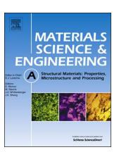

# Quantitative metallography of precipitating and secondary phases after strengthening treatment of net shaped casting of Al-Zn-Mg-Cu (7000) alloys

Reza Ghiaasiaan[a](#page-0-0) , Babak Shalchi Amirkhiz[b](#page-0-1) , Sumanth Shankar[a,](#page-0-0)[⁎](#page-0-2)

- a Light Metal Casting Research Center (LMCRC), Department of Mechanical Engineering, 1280 Main Street West, JHE 310, McMaster University, Hamilton, ON, Canada L8S 4L7
- b Canmet MATERIALS, Natural Resources Canada, 183 Longwood South St., Hamilton, ON, Canada L8P 0A1

## ARTICLE INFO

#### Keywords: Al–Zn–Mg-Cu (7000) alloys TEM SEM EDS Artificial Ageing (T6) Controlled Diffusion Solidification (CDS) Near net shape casting

## ABSTRACT

The effect of a near net shaped casting of the Al-Zn-Mg-Cu (Al-7000) alloys on the size and distribution of the strengthening precipitates formed during the peak age (T6) heat treatment was investigated using analytical microscopy with SEM, XRD and high resolution TEM. The near net shaped components were produced using the Controlled Diffusion Solidification (CDS) technology coupled with the tilt pour gravity casting process. Three different alloys were selected from the Al-Zn-Mg-Cu family with three distinctive sum total of alloying elements (Zn+Mg+Cu =4.3, 7.7 and 10.6 wt%). The uniaxial tensile yield strengths of these CDS cast alloys were also determined to be 279, 390 and 540 MPa, respectively. Further, the microstructural and uniaxial tensile properties of the CDS cast and wrought products of an Al-Zn-Mg-Cu alloy (AA7050) were also compared in this study.

#### 1. Introduction

The Al-7000 series of Al alloys have notably found an application in the global automotive sector driven by the quest for significant reduction in the curb weight of light duty automobiles. The near net shaped manufacturing of these alloys using casting technology would circumvent several down stream processing methods involving solid state transformations of the wrought product, such as hot/cold working, extrusion, forging and stamping [\[1\].](#page-10-0) Prior to their commercial application, the near net shaped casting products of these alloys would undergo heat treatment procedures such as solution treatment (T4) and artificial ageing (T6/ T7) [\[1\]](#page-10-0). In this work, an innovative casting technology know as the Controlled Diffusion Solidification (CDS) [2–[4\]](#page-10-1) is used in conjunction with a Tilt Pour Gravity Casting (TPGC) machine [\[5,6\],](#page-10-2) enabling the net shaped casting of the uniaxial tensile specimens akin to the ASTM B557 standard [\[3,4\]](#page-10-3). The motivation for this study was to evaluate and compare the evolution, and quantitative size and distribution of the strengthening phases formed in the near net shaped CDS castings of the Al-Zn-Mg-Cu alloys with that of their wrought counterparts. This motivation originates from the fact that the back diffusion mechanism proposed for solute redistribution during solidification of the CDS casting process [7–[10\]](#page-10-4) is significantly different from and exactly opposite to the solute rejection mechanism observed in a conventional solidification path dictated by the phase diagram, as

The overarching objective of this study is to examine the opposite effect of solute redistribution in the CDS casting process on the formation of secondary phases during the subsequent heat treatments such as the artificial ageing (T6) processes.

In the Al-Zn-Mg-Cu (7000) series alloys, the quantitative stoichiometry, size and distribution of the strengthening precipitates out of the super saturated solid solution (SSSS) of Al matrix are very critical data to evaluate and predict the yield strength of these alloys at various heat treated temper conditions [\[11](#page-10-6)–14]. The objective of this publication is to quantify the various strengthening phases forming in the Al-7000 CDS cast alloys during the near peak age (T6) processes: mean volume fraction, size and distribution of the precipitates. Further, the microstructure and uniaxial tensile properties of an Al-Zn-Mg-Cu alloy (AA7050) are also compared in both processing conditions: the CDS casting and the wrought processing methods. Three distinctive alloys within the realm of commercial Al-Zn-Mg-Cu family were so chosen

E-mail address: [shankar@mcmaster.ca](mailto:shankar@mcmaster.ca) (S. Shankar).

shown in [Fig. 1](#page-1-0). This mechanistic difference can significantly influence the formation of the intermetallic and secondary phases during the subsequent heat treatments; which would provide either a detrimental or favorable effect on the mechanical properties of the resultant CDS cast alloy components. The conventional casting processes such as direct chill are most commonly used as the first step of ingot casting for the Al-wrought alloy products, which are subsequently subjected to further thermo-mechanical processes [\[33\].](#page-10-5)

⁎ Corresponding author.

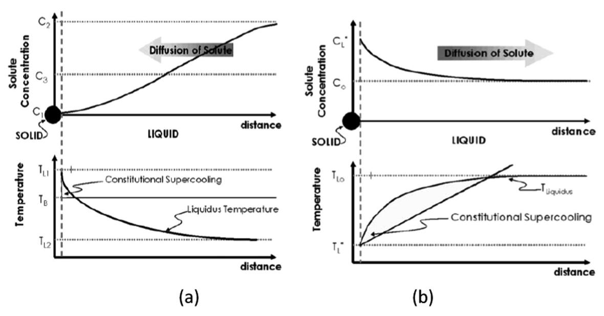

Fig. 1. Comparative schematic solute and temperature redistribution regimes ahead of the solidifying solid-liquid interface are presented for (a) the CDS process and (b) conventional solidification [\[7,8\].](#page-10-4)

that the sum total of the significant alloying elements (Zn+Mg+Cu) was at the two extremes of 4.3 wt% (with no Cu) and 10.6 wt% (with high Cu) along with a median of 7.7 wt%. Several of the information presented in this publication has been extracted from the doctoral dissertation of the first author herein [\[4\]](#page-10-7). The elemental compositions of the alloys reported in this publication are all in percentage by weight, unless otherwise mentioned.

## 2. Prior-Art

Precipitation hardening of 7000 series of aluminum wrought alloys usually occurs during the non-isothermal cooling from the solution treatment temperature wherein the precipitates are formed within the supersaturated aluminum matrix of the high strength Al-7000 series alloys. These non-isothermal precipitates are industrially important because they can remove solute elements from the supersaturated solid solution matrix to form coarse precipitates. This has a detrimental effect on the subsequent age-hardening response of the material [\[15](#page-10-8)–17]. Formation and dissolution of the secondary-phase precipitation during each of these heat treatment steps, including the solution heat treatment and the subsequent artificial ageing procedures, have a strong impact on the microstructural evolution in the following heat treatment stages [\[17,18\]](#page-10-9). In the complex alloy system of Al-Zn-Mg-Cu, several precipitation phases could evolve such as the η phase (MgZn2), M/ Sigma phase Mg(Zn,Cu,Al)2, T phase Al2Mg3Zn3, S phase (Al2CuMg), θ phase (Al2Cu), iron containing intermetallic phases (the bulk-shape Al7Cu2Fe and/or the needle-/plate-shape Al3Fe/Al13Fe4) and Mg2Si [\[3,19\]](#page-10-3). Some of these phases could evolve below the solidus temperature as well [\[3,17](#page-10-3)–19]. The hexagonal η phase is mostly observed in the as-cast microstructures; whereas the orthorhombic S phase and T phase are more commonly observed in the solid solution states with an extended composition ranges containing all four elements in the Al-Zn-Mg-Cu alloy [\[3,18,20\]](#page-10-3).

It is widely accepted that the precipitation sequence in the Al-7000 alloys at an elevated aging temperature is essentially as per the following stages [\[17,18\]](#page-10-9): super saturated solid solution (SSSS) → GP zones/Vacancy Rich Clusters (VRC) →η′-phase → η-phase (MgZn2). The metastable η'-phase is a semi-coherent phase within the Al-matrix, and has generally a hexagonal structure with lattice parameters of a=0.496 nm and c=1.402 nm [\[21\].](#page-10-10) The most accepted orientation relationships between η′-phase and aluminum matrix are (001) η′// {111}Al and [110] η′// < 112 > Al [\[22\]](#page-10-11). The equilibrium η-phase has also a hexagonal structure with lattice parameters of a=0.515 nm and c=0.86 nm [\[23\]](#page-10-12). The η-phase is, on the other hand, fully incoherent with aluminum matrix lattice, and it could nucleate directly from the solid solution [\[17,18\].](#page-10-9) Guinier–Preston or GP-zones have been recognized as microstructural elements [\[23\]](#page-10-12) in aluminum alloys since the early work of Guinier [\[24\]](#page-10-13) and Preston [\[25\].](#page-10-14) The formation and growth of GP-zones in aluminum alloys can be evidently approved by various measurement methods such as the indirect methods of electrical conductivity, calorimetry (DSC), positron annihilation, magnetic susceptibility and mechanical property measurements (hardness and flow stress) [\[23\].](#page-10-12) More structural information can be obtained by diffraction methods using either electron microscopy or X-ray (including smallangle) diffraction experiments such as SAXS. Schmalzried and Gerold [\[26\]](#page-10-15) found strong diffuse scattering in the diffraction patterns of their early X-ray studies of the Al–Zn–Mg system in the natural aged condition, and concluded that the GP clusters must be ordered clusters of atoms. They proposed a microstructural model based on alternating {100} planes of Zn and Mg, which is similar to that in CuAu (I)-type ordering [\[26\].](#page-10-15) Early electron microscopy studies by conventional bright-field and dark field micrographs, and electron diffraction patterns [\[18,](#page-10-16)[27\]](#page-10-17) had mainly been used to deal with the characterization of the age hardening precipitates. Early TEM micrographs revealing GPzones had also been reported [\[28\].](#page-10-18) Mukhopadhyay [\[29\]](#page-10-19) has published the first high-resolution electron microscopy (HRTEM) micrographs of GP-zones for the Al-Zn-Mg system; the contrast effect attributed to the spherical GP zones with 3–5 nm diameter for under-aged samples was highlighted. Three-Dimensional Atom Probe (3DAP) and TEM investigations by Stiller et al [\[30\]](#page-10-20) on an Al–Zn–Mg alloy after two-step ageing treatment at 373 K (100 °C) and 423 K (150 °C) had revealed a fine distribution of approximately spherical precipitates with 2.5 ± 1 nm in size. Their observation showed no distinction between GP cluster types: Type (I) and Type (II). Further, They also observed a coarser distribution of precipitates typically greater than 6 nm in size; which were classified according to their morphology: the plate-like particles as η′ precipitates on {111} and cigar-like particles as η-precipitates [\[30\]](#page-10-20). Further 3DAP analyses revealed the existence of larger precipitates (~5–10 nm) in the Al-Zn-Mg alloys at their optimal peak age (T6) heat treatment condition, aged for 5 h at 373 K (100 °C) followed by another 6 h ageing at 423 K (150 °C) [\[31\].](#page-10-21)

The above-mentioned salient information from the prior-art is

Table 1
Actual composition (wt%)a measured by GDOESb test for three Al-7000 alloys used in this study.

| # | Alloy Designation             | Zn         | Mg         | Cu + Fe + Si | Ti         | Zn + Mg + Cu | Zn/MG |
|---|-------------------------------|------------|------------|--------------|------------|--------------|-------|
| 1 | Al-3.5Zn-0.8Mg-0Cu            | 3.48       | 0.79       | < 0.1        | 0.05       | 4.3          | 4.4   |
|   | (Low Total Alloying Content)  | $\pm 0.30$ | $\pm 0.39$ |              | $\pm 0.02$ |              |       |
| 2 | Al-3.8Zn-2.2Mg-1.7Cu          | 3.81       | 2.18       | < 0.1        | 0.04       | 7.75         | 1.7   |
|   | (Mid Total Alloying Content)  | $\pm 0.18$ | ± 0.05     |              | $\pm 0.05$ |              |       |
| 3 | Al-5.8Zn-2.2Mg-2.5Cu (7050)   | 5.82       | 2.22       | < 0.1        | 0.03       | 10.57        | 2.6   |
|   | (High Total Alloying Content) | ± 0.30     | ± 0.05     |              | $\pm 0.00$ |              |       |

&lt;sup>a Average numbers were calculated over the total number of 10 data points for each condition.

primarily extracted from researches carried out on the wrought products of the Al 7000 series alloys. In this study, the sample alloys from the Al-7000 series family are produced using a new casting process known as the Controlled Diffusion Solidification (CDS) technology in conjunction with a Tilt Pour Gravity Casting (TPGC) machine. Further, an analytical metallographic characterization is carried out using SEM, XRD and TEM on the strengthening precipitates formed during the solutionizing (T4) and artificial age (T6) heat treatments of the Al-7000 CDS cast alloys. The Controlled Diffusion Solidification (CDS) process is an innovative casting process designed specifically to improve the net shaped castability of the Al-wrought alloys [3,4]. The CDS casting process had been proven to be a viable near net shape casting method for the Al 7000 series alloys while completely mitigated hot tearing phenomena and producing a non-dendritic morphology of the primary Al phase in the cast microstructure [3,4,20]. The CDS technology involves an intermediate mixing stage of the two precursor alloys made by dividing the target alloy composition based on a certain mass ratio difference between the two. Each of precursor alloys possesses a specific thermal mass: one with a high thermal mass (higher temperature and mass) and the other with a low thermal mass. Further, the precursor alloys are mixed at their specific thermal mass ratios (different mass and temperatures) and then subsequently the resultant molten mixture is cast into the near net shaped cast components [3,4,32,33]. Based on the mechanism proposed for the CDS casting process found in the background literature: the back diffusion of solute atoms occurring during the solidification path in the CDS process is contrary to and significantly different from that in a conventional casting process [32,33], as shown in Fig. 1. This mechanistic difference is expected to have an impact on the formation of intermetallic and secondary phases formed during the subsequent heat treatments such as artificial ageing; which in turn could influence the mechanical properties of the resultant cast alloy. The main objective of this study is to investigate the effect of this new casting process (CDS) on precipitation of secondary phases and the uniaxial properties of the Al-Zn-Mg-Cu alloys.

## 3. Experimental procedure

The actual composition of the alloys used in this study is presented in Table 1. Si and Fe are impurity elements with maximum allowable limits and Ti is typically added to enhance the grain boundary strengthening effects that are possible in a solid-state transformation processes.

The casting methodology is reported in our earlier publications [2,3]. The cylindrical uniaxial tensile test specimens have a gauge of 12.5 mm diameter and 50 mm length [2,3]. The samples for the microstructural evaluation were sectioned from the gauge length of the cast tensile test bars. The castings were heat treated to the solution treatment (T4) and near peak age (T6) heat treatments [3]. The details of the heat treatment procedures are presented in Table 2.

The heat treatment procedures were carried out in an electric resistance convection furnace wherein an internal fan maintained the constant thermal condition within  $\pm$  2 K (°C) of the set temperatures. At

the end of the respective solution treatment (T4), the tensile test bar samples were quenched in water maintained at ambient conditions ( $\sim$ 21 °C). This was followed by the natural ageing process of the samples in ambient conditions for 96 h prior to the respective artificial ageing at an elevated temperature to attain the near peak age condition (T6), [3.18.34.35].

Thin-foil specimens for TEM studies were prepared by electropolishing and ion milling techniques. The electro-polishing solution consisted of 10% Perchloric acid in 20% Glycerol and 70% Methanol at 253 K (-20 °C) using standard twin-jet polishing. TEM studies were performed on all heat-treated materials. GATAN PIPS ion mill was used for preparing the Thin-foil TEM specimen. TEM Samples were investigated under the electron beam using TEM1 operating at 200 kV, equipped with high angle annular dark field (HAADF) STEM detector and Super-X-ray detection technology. In order to study the chemistry of different phases, Energy Dispersive Spectroscopy (EDS) technique was used in STEM-HAADF mode to perform quantitative analysis and elemental mapping. Conventional bright field and dark field imaging, and selected area diffraction (SAD) pattern were employed to study the microstructure and precipitation phases. The quantitative image analyses were carried out using ImageJ2 software in accordance with the ASTM standard E1245-03 standard [2,3]. For the measurement of the particle size or Equivalent Circular Radius (ECR), the area measurement method was used with various thresholding techniques in the image analyses. In case of nano-scale fine precipitates such as the precipitates present at the end of the peak age (T6) temper, the volume fraction of precipitates was evaluated by the stereology theorem [36]. The quantitative determination of particle size and number was carried out by using the Electron Energy Loss Spectroscopy (EELS) log ratio technique for specimen thickness measurement in the TEM; for which we used images that were obtained from areas of TEM thin foil with an average thickness of 100 nm [37-39]. The volume fraction of the nanoscale precipitates forming during the T6 process was calculated from the TEM micrographs using Eq. (1), wherein the nano-scale precipitate phases are assumed to be spherical particles.

$$f_{Volume} = \left[\frac{\sum_{i=0}^{N} V_i}{V_{Total}}\right] = \left[\frac{\sum_{i=0}^{N} \left\{\frac{4}{3} \cdot \pi \cdot (ECR_i)^3\right\}}{t \cdot A_{Total}}\right] = \left[\frac{N \cdot \left\{\frac{4}{3} \cdot \pi \cdot (\overline{ECR})^3\right\}}{t \cdot A_{Total}}\right]$$

$$(1)$$

In Eq. (1),  $A_{total}$  is the total area of TEM micrograph;  $V_i$  and  $A_i$  are the volume and area of each precipitate (i) measured on TEM micrographs, respectively; t is the TEM thin foil thickness ( $\approx 100$  nm); and the  $ECR_i$  is the Equivalent Circular Radius for each of the spherical particles. The  $ECR_i$  is calculated using Eq. (2). Fig. 2 is a schematic presentation of parameters used in Eqs. (1) and (2).

&lt;sup>b Glow Discharge Optical Emission Spectroscopy (GDOES).

&lt;sup>1 FEI's Tecnai Osiris: https://www.fei.com/products/tem/tecnai/

&lt;sup>2 ImageJ, Image processing and Analysis in Java, 1.42q Java 1.6.0 (32 bit)

Table 2
Typical heat treatment/temper conditions applied to the cast samples in this study.

| Temp     | Alloys                                                                    | Solution treatment T4 |             | Quench Water at ambient temperature (~21 °C) | Natural Ageing NA |              | Artificial A Step 1         | Artificial Ageing (T6) Step 1 |                           | Step 2      |  |
|----------|---------------------------------------------------------------------------|--------------------------|-------------|-------------------------------------------------|----------------------|--------------|--------------------------------|----------------------------------|---------------------------|-------------|--|
|          |                                                                           | Temp K (°C)           | Time (h) |                                                 | Temp K (°C)       | Time (h)  | Temp K (°C)                 | Time (h)                      | Temp K (°C)            | Time (h) |  |
| T4 T6 | All Al-3.5Zn-0.8Mg-0Cu Al-3.8Zn-2.2Mg-1.7Cu Al-5.8Zn-2.2Mg-2.5Cu | 750 (477) 750 (477)   | 24 24    |                                                 | None RT           | None > 96 | None 373 (100) 393 (120) | None 6 24                  | None 423 (140) None | 15          |  |

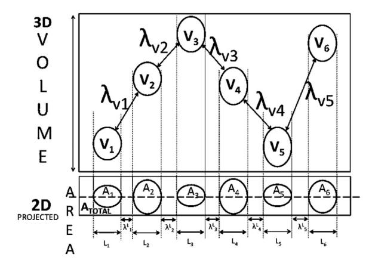

Fig. 2. Schematic presentation of the stereology theorem [36], which evaluates the spatial distribution of nano-scale particles within the volume of TEM foil sample and respective projection on a 2-dimensional image.

$$ECR_i = \sqrt{\left(\frac{A_i}{\pi}\right)} \tag{2}$$

Fig. 3 presents a typical procedure of image analyses on the sample microstructure to evaluate the area of each phase particle that would be input in Eq. (2).

In order to circumvent the effect of particle morphology on prediction of the process models for the yield strengths of these alloys, the mean free path between these strengthening precipitates is used [11,12], which is evaluated using the Eq. (3).

$$\overline{\lambda}_{Volume} = (1.15) \left[ \sqrt{\frac{(2\pi)}{(3f_{Volume})}} \right] (\overline{ECR})$$
 (3)

Eq. (3) is based on the assumption of Gaussian distribution of spherical precipitates in combination with the statistical theory proposed by Kocks [40].

#### 4. Results and discussion

In the complex system of the Al-Zn-Mg-Cu alloys, the precipitates

evolving during the age hardening heat treatments (T6) are commonly characterized by the Selected Area Diffraction (SAD) pattern obtained along with the [001] zone axes reflections of the aluminum matrix [41-47]. Fig. 4(a) to (c) present the SAD patterns from the Al phase in the [001]Al zone axis for the Low, Mid and High alloys used in this study in their near peak age (T6) temper. Fig. 4(d) presents the schematic representation of the reciprocal lattice of Al-matrix obtained along the [001] zone axis of the Al-matrix, wherein the positions of the super-lattice reflection of GP clusters/η'-precipitates are presented to be in a four folded pattern, appearing in the vicinity of the 2/3{220} positions [23,28,48–51]. Fig. 4(a) to (c) show the supper-lattice reflection spots of the GP clusters/η'-phases appearing at positions close to 2/3{220} in the Al matrix reciprocal lattice. This evidently proves the formation of strengthening precipitates in all three alloys of this study to be a mixture of early stage GP clusters and other meta-/ stable  $\eta'$ - $/\eta$ - precipitates. This is consistent with the effect of similar near peak-aged (T6) heat treatment in the wrought counterparts of the Al 7000 series alloys found in the background literature [22,23].

Fig. 5 presents STEM images obtained using Dark Field (DF) and High Angle Annular Dark Field (HAADF) detectors for the Low and High alloys of this study in the near peak age (T6) heat treatment condition. Fig. 5(a) & (c) show the DF and HAADF images for the Low Alloy, respectively; and Fig. 5(b) & (d) show the same for the High alloy, respectively. Using the chemical composition contrast, size and morphological differences in the DF and z-contrast HAADF micrographs, the various types of precipitate phases i.e., GP clusters,  $\eta'$  and  $\eta$ phases, have been identified and denoted in Fig. 5(b) and (d) for the Low and High alloys, respectively. The GP clusters had been identified as the coherent phases with the lowest content of total alloving elements; they have the smallest size amongst the three with a spherical morphology. As the precipitation reaction progresses, the GP clusters evolve into  $\eta$ ' phases, which are bigger in size and have a notable morphological deviation from being spherical, and contain higher total alloying elements to present a brighter contrast in the z-contrast images as compared to GP clusters. The fully incoherent and stable  $\eta$  phases are evolved with the largest size, elongated/oval morphology and contain the highest amount of total alloying elements; therefore, the  $\eta$  phases appear as the brightest spots on the z-contrast images with largest size and most elongated morphology. The  $\eta$  phases were identified from their size, morphology and significantly brighter contrast in the STEM-

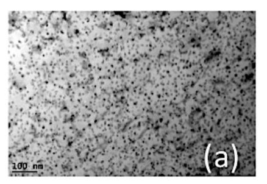

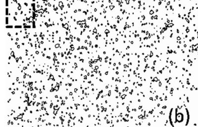

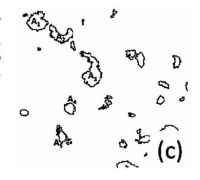

Fig. 3. Typical procedure used in this study for determination of individual phase particle area. (a) 2D sample microstructure image, (b) obtaining phase outlines for precipitates through several steps in an image analysis and (c) quantitative analysis of each particle area.

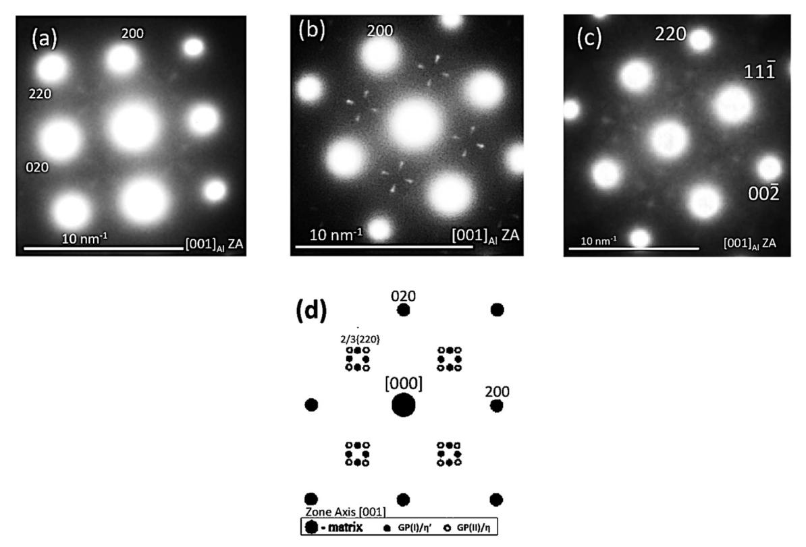

Fig. 4. Selected Area Differaction (SAD) patterns of Al matrix brought to [001]-zone axes for samples in T6 temper from (a) Al-3.5Zn-0.8Mg-0Cu, (b) Al-3.8Zn-2.2Mg-1.7Cu and (c) Al-5.8Zn-2.2Mg-2.5Cu alloys. (d) shows a schematic illustration of observations in (a) to (c) is presented.

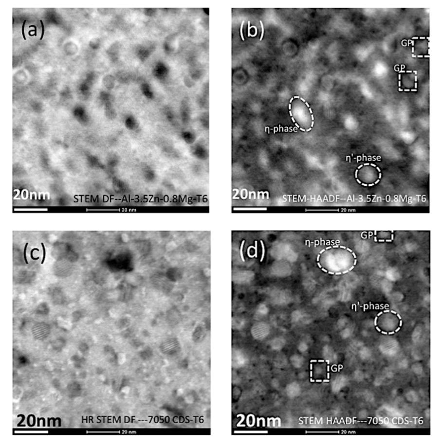

Fig. 5. STEM images: (a) and (c) are in dark field mode; and (b) and (d) are in HAADF (z-contrast) mode. The GP zones and η'-/η-precipitates forming at the end of T6 heat treatment are shown in (a) and (b) for the Low alloy (Al-3.5Zn-0.8Mg-0Cu), and in (c) and (d) for the High alloy (Al-5.8Zn-2.2Mg-2.5Cu).

HAADF compositional/z-contrast (atomic weight) micrographs. All these features are shown in [Fig. 5](#page-4-1)(b) and (d).

Further quantitative observations presented in the following sections confirm that the number density of the strengthening precipitates is higher in the High alloy than the Low alloy. This could be attributed to the increased spatial density of all alloying elements in the solid solution of Al matrix at the beginning of the artificial ageing (T6) process for the High alloy. It is notable that there are some Moiré fringes detectable in [Fig. 5](#page-4-1), which can occur when there is a superposition of two different fringes; for example, the fringes from the lattice and those from the precipitates on top [\[52\].](#page-10-27) In STEM imaging mode, the interaction between the scanning patterns of the electron beam with the fringes of phases within the sample can also give rise to Moiré fringes, also known as Scanning Moiré fringes (SMF) pattern. In HAADF- STEM imaging mode, the SMF appears where the scanning grating size is close to the atomic plane spacing of precipitates [\[53\]](#page-10-28). Depending on the orientation of the scanned area and that of the precipitates, the SMF could appear in one or more sets of precipitates that are oriented in a relatively similar crystallographic relationship with each other; also, even the minor variation in foil thickness may influence the Moiré fringes appearance. In STEM mode, the precipitates that have larger lattice (higher d-spacing) can present higher chances of showing Moiré fringes. In [Fig. 5](#page-4-1) (a) and (b), the scanning moiré fringes are visible in one η phase in the centre and in [Fig. 5](#page-4-1) (c) and (d), two identically oriented η' spherical phase precipitates are showing similar moiré fringes.

[Fig. 6](#page-5-0) presents the natural ageing hardness curves for the three alloys of this study. [Fig. 6](#page-5-0)(a) is a graph of the transient hardness data for the three alloys, which are obtained during the natural age (T4) processes by hardness measurements immediately after water quenching to ambient temperature (~21 °C) from the solution treatment temperature (477 °C). [Fig. 6](#page-5-0)(b) shows the magnified section of the initial stages of precipitation reaction forming during the natural ageing process for the three alloys; it is also shown in [Fig. 6](#page-5-0)(b), the respective empirical linear regression lines super imposed on the experimental data. Further, [Fig. 6\(](#page-5-0)a) shows that the increase in the total alloying content of the Al 7000 series alloy will increase the peak hardness value attained after the stabilized natural aged (T4) treatment condition. Also, [Fig. 6\(](#page-5-0)b) shows that the increase in total alloying elements will increase the hardening rate in the alloy during natural ageing processes. This is shown in [Fig. 6\(](#page-5-0)b) by the linear regression model presenting the initial hardening rate of 0.3, 0.7 and 4.1 for the Low, Medium and High alloys, respectively. Further, the as-quench hardness values measured immediately after quenching to ambient from the solution treatment (T4) temperature (477 °C) are also shown in [Fig. 6](#page-5-0)(b) using the intercept points of the regression fit lines, which are 48.5, 64.58, and 70.32 HRB for Low, Mid and High alloys, respectively.

The accelerating effect in the age hardening curves of the Al-7000 alloys observed in [Fig. 6](#page-5-0)(b) are partly attributed to the effect of alloying elements on the formation of metastable early stage GP clusters [\[23,31,41\].](#page-10-12) The reason being, the GP zones are the precursor phases for the more stable η'-/η- precipitates forming during ageing processes in the Al 7000 alloys [\[17,18\].](#page-10-9) The nucleation and growth mechanism of GP zones are critically studied for many years [\[17,18\].](#page-10-9) Recent investigations [\[41\]](#page-10-26) reveal that apart from aging temperature, the alloy composition plays a critically important role in the nucleation and growth stages of the metastable early stage GP clusters. This compositional effect can be addressed using two factors: the Zn/Mg ratio and the Cu content in the alloy composition [\[18,31,41,42,54](#page-10-16)–58]. Using an intensive characterizing analysis by high resolution TEM, SAD and 2D/ 3D Atom Probe results, Sha and Cerezo [\[41\]](#page-10-26) reported that the metastable early stage GP clusters are formed with a Zn/Mg ration close to 0.85. This is evidently showing that the Mg atoms are the dominant elements in the early stage GP clusters. Therefore, the Mg atoms play an important role in the nucleation stage of metastable early stage GP clusters. This is also consistent with the observed activation energy (~0.6 eV) for the GP zones found in the background literature, which is measured using both SAXS and electrical resistivity experiments [\[18,41\].](#page-10-16) This value is generally considered to be the activation energy required for migration of Mg atoms [\[18,41\]](#page-10-16). In other words, Mg atoms are the controlling elements in the nucleation stage of metastable GP clusters; which can also be attributed to the strong bonding between Mg atoms and vacancies [\[18\]](#page-10-16). During the growth stage of GP clusters, the Zn/Mg ratio increases and reaches the unity (1) [\[41\].](#page-10-26) This shows the larger and increasing participation of Zn atoms during the growth stage of GP zones. The more stable GP zones (Zn/Mg~1) can further grow and form the more stable strengthening precipitates (η' or η) with an increasing Zn/Mg ratio of 1.07–1.26 [\[41\].](#page-10-26)

Also, with the use of comprehensive 3D-AP measurements, Sha and Cerezo [\[41\]](#page-10-26) had shown that during the nucleation stage of metastable GP clusters (Zn/Mg~0.85), the average Cu content (~12at%Cu) is slightly larger than that (~5at%Cu) of more stable GP zones (Zn/ Mg~1) forming at a later growth stage of GP zones. This is indicating that Cu atoms are more actively involved in the nucleation stage of GP clusters than in the growth stage [\[41\]](#page-10-26). Although no direct comparison has been made in this research to determine the starting point for the nucleation stage of GP clusters, the Cu involvement are observed in the EDS elemental maps of the two High and Mid Cu-containing alloys of this study. This is shown in [Fig. 7](#page-6-0), wherein the HAADF image from STEM for the Low, Mid and High alloys are respectively presented along with their EDS elemental maps for the respective alloying elements. [Fig. 7](#page-6-0) also shows the existence of an optimal mixture of GP zones, η' and η phases forming during the near peak age (T6) condition for each of three alloys used in this study.

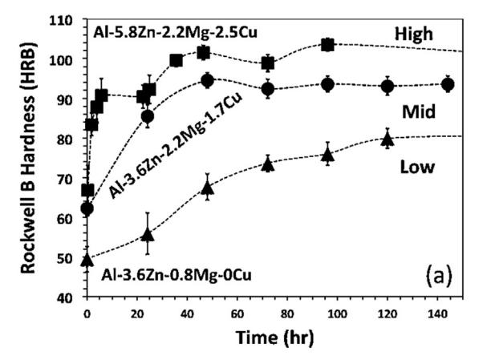

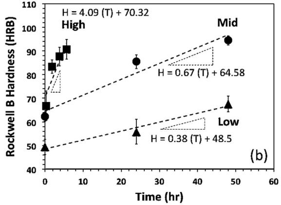

Fig. 6. Transient hardness data measured immediately following the quenching process after solution treatment (T4). (a) The hardening process during natural ageing of the three alloys and (b) magnified section of the initial hardening stage during the first 60 min for the three alloys along with the linear regression model to quantify the respective rate of hardening.

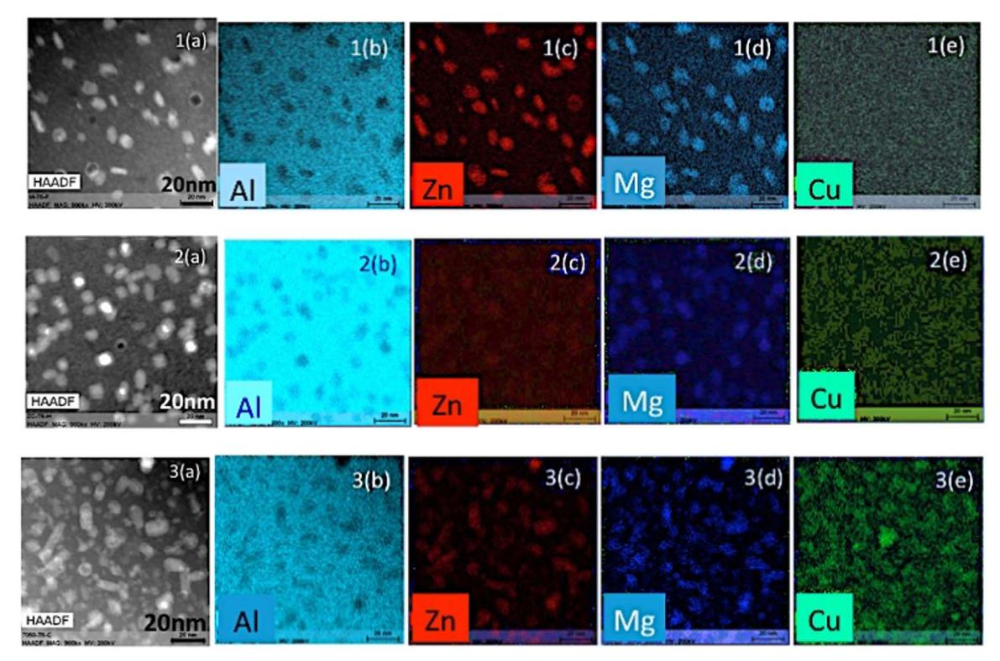

Fig. 7. Typical HAADF and respective EDS elemental maps for (a) Al-3.5Zn-0.8Mg-0Cu, (b) Al-3.8Zn-2.2Mg-1.7Cu, and (c) 5.8Zn-2.2Mg-2.5Cu.

[Fig. 8](#page-6-1) presents the typical bright field (BF) TEM images from the Al matrix showing the increasing trend in the population of the strengthening precipitate phases in the Low, Medium and High alloys, respectively. The result of further quantitative image analysis on similar TEM micrographs shown in [Fig. 8](#page-6-1) will be presented and discussed in the following sections of this publication.

[Fig. 9](#page-6-2) presents the results of our quantitative image analysis for the particle size and volume fraction forming after T6 treatment in the three alloys. It is notable as shown in [Fig. 9](#page-6-2) that both the average particle size and volume fraction of precipitates will decrease with the increase in the total alloying elements. Also, it is noteworthy that our image analysis for average particle size and volume fraction of precipitates forming in the Al-7000 CDS cast alloys after T6 are fairly consistent with that of the wrought products found in the background literature [\[29,30,31,59\]](#page-10-19). [Fig. 10](#page-7-0) presents the size distribution of precipitates for the three alloys showing a near Gaussian distribution.

Hypothetically, the decreasing effect in particle size and the increasing effect in the volume fraction of the precipitates with the increase of total alloying elements can be attributed to the effect of the alloy composition as earlier explained using the Zn/Mg ratio and the Cu content of the alloy composition. Based on the Atomic Probe observations by Sha and Cerezo [\[41\],](#page-10-26) the Cu atoms are more actively involved in the nucleation stage of metastable GP clusters than in their growth stage. This can be hypothetically ascribed to the atomic size and

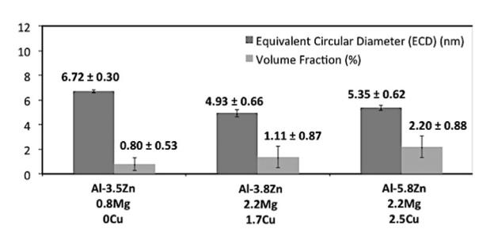

Fig. 9. Measurements for the particle size and area fraction of precipitates in three alloys of this study shown in [Fig. 6.](#page-5-0) The results here show the total combination of all possible particles forming after T6 temper including GP zones, η′ and η precipitates in the respective alloys.

diffusivity of Cu atoms as compared to the other major alloying elements in the Al-Zn-Mg-Cu system. Since Cu atoms are the smallest with the lowest diffusion coefficient in the Al-Zn-Mg-Cu alloying system ([Table 3\)](#page-7-1), they can occupy a substitutional position in the GP clusters at very early stage of GP nucleation with low diffusivity at low temperatures. Further due to their sluggish diffusivity, the Cu atoms help the early stage metastable GP clusters to become more resistance to the dissolution competition occurring later during the growth stage of GP clusters. Therefore, in the alloys with higher Cu content, the number density of more stable early stage GP clusters is expected to be larger

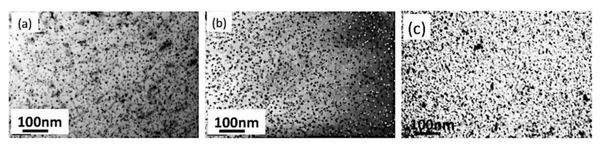

Fig. 8. TEM Bright-field micrographs for T6-aged samples of: (a) Al-3.5Zn-0.8Mg-0Cu; (b) Al-3.8Zn-2.2Mg-1.7Cu; (c) Al-5.8Zn-2.2Mg-2.5Cu.

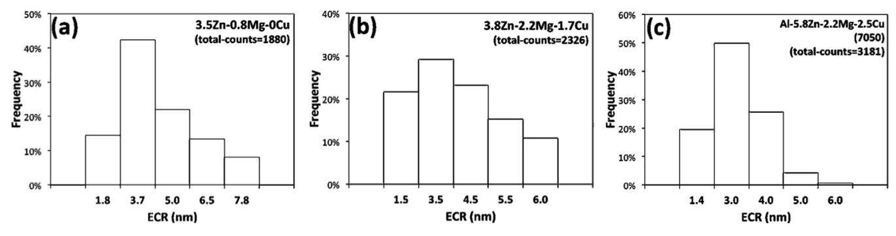

Fig. 10. Typical gaussian distribution of particle size for the precipitate phases forming after T6 temper in (a) Al-3.5Zn-0.8Mg; (b) Al-3.8Zn-2.2Mg-1.7Cu; and (c) 5.8Zn-2.2Mg-2.5Cu alloys and shown in Fig. 9.

Table 3
Typical physical properties of alloying elements in the Al-7000 series system.

| Atom | Radius (Å) Ref. [63] | Self Diffusion Coefficient (µm²/s) (~@T m ) Ref. [1,63,64] | Inter-diffusion Coefficient (in quaternary, AlZnMgCu, system)  Ax10 -14 (m 2 /s) (~@755K-482 °C) Ref. [65,66] | Misfit strain zone in Al (%) Ref. [63] |  |
|------|----------------------------|-----------------------------------------------------------------------------------|-------------------------------------------------------------------------------------------------------------------------------------|----------------------------------------------------|--|
| Al   | 1.432                      | 1.9                                                                               | 6.2 (in Mg) – 7 (in Zn)                                                                                                             | -                                                  |  |
| Zn   | 1.387                      | 0.98–1.6                                                                          | 10.7                                                                                                                                | -3.5                                               |  |
| Mg   | 1.60                       | 2.3–2.9                                                                           | 5.9                                                                                                                                 | +12                                                |  |
| Cu   | 1.28                       | 0.6                                                                               | 3.2                                                                                                                                 | -10.5                                              |  |

than that of the lower Cu-containing alloys. This in turn will increase the total population or fraction volume of the strengthening precipitates after T6 temper in the respective alloys. This is mainly because the GP clusters are the precursor precipitates for the more stable strengthening  $(\eta'-/\eta)$  precipitates [17,18]. It is noteworthy that the presence of Cu atoms in the Al-matrix and/or the evolving precipitates does not change the nature of precipitation reaction; instead, the Cu atoms merely have a stabilizing effect on the early stage GP clusters, which in turn affect the number density of strengthening phases [17,31,35,41]. The driving force during the growth regime is to minimize the interfacial free energy in a two-phase alloy matrix; this results in the coarsening of the high number density of smaller precipitates into a lower number density of larger ones, which in turn leads to a decrease of total interfacial area. This coarsening effect and minimization of interfacial energy could be attributed to the Gibbs-Thomson effect on the solute concentration in the matrix adjacent to a particle [60-62]. During the particle coarsening stage, the Gibbs-Thomson effect causes the solute concentration in the matrix at the vicinity of the particle interface with smaller radius of curvature to be higher than that of a particle with a larger radius of curvature. Therefore, there would be a significant gradient in chemical potential of solute (concentration) in the matrix between the two adjacent spherical precipitates with a marked difference in their sizes; this will promote the diffusion of the solute atoms to the larger particles and away from the smaller ones. This migration of solute atoms results in the growth of large particles at the expense of the smaller ones, which would eventually shrink and disappear. Therefore, the overall result would be that the total number of particles decreases and the mean radius of precipitates increases with time [60-62].

Fig. 11 is a graphical representation of the decreasing effect in the average particle size (Equivalent Circular Radius or ECR, explained in

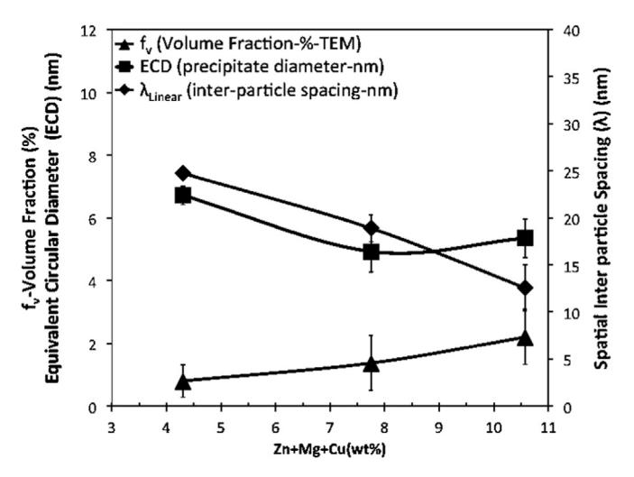

Fig. 11. Quantitatve image analyses on the TEM micorgraphs for three alloys of the Al-7000 family selected for this study: ECD,  $\lambda$  and  $f_v$ .

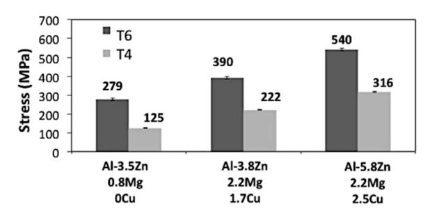

Fig. 12. Uniaxial Tensile properties in T4 and T6 conditons for the three alloys used in this study.

Eq. (1)) and the increasing effect in the volume fraction ( $f_V$ , explained in Eq. (2)) of the strengthening precipitates with the increase in the total alloying content of the alloy. Also, Fig. 11 shows the effect of total alloying elements in the alloy on the average planar free inter-particle spacing ( $\lambda_V$ , explained in Eq. (3)). It is notable that these three quantified parameters (ECD,  $\lambda$  and  $f_V$ ) could be used for validation and examination of predictive yield strength models for these alloys.

### 5. CDS cast versus wrought products

Fig. 12 shows the mean yield strength form uniaxial tensile tests for

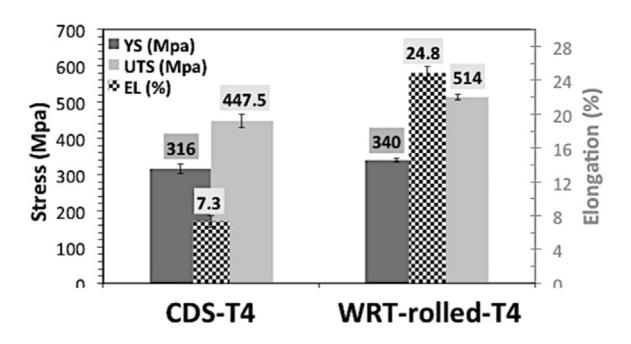

Fig. 13. Comparative bar graphs of uniaxial tensile properties of AA 7050 alloy, produced using two different methods: (1) the CDS technology coupled with TPGC process; and (2) the wrought processing (rolled[3](#page-8-1) ) method. Note that the uniaxial tensile properties of both cases are reported in the same solution (T4[4](#page-8-2) ) heat treatment conditions.

in two heat treatment conditions: T4 and T6.

[Fig. 13](#page-8-0) presents the uniaxial tensile properties of the CDS casting and wrought (rolled sheet) products of the AA 7050 alloy both in the solution (T4) heat-treated condition (24 h at 477 °C+water quenching +96 h natural ageing at room temperature). It is noteworthy that the CDS tensile specimens were designed according to the ASTM B557 standard (2-in. gauge length standard size specimen with circular cross section); whereas the AA 7050 wrought (rolled) tensile samples were machined out of the 0.25″X6.0″ plates in accordance with the ASTM E8/E8M–(13a) standard (flat substandard size specimen with a1.0-in. gauge length).

The relatively similar strengths of the AA-7050 in both the CDS cast and wrought products, in T4 temper shown in [Fig. 13](#page-8-0) are largely attributed to two major strengthening contributions: the solid solution and precipitation strengthening constituents [\[11,13,14,67,68\].](#page-10-6) The former is mainly a function of the alloy composition and thermodynamically driven heat-treatment condition [\[11,13,14,67,68\].](#page-10-6) The latter, on the other hand, is a function of the nature, size and volume fraction of the strengthening precipitates forming in the AA-7050 alloy during the subsequent heat treatment; which are expected to be relatively similar in both the CDS cast and wrought products of Al-7050 alloys as judged by the relatively similar yield strengths shown in [Fig. 13.](#page-8-0) This is also fairly consistent with experimental results found in the background literature for the particle size and volume fraction in the Al-7000 alloys measured by SAXS technique coupled with TEM and DSC analysis [29–[31,59\]](#page-10-19). As shown in [Fig. 13,](#page-8-0) the ductility (or elongation) in the CDS casting samples is significantly lower than that of the wrought products of AA 7050 alloys. This is mainly attributed to the observed difference in the size and morphology of detrimental intermetallic phases such as Fe-containing phases (Cu2FeAl7/FeAl3) in the CDS cast Al-7050 alloys with that of the wrought counterparts found in the background literature. [Figs. 14](#page-9-0) and [15](#page-9-1) present the SEM micrographs of the AA-7050 cast samples, wherein the Fe-intermetallic phases are identified using the EDS elemental mapping. It is noteworthy that the Fe-containing intermetallic phases (Cu2FeAl7/FeAl3) appear in two distinct morphologies: (1) the rod- or plate- or needle-like morphologies, as shown in [Figure 15](#page-9-1) (a) and (b) and/or (2) the bulky or irregular shapes, as shown in [Fig. 15\(](#page-9-1)c) and (d).

Further, our quantitative image analysis on the similar SEM micrographs shows that the average size distribution of these detrimental Fe-containing intermetallic phases in the AA-7050 CDS cast products are larger than that of their wrought counterparts observed and reported in the background literature [\[69\].](#page-11-1) This is graphically shown in [Fig. 16,](#page-9-2) wherein the typical comparative bar graphs of average size distribution and area fractions for the Fe-containing intermetallic phases are presented for the CDS cast and wrought products of AA-7050 alloys, respectively. The observed difference is sizes of Fe intermetallic phases could explain the significant ductility drop observed the AA-7050 CDS cast alloy as compared with the wrought counterpart [\(Fig. 13\)](#page-8-0). This is mainly because the large insoluble compounds containing impurity elements such as iron or silicon (Al6(Fe,Mn), Al3Fe, α-Al(Fe,Mn,Si) and Al7Cu2Fe) formed at interdendritic areas during ingot solidification of the Al-7000 alloys are later broken into the smaller sizes with less detrimental morphologies during the subsequent solid state processes such as, typical of the wrought processing methods such as hot/cold working, extrusion, forging and stamping [\[1\].](#page-10-0) It is noteworthy that further quantitative image analysis on the high magnification optical micrographs reveal that the average grain sizes of both the CDS cast and wrought samples are relatively in a same size range of 65 ( ± 4.4) nm and 50 ( ± 5.2) nm, respectively. Also, the experimental results for the porosity content of both the AA-7050 cast and wrought samples show that both samples contain similar level of porosity of 2.82 ( ± 0.54) and 2.65 ( ± 0.25), respectively. This is consistent with the data for the porosity content of the AA-7050 wrought product reported in the background literature [\[70\]](#page-11-2). The porosity content and average grain size are other possibilities for the influential parameters on uniaxial tensile yield strengths in the Al-7050 alloys. Therefore, having a similar level of porosity content and average grain size will eliminate the subsequent effect of these parameters on the yield strengths of the Al-7050 alloy.

#### 6. Summary and conclusions

The [001]-projection SADP revealed that an optimal mixture of the strengthening precipitates such as the GP Clusters/η′/η-phase are formed in all three Al-7000 alloys during the peak aged (T6) heat treatment process. The quantitative image analyses on the TEM micrographs reveals that the number density of strengthening precipitates forming during the age hardening process (T6) in all the three alloys increase with the increase in the total alloying content of the alloy. Also, the image analyses on the TEM micrographs show that there is a slight decreasing trend in the average size or the measured Equivalent Circular Radius of the strengthening precipitates forming during the age hardening process (T6) in all three alloys with the increase in the total alloying content of the alloy composition in the Al-7000 alloys. Moreover, the EDS elemental mappings and High Angle Annular Dark Field (HAADF) micrographs also revealed the existence of the Cu element within the precipitates. This is more pronounced especially in the sample alloys with higher Cu content; where the excessive Cu content tends to precipitates in metastable early stage GP clusters rather than remaining in the SSSS Al-matrix. This is important because Cu atoms are substitutional atoms attending more actively in the metastable early stage GP clusters [\[41\]](#page-10-26). Hypothetically, incorporation of Cu into the metastable early stage GP-Clusters can be explained based on the fact that it is the smallest and the slowest (i.e., with the lowest diffusivity) atom among all the existing atoms in the Al-Zn-Mg- (Cu) system. Due to their small size, the Cu atoms can easily substitute other atoms (Al, Zn, and Mg) in the nucleation stage of metastable GP clusters at their early stage of formation; and yet, because of sluggishness, the Cu atoms can hinder the dissolution and growth of these finescale GP clusters. This in turn can cause the formation of higher effective number of smaller GP clusters (and/or η'- and η-precipitates), which are theoretically not only coherent but also homogeneous precipitates in the supersaturated solid solution Al-matrix. Therefore, Cu can hypothetically cause a greater hardening rate in the precipitation hardening process of the Al-Zn-Mg-(Cu) alloys with higher Cu content. The castings produced in this study using the CDS technology

3 The AA-7050 wrought samples were originally purchased from the manufacturer, REYNOLDS Inc. (or Alabama Specialty Products, Inc., [www.alspi.com](http://www.alspi.com)). The original AA-7050 wrought samples were received in the form of hot rolled 0.25"X6" plates and T7561

heat treatment condition according to the ASM-4201B-T7651 standard. 4 The machined tensile specimens of the original AA-7050 wrought (rolled) samples were heat treated along with the AA-7050 CDS cast tensile specimens, all together in an exactly the same T4 procedure (soaking for 24 hours at 477°C, followed by a water quenching and an incubation period of 96 hours at ambient temperature).

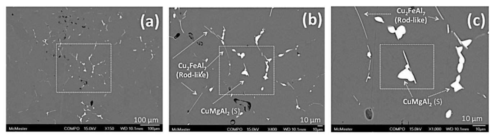

Fig. 14. Secondary Electron images from SEM in low and high magnifications from the grain boundary areas of AA7050 CDS cast samples in T4 condition, showing the dominant S-phase and detrimental plate-like Iron-containing intermetallic phases.

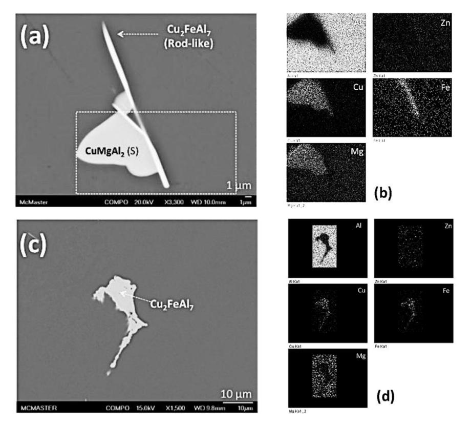

Fig. 15. SE-SEM images of Fe-bearing intermetallic phases in AA7050 CDS castings in T4 temper; the FeAl7Cu2/FeAl3 phases are found to be in two distinctively different morphologies: the rod or plate- or needle-like shapes in (a) and (b) and the bulky or irregular morphologies in (c) and (d).

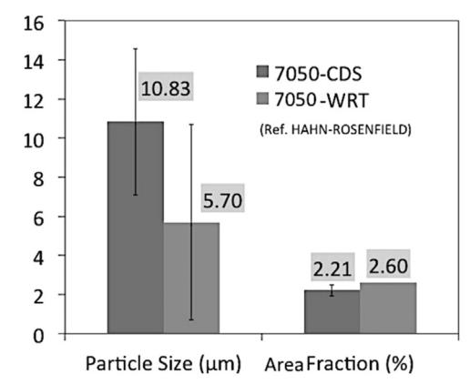

Fig. 16. Typical comparative bar graphs of particle size and area fraction of intermetallic phases between 7050 CDS and wrought condition [\[69\].](#page-11-1)

were fairly defect-free with the level of total porosity (shrinkage and gas) similar to those observed in the wrought products. It is notable that the size of the primary Al grains in the alloys cast using the CDS technology is similar to those of the recrystallized grains in the wrought products (~60 µm). The nature, size and distribution of the secondary phases and strengthening precipitate phases evolved during solidification and heat treatment of these alloys in this study is nearly the same as those observed in the wrought counterparts.

## Acknowledgements

The authors express their gratitude to the Natural Sciences and Engineering Research Council (NSERC) of Canada for their financial support through the Discovery Grant program. The authors also would like to thank CanmetMATERIALS, a division of Natural Resources Canada, for providing their characterization labs for this study. We also express special thanks to Dr. Kumar Sadayappan of CanmetMATERIALS for his guidance during this study. The primary author would also like to express his humble gratitude to Dr. Peyman Ashtari for the discussions and his editorial contribution towards this publication.

#### References

- [1] [I.J. Polmear, Light Alloys From Traditional Alloys to Nano-crystals, Fourth ed.,](http://refhub.elsevier.com/S0921-5093(17)30654-8/sbref1) [Butterworth-Heinemann is an imprint of Elsevier, Jordan Hill, Oxford, UK, 2006.](http://refhub.elsevier.com/S0921-5093(17)30654-8/sbref1)
- [2] R. Ghiaasiaan, X. Zeng, S. Shankar, Near net shaped casting of heat treatable Al-Zn-Mg-Cu wrought alloy by controlled diffusion solidification (CDS) process: microstructure, mechanical properties and heat treatment, Mater. Sci. and Tech. (MS & T) Conference, October 2013, Montreal, Quebec, Canada.
- [3] [R. Ghiaasiaan, X. Zeng, S. Shankar, Controlled di](http://refhub.elsevier.com/S0921-5093(17)30654-8/sbref2)ffusion solidification (CDS) of Al-[Zn-Mg-Cu \(7050\): microstructure, heat treatment and mechanical properties, Mat.](http://refhub.elsevier.com/S0921-5093(17)30654-8/sbref2) [Sci. Eng. A 594 \(2014\) 260](http://refhub.elsevier.com/S0921-5093(17)30654-8/sbref2)–277.
- [4] [S. Reza Ghiaasiaan, The Controlled Di](http://refhub.elsevier.com/S0921-5093(17)30654-8/sbref3)ffusion Solidification (CDS) of Al-7xxx Alloys, [Heat Treatments, Microstructure, and Mechanical Properties \(PhD Thesis\),](http://refhub.elsevier.com/S0921-5093(17)30654-8/sbref3) [McMaster University, Hamilton, Ontario, Canada, 2015.](http://refhub.elsevier.com/S0921-5093(17)30654-8/sbref3)
- [5] [G. Birsan, P. Ashtari, S. Shankar, Valid mould and process design to cast tensile and](http://refhub.elsevier.com/S0921-5093(17)30654-8/sbref4) [fatigue test bars in tilt pour casting process, Int. J. Cast. Met. Res. 24 \(6\) \(2011\)](http://refhub.elsevier.com/S0921-5093(17)30654-8/sbref4) 378–[384.](http://refhub.elsevier.com/S0921-5093(17)30654-8/sbref4)
- [6] [G. Birsan, Shaped Casting of Aluminum Wrought Alloys by Controlled Di](http://refhub.elsevier.com/S0921-5093(17)30654-8/sbref5)ffusion Solidifi[cation \(CDS\) in a Tilt-Pour Gravity Casting process \(Master Thesis\),](http://refhub.elsevier.com/S0921-5093(17)30654-8/sbref5) [Mechanical Engineering Department, McMaster University, Hamilton, Canada,](http://refhub.elsevier.com/S0921-5093(17)30654-8/sbref5) [2009.](http://refhub.elsevier.com/S0921-5093(17)30654-8/sbref5)
- [7] A.A. Khalaf, Controlled Diffusion Solidifi[cation: Process Mechanism and Parameter](http://refhub.elsevier.com/S0921-5093(17)30654-8/sbref6) [Study \(PhD Thesis\), McMaster University, Hamilton, ON, Canada, 2010.](http://refhub.elsevier.com/S0921-5093(17)30654-8/sbref6)
- [8] [A.A. Khalaf, P. Ashtari, S. Shankar, Formation of non-dendritic primary aluminum](http://refhub.elsevier.com/S0921-5093(17)30654-8/sbref7) [phase in hypoeutectic alloys in controlled di](http://refhub.elsevier.com/S0921-5093(17)30654-8/sbref7)ffusion solidification (CDS): a hypoth[esis, Metall. Mater. Trans. B 40B \(2009\) 843](http://refhub.elsevier.com/S0921-5093(17)30654-8/sbref7)–849.
- [9] [A.A. Khalaf, S. Shankar, Favorable environment for a non-dendritic morphology in](http://refhub.elsevier.com/S0921-5093(17)30654-8/sbref8) controlled diffusion solidifi[cation, Metall. Mater. Trans. A 42A \(2011\) 2456](http://refhub.elsevier.com/S0921-5093(17)30654-8/sbref8)–2465.
- [10] A.A. Khalaf, S. Shankar, Eff[ect of mixing rate on the morphology of primary Al](http://refhub.elsevier.com/S0921-5093(17)30654-8/sbref9) phase in the controlled diffusion solidifi[cation \(CDS\) process, J. Mater. Sci. 47](http://refhub.elsevier.com/S0921-5093(17)30654-8/sbref9) [\(2012\) 8153](http://refhub.elsevier.com/S0921-5093(17)30654-8/sbref9)–8166.
- [11] A. Deschamps, F. Livet, Y. Breâchet, Infl[uence of pre-deformation on ageing in an](http://refhub.elsevier.com/S0921-5093(17)30654-8/sbref10) [Al-Zn-Mg Alloy-I: microstructure evolution and mechanical properties, Acta Mater.](http://refhub.elsevier.com/S0921-5093(17)30654-8/sbref10) [47 \(1\) \(1999\) 281](http://refhub.elsevier.com/S0921-5093(17)30654-8/sbref10)–292.
- [12] A. Deschamps, Y. Breâchet, Influence [of pre-deformation and ageing of an Al-Zn-Mg](http://refhub.elsevier.com/S0921-5093(17)30654-8/sbref11) [Alloy-II: modeling of precipitation kinetics and yield stress, Acta Mater. 47 \(1\)](http://refhub.elsevier.com/S0921-5093(17)30654-8/sbref11)
- [\(1999\) 293](http://refhub.elsevier.com/S0921-5093(17)30654-8/sbref11)–305. [13] [M.J. Starink, S.C. Wang, A model for the yield strength of overaged Al](http://refhub.elsevier.com/S0921-5093(17)30654-8/sbref12)–Zn–Mg–Cu [Alloys, Acta Mater. 51 \(2003\) 5131](http://refhub.elsevier.com/S0921-5093(17)30654-8/sbref12)–5150.
- [14] [M. Dixit, R.S. Mishra, K.K. Sankaran, Structure](http://refhub.elsevier.com/S0921-5093(17)30654-8/sbref13)–property correlations in Al 7050 [and Al 7055 high-strength aluminum alloys, Mater. Sci. Eng. A 478 \(2008\)](http://refhub.elsevier.com/S0921-5093(17)30654-8/sbref13) 163–[172.](http://refhub.elsevier.com/S0921-5093(17)30654-8/sbref13)
- [15] [D. Godard, P. Archambault, E. Aeby-Gautier, G. Lapasset, Precipitation sequences](http://refhub.elsevier.com/S0921-5093(17)30654-8/sbref14) [during quenching of the AA 7010 alloy, Acta Mater. 50 \(2002\) 2319](http://refhub.elsevier.com/S0921-5093(17)30654-8/sbref14)–2329.
- [16] [F. Xie, X. Yan, L. Ding, F. Zhang, S. Chen, M.G. Chu, Y.A. Chang, A study of](http://refhub.elsevier.com/S0921-5093(17)30654-8/sbref15) [microstructure and micro segregation of aluminum 7050 alloy, Mater. Sci. Eng. A](http://refhub.elsevier.com/S0921-5093(17)30654-8/sbref15) [A355 \(2003\) 144](http://refhub.elsevier.com/S0921-5093(17)30654-8/sbref15)–153.
- [17] [L.F. Mondolfo, Structure of the aluminum: magnesium: zinc alloys, Metall. Rev. 95](http://refhub.elsevier.com/S0921-5093(17)30654-8/sbref16) [\(153\) \(1971\) 94](http://refhub.elsevier.com/S0921-5093(17)30654-8/sbref16)–124.
- [18] H. Loffl[er, I. Kovacs, J. Lendvai, Review decomposition processes in AI-Zn-Mg](http://refhub.elsevier.com/S0921-5093(17)30654-8/sbref17) [alloys, J. Mat. Sci. 18 \(1983\) 2215](http://refhub.elsevier.com/S0921-5093(17)30654-8/sbref17)–2240.
- [19] [J.D. Robson, Microstructural evolution in aluminum alloy 7050 during processing,](http://refhub.elsevier.com/S0921-5093(17)30654-8/sbref18) [Mat. Sci. Eng. A 382 \(2004\) 112](http://refhub.elsevier.com/S0921-5093(17)30654-8/sbref18)–121.
- [20] [J.D. Robson, P.B. Prangnell, Dispersoid precipitation and process modeling in](http://refhub.elsevier.com/S0921-5093(17)30654-8/sbref19) [zirconium containing commercial aluminium alloys, Acta Mater. 49 \(2001\)](http://refhub.elsevier.com/S0921-5093(17)30654-8/sbref19) 599–[613.](http://refhub.elsevier.com/S0921-5093(17)30654-8/sbref19)
- [21] [J.Q. Su, T.W. Nelson, R. Mishra, M. Mahoney, Microstructural investigation of](http://refhub.elsevier.com/S0921-5093(17)30654-8/sbref20) [friction stir welded 7050-T651 aluminum, Acta Mater. 51 \(2003\) 713](http://refhub.elsevier.com/S0921-5093(17)30654-8/sbref20)–729.
- [22] [X.Z. Li, V. Hansen, J. Gjønnes, L.R. Wallenberg, HREM study and structure](http://refhub.elsevier.com/S0921-5093(17)30654-8/sbref21) modeling of the η′ [phase, the hardening precipitates in commercial Al](http://refhub.elsevier.com/S0921-5093(17)30654-8/sbref21)–Zn–Mg [alloys, Acta Mater. 47 \(1999\) 2651](http://refhub.elsevier.com/S0921-5093(17)30654-8/sbref21)–2659.
- [23] [L.K. Berg, J. Gjønnes, V. Hansen, X.Z. Li, M. Knutson-Wedel, G. Waterloo,](http://refhub.elsevier.com/S0921-5093(17)30654-8/sbref22) [D. Schryvers, L.R. Wallenberg, GP-zones in Al](http://refhub.elsevier.com/S0921-5093(17)30654-8/sbref22)–Zn–Mg alloys and their role in artifi[cial aging, Acta Mater. 49 \(2001\) 3443](http://refhub.elsevier.com/S0921-5093(17)30654-8/sbref22)–3451.
- [24] [A. Guinier, Compte Rend. 206 \(1938\) 164.](http://refhub.elsevier.com/S0921-5093(17)30654-8/sbref23)
- [25] G.D. [Preston, Proc. R. Soc. A 167 \(1938\) 526.](http://refhub.elsevier.com/S0921-5093(17)30654-8/sbref24)
- [26] [H. Schmalzried, V. Gerold, Z. Met. 49 \(1954\) 291.](http://refhub.elsevier.com/S0921-5093(17)30654-8/sbref25)
- [27] [J. Gjønnes, J, C.H.R.C. Simensen, An electron microscope investigation of the](http://refhub.elsevier.com/S0921-5093(17)30654-8/sbref26) [microstructure in an aluminium-zinc-magnesium alloy, Acta Metal. 18 \(1970\)](http://refhub.elsevier.com/S0921-5093(17)30654-8/sbref26) 881–[890.](http://refhub.elsevier.com/S0921-5093(17)30654-8/sbref26)
- [28] [J.D. Embury, R.B. Nicholson, The nucleation of precipitates: the system Al-Zn-Mg,](http://refhub.elsevier.com/S0921-5093(17)30654-8/sbref27) [Acta Metal. 13 \(1965\) 403](http://refhub.elsevier.com/S0921-5093(17)30654-8/sbref27)–417.
- [29] [A.K. Mukhopadhyay, Guinier-Preston zones in a high-purity Al-Zn-Mg alloy, Philos.](http://refhub.elsevier.com/S0921-5093(17)30654-8/sbref28) [Mag. Lett. 70 \(1994\) 135](http://refhub.elsevier.com/S0921-5093(17)30654-8/sbref28)–140.
- [30] [K. Stiller, P.J. Warren, V. Hansen, J. Angenete, J. Gjønnes, Investigation of](http://refhub.elsevier.com/S0921-5093(17)30654-8/sbref29) precipitation in an Al–Zn–[Mg alloy after two-step ageing treatment at 100 and](http://refhub.elsevier.com/S0921-5093(17)30654-8/sbref29) [150C, Mat. Sci. Eng. A A270 \(1999\) 55](http://refhub.elsevier.com/S0921-5093(17)30654-8/sbref29)–63.
- [31] [T. Engdahl, V. Hansen, P.J. Warren, K. Stiller, Investigation of](http://refhub.elsevier.com/S0921-5093(17)30654-8/sbref30) fine scale precipitates in Al–Zn–[Mg alloys after various heat treatments, Mat. Sci. Eng. A A327 \(2002\)](http://refhub.elsevier.com/S0921-5093(17)30654-8/sbref30) 59–[64.](http://refhub.elsevier.com/S0921-5093(17)30654-8/sbref30)

- [32] A.A. Khalaf, Controlled Diffusion Solidifi[cation: Process Mechanism and Parameter](http://refhub.elsevier.com/S0921-5093(17)30654-8/sbref31) [Study \(PhD Thesis\), McMaster University, Hamilton, ON, Canada, 2010.](http://refhub.elsevier.com/S0921-5093(17)30654-8/sbref31)
- [33] [A.A. Khalaf, P. Ashtari, S. Shankar, Formation of non-dendritic primary Al phase in](http://refhub.elsevier.com/S0921-5093(17)30654-8/sbref32) [hypoeutectic alloys in CDS: a hypothesis, Metall. Mater. Trans. B 40B \(2009\)](http://refhub.elsevier.com/S0921-5093(17)30654-8/sbref32) 843–[849.](http://refhub.elsevier.com/S0921-5093(17)30654-8/sbref32)
- [34] N.E. Mazibuko, U.A. Curle, Eff[ect of solution heat treatment time on a rheocast Al-](http://refhub.elsevier.com/S0921-5093(17)30654-8/sbref33)[Zn-Mg-Cu alloy, Mat. Sci. Forum 690 \(2011\) 343](http://refhub.elsevier.com/S0921-5093(17)30654-8/sbref33)–346.
- [35] [J.E. Hatch, Aluminum Properties and Physical Metallurgy, American Society](http://refhub.elsevier.com/S0921-5093(17)30654-8/sbref34) [forMetals \(ASM\), First Printing, Ohio, 1984.](http://refhub.elsevier.com/S0921-5093(17)30654-8/sbref34)
- [36] G.A. Botton, G. L′[esperance, C.E. Gallerneault, M.D. Ball, Volume fraction mea](http://refhub.elsevier.com/S0921-5093(17)30654-8/sbref35)[surement of dispersoids in a thin foil by parallel energy-loss spectroscopy:](http://refhub.elsevier.com/S0921-5093(17)30654-8/sbref35) [development and assessment of the technique, J. Microsc. 180 \(1995\) 217](http://refhub.elsevier.com/S0921-5093(17)30654-8/sbref35)–229.
- [37] [T. Malis, S.C. Cheng, R.F. Egerton, EELS log-ratio technique for specimen-thickness](http://refhub.elsevier.com/S0921-5093(17)30654-8/sbref36) [measurement in the TEM, Microsc. Res. Tech. 8 \(2\) \(1988\) 193](http://refhub.elsevier.com/S0921-5093(17)30654-8/sbref36)–200.
- [38] G.E. Dieter, Mechanical metallurgy, in: Metallurgical Fundamentals, and Dislocation Theory, McGraw Hill Book Company (UK) limited, London, UK, 1988, pp. 148.
- [39] [M.J. Starink, S.C. Wang, A model for the yield strength of over-aged Al](http://refhub.elsevier.com/S0921-5093(17)30654-8/sbref37)–Zn–Mg–Cu alloys, [Acta Mater. 51 \(2003\) 5131](http://refhub.elsevier.com/S0921-5093(17)30654-8/sbref37)–5150.
- [40] [U.F. Kocks, The theory of an obstacle-controlled yield strength](http://refhub.elsevier.com/S0921-5093(17)30654-8/sbref38)—report after an [international workshop, Mat. Sci. Eng. 27 \(1977\) 291](http://refhub.elsevier.com/S0921-5093(17)30654-8/sbref38)–298.
- [41] [G. Sha, A. Cerezo, Early-stage precipitation in Al](http://refhub.elsevier.com/S0921-5093(17)30654-8/sbref39)–Zn–Mg–Cu alloy (7050), Acta [Mater. 52 \(2004\) 4503](http://refhub.elsevier.com/S0921-5093(17)30654-8/sbref39)–4516.
- [42] [G. Sha, Y.B. Wang, X.Z. Liao, Z.C. Duan, S.P. Ringer, T.G. Langdon, In](http://refhub.elsevier.com/S0921-5093(17)30654-8/sbref40)fluence of [equal-channel angular pressing on precipitation in an Al](http://refhub.elsevier.com/S0921-5093(17)30654-8/sbref40)–Zn–Mg–Cu alloy, Acta [Mater. 57 \(10\) \(2009\) 3123](http://refhub.elsevier.com/S0921-5093(17)30654-8/sbref40)–3132.
- [43] [V.V. RavikumarS, Kumaran, Improved strength and ductility of high alloy](http://refhub.elsevier.com/S0921-5093(17)30654-8/sbref41) containing Al–12Zn–3Mg–[2.5Cu alloy by combining non-isothermal step rolling](http://refhub.elsevier.com/S0921-5093(17)30654-8/sbref41) [and cold rolling, Int, J. Miner. Metall. Mater. 24 \(2\) \(2017\) 179](http://refhub.elsevier.com/S0921-5093(17)30654-8/sbref41)–185.
- [44] [X.J. jiang, B. Noble, B. Holme, G. Waterloo, J. Tafto, Di](http://refhub.elsevier.com/S0921-5093(17)30654-8/sbref42)fferential scanning calorimetry and electron diff[raction investigation on low-temperature aging in Al-](http://refhub.elsevier.com/S0921-5093(17)30654-8/sbref42)[Zn-Mg alloys, Met Trans. A 31A \(2000\) 339](http://refhub.elsevier.com/S0921-5093(17)30654-8/sbref42)–348.
- [45] [X.J. jiang, B. Noble, V. Hansen, G. Waterloo, J. Tafto, In](http://refhub.elsevier.com/S0921-5093(17)30654-8/sbref43)fluence of zirconium and [copper on the early stages of aging in Al-Zn-Mg alloys, Metall. Trans. A 32A \(2001\)](http://refhub.elsevier.com/S0921-5093(17)30654-8/sbref43) 1063–[1073.](http://refhub.elsevier.com/S0921-5093(17)30654-8/sbref43)
- [46] [Fulin Jiang, Hatem S. Zurob, Gary R. Purdy, Hui Zhang, Characterizing precipitate](http://refhub.elsevier.com/S0921-5093(17)30654-8/sbref44) evolution of an Al–Zn–Mg–[Cu-based commercial alloy during arti](http://refhub.elsevier.com/S0921-5093(17)30654-8/sbref44)ficial aging and [non-isothermal heat treatments by in situ electrical resistivity monitoring, Mater.](http://refhub.elsevier.com/S0921-5093(17)30654-8/sbref44) [Charact. 117 \(2016\) 47](http://refhub.elsevier.com/S0921-5093(17)30654-8/sbref44)–56.
- [47] [A.C. Umamaheshwer Rao, V. Vasu, M. Govindaraju, K.V. Sai Srinadh, Stress](http://refhub.elsevier.com/S0921-5093(17)30654-8/sbref45) [corrosion cracking behaviour of 7xxx aluminum alloys: a literature review, Trans.](http://refhub.elsevier.com/S0921-5093(17)30654-8/sbref45) [Nonferrous Met. Soc. China 26 \(6\) \(2016\) 1447](http://refhub.elsevier.com/S0921-5093(17)30654-8/sbref45)–1471.
- [48] [L.K. Berg, J. Gjønnes, V. Hansen, X.Z. Li, M. Knutson-Wedel, G. Waterloo,](http://refhub.elsevier.com/S0921-5093(17)30654-8/sbref46) [D. Schryvers, L.R. Wallenberg, GP-zones in Al](http://refhub.elsevier.com/S0921-5093(17)30654-8/sbref46)–Zn–Mg alloys and their role in artifi[cial aging, Acta Mater. 49 \(2001\) 3443](http://refhub.elsevier.com/S0921-5093(17)30654-8/sbref46)–3451.
- [49] [Tae-Young Ahn, Jae-Gil Jung, Eun-Ji Baek, Seong Sik Hwang, Kwangjun Euh,](http://refhub.elsevier.com/S0921-5093(17)30654-8/sbref47) [Temporal evolution of precipitates in multicomponent](http://refhub.elsevier.com/S0921-5093(17)30654-8/sbref47) Al–6Mg–9Si–10Cu–10Zn–[3Ni alloy studied by complementary experimental meth](http://refhub.elsevier.com/S0921-5093(17)30654-8/sbref47)[ods, J. Alloy. Compd. 701 \(15\) \(2017\) 660](http://refhub.elsevier.com/S0921-5093(17)30654-8/sbref47)–668.
- [50] [Xiaoyan Peng, Qi Guo, Xiaopeng Liang, Ying Deng, Yi Gu, Guofu Xu, Zhimin Yin,](http://refhub.elsevier.com/S0921-5093(17)30654-8/sbref48) [Mechanical properties, corrosion behavior and microstructures of a non-isothermal](http://refhub.elsevier.com/S0921-5093(17)30654-8/sbref48) [ageing treated Al-Zn-Mg-Cu alloy, Mater. Sci. Eng. A 688 \(14\) \(2017\) 146](http://refhub.elsevier.com/S0921-5093(17)30654-8/sbref48)–154.
- [51] [Xuesong Xu, Jingxu Zheng, Zhi Li, Ruichun Luo, Bin Chen, Precipitation in an Al-](http://refhub.elsevier.com/S0921-5093(17)30654-8/sbref49)[Zn-Mg-Cu alloy during isothermal aging: atomic-scale HAADF-STEM investigation,](http://refhub.elsevier.com/S0921-5093(17)30654-8/sbref49) [Mater. Sci. Eng. A 691 \(13\) \(2017\) 60](http://refhub.elsevier.com/S0921-5093(17)30654-8/sbref49)–70.
- [52] [D.B. Williams, C.B. Carter, Transmission Electron Microscopy: a Textbook for](http://refhub.elsevier.com/S0921-5093(17)30654-8/sbref50) [Material Science III, Plenum Press, New York, 1996, pp. 444](http://refhub.elsevier.com/S0921-5093(17)30654-8/sbref50)–450.
- [53] [D. Su, Y. Zhu, Scanning moiré fringe imaging by scanning transmission electron](http://refhub.elsevier.com/S0921-5093(17)30654-8/sbref51) [microscopy, Ultramicroscopy 110](http://refhub.elsevier.com/S0921-5093(17)30654-8/sbref51)–3 (2010) 229–233.
- [54] [R.W. Gould, E.A. Starke, Adv. X-Ray Anal. 9 \(1966\) 59](http://refhub.elsevier.com/S0921-5093(17)30654-8/sbref52)–73.
- [55] [N.Q. Chinh, J. Lendvai, D.H. Ping, K. Hono, The e](http://refhub.elsevier.com/S0921-5093(17)30654-8/sbref53)ffect of Cu on mechanical and precipitation properties of Al–Zn–[Mg alloys, J. Alloy. Compd. 378 \(2004\) 52](http://refhub.elsevier.com/S0921-5093(17)30654-8/sbref53)–60.
- [56] [Guo-sheng Peng, Kang-hua Chen, Song-yi Chen, Hua-chan Fang, In](http://refhub.elsevier.com/S0921-5093(17)30654-8/sbref54)fluence of dual [retrogression and re-aging temper on microstructure, strength and exfoliation](http://refhub.elsevier.com/S0921-5093(17)30654-8/sbref54) corrosion behavior of Al–Zn–Mg–[Cu alloy, Trans. Nonferrous Met. Soc. China 22 \(4\)](http://refhub.elsevier.com/S0921-5093(17)30654-8/sbref54) [\(2012\) 803](http://refhub.elsevier.com/S0921-5093(17)30654-8/sbref54)–809.
- [57] [Mahmoud Cheminguia, Mohamed Khitounia, Karol Jozwiakb,](http://refhub.elsevier.com/S0921-5093(17)30654-8/sbref55) [G.érard Mesmacquec, Abdelwaheb Kolsia, Characterization of the mechanical](http://refhub.elsevier.com/S0921-5093(17)30654-8/sbref55) properties changes in an Al–Zn–[Mg alloy after a two-step ageing treatment at 70°](http://refhub.elsevier.com/S0921-5093(17)30654-8/sbref55) [and 135 °C, Mater. Des. 31 \(6\) \(2010\) 3134](http://refhub.elsevier.com/S0921-5093(17)30654-8/sbref55)–3139.
- [58] [Yan-Ping Xiao, Qing-Lin Pan, Wen-Bin Li, Xiao-Yan Liu, Yun-Bin He, In](http://refhub.elsevier.com/S0921-5093(17)30654-8/sbref56)fluence of [retrogression and re-aging treatment on corrosion behavior of an Al](http://refhub.elsevier.com/S0921-5093(17)30654-8/sbref56)–Zn–Mg–Cu [alloy, Mater. Des. 32 \(4\) \(2011\) 2149](http://refhub.elsevier.com/S0921-5093(17)30654-8/sbref56)–2156.
- [59] [Myriam Nicolas, Alexis Deschamps, Characterization and modeling of precipitate](http://refhub.elsevier.com/S0921-5093(17)30654-8/sbref57) evolution in an Al–Zn–[Mg alloy during non-isothermal heat treatments, Acta Mater.](http://refhub.elsevier.com/S0921-5093(17)30654-8/sbref57) [51 \(2003\) 6077](http://refhub.elsevier.com/S0921-5093(17)30654-8/sbref57)–6094.
- [60] D.A. Porter, K.E. Easterling, Phase transformations in metals and alloys, in: Diffusion Transformation in Solids and Precipitation in Age-hardening Alloys, 1st ed., Von Nostard Reinhold Company, New York, USA, 1981, pp. 314–316.
- [61] [Lorenz Ratke, Peter W. Voorhees, Growth and Coarsening: Ostwald Ripening in](http://refhub.elsevier.com/S0921-5093(17)30654-8/sbref58) [Material Processing, Springer, Berlin, Germany, 2001.](http://refhub.elsevier.com/S0921-5093(17)30654-8/sbref58)
- [62] [A. Baldan, Review, progress in Ostwald ripening theories and their applications to](http://refhub.elsevier.com/S0921-5093(17)30654-8/sbref59) [nickel-base super alloys, Part I: ostwald ripening theories, J. Mater. Sci. 37 \(2002\)](http://refhub.elsevier.com/S0921-5093(17)30654-8/sbref59) 2171–[2202.](http://refhub.elsevier.com/S0921-5093(17)30654-8/sbref59)
- [63] [D.A. Porter, K.E. Easterling, Phase Transformations in Metals And Alloys, 1st ed.,](http://refhub.elsevier.com/S0921-5093(17)30654-8/sbref60) [Von Nostard Reinhold Company, New York, USA, 1981, p. 152.](http://refhub.elsevier.com/S0921-5093(17)30654-8/sbref60)

- [64] [William D. Calister, Jr. David G. Rethwisch, Material Science and Engineering: An](http://refhub.elsevier.com/S0921-5093(17)30654-8/sbref61) [Introduction, 8th ed., John & Wiley, USA, 2010.](http://refhub.elsevier.com/S0921-5093(17)30654-8/sbref61)
- [65] [T. Takahashi, Y. Minamino, T. Yamane, Quaternary di](http://refhub.elsevier.com/S0921-5093(17)30654-8/sbref62)ffusion in 7000 aluminum [alloys, Mater. Trans. 43 \(2\) \(2002\) 232](http://refhub.elsevier.com/S0921-5093(17)30654-8/sbref62)–238.
- [66] [C.C. Kammerer, N.S. Kulkarni, B. Warmack, Y.H. Sohn, Interdi](http://refhub.elsevier.com/S0921-5093(17)30654-8/sbref63)ffusion in ternary [magnesium solid solutions of aluminum and zinc, J. Phase Equilibria Di](http://refhub.elsevier.com/S0921-5093(17)30654-8/sbref63)ffus. (2016).
- [67] H.R. Shercliff[, M.F. Ashby, A process model for age hardening of aluminum alloys](http://refhub.elsevier.com/S0921-5093(17)30654-8/sbref64)–I. [The model, Acta Metall. Mater. 38 \(10\) \(1990\) 1789](http://refhub.elsevier.com/S0921-5093(17)30654-8/sbref64)–1802.
- [68] H.R. Shercliff[, M.F. Ashby, A process model for age hardening of aluminum alloys](http://refhub.elsevier.com/S0921-5093(17)30654-8/sbref65) [II. Applications of the model, Acta Metal. Mater. 38 \(10\) \(1990\) 1803](http://refhub.elsevier.com/S0921-5093(17)30654-8/sbref65)–1812.
- [69] G.T. Hahn, A.R. Rosenfield, Metallurgical factors aff[ecting fracture toughness of](http://refhub.elsevier.com/S0921-5093(17)30654-8/sbref66) [aluminum alloys, Met. Trans. A 6A \(1975\) 653](http://refhub.elsevier.com/S0921-5093(17)30654-8/sbref66)–668.
- [70] [M. Lalpoora, D.G. Eskina, L. Katgerman, Fracture behavior and mechanical](http://refhub.elsevier.com/S0921-5093(17)30654-8/sbref67) [properties of high strength aluminum alloys in the as-cast condition](http://refhub.elsevier.com/S0921-5093(17)30654-8/sbref67)", Mater. Sci. [Eng. A 497A \(2008\) 186](http://refhub.elsevier.com/S0921-5093(17)30654-8/sbref67)–194.