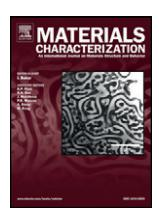
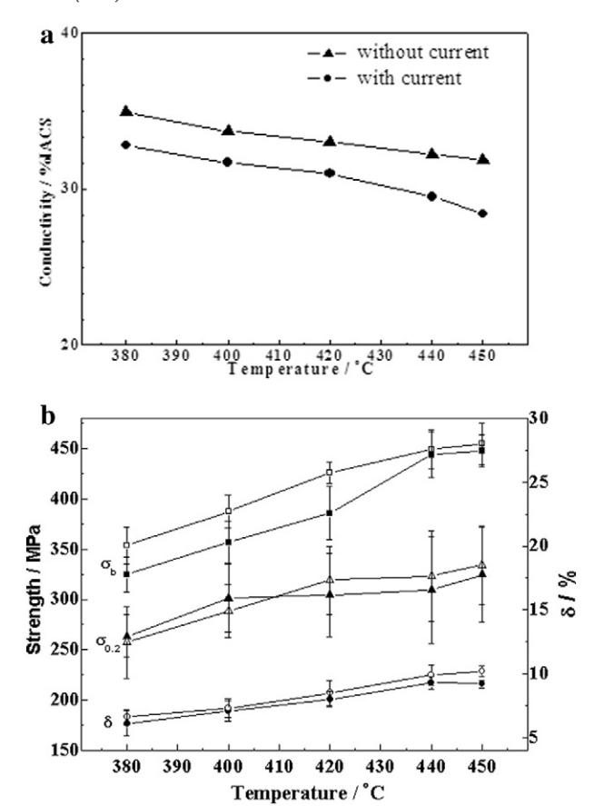
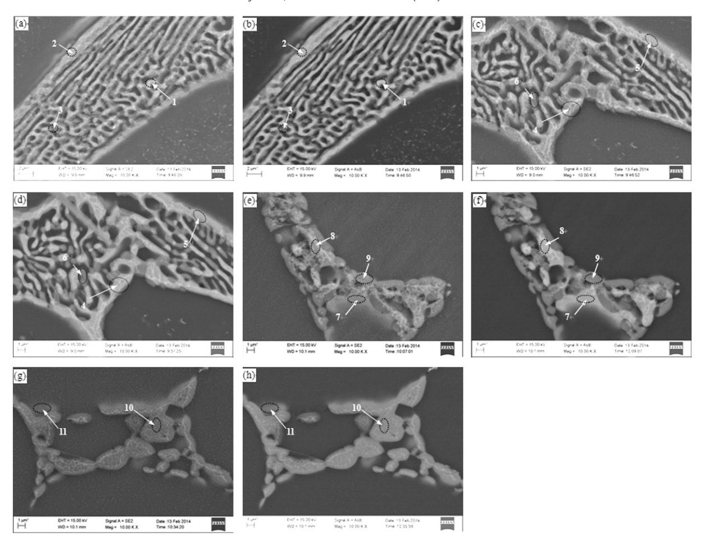
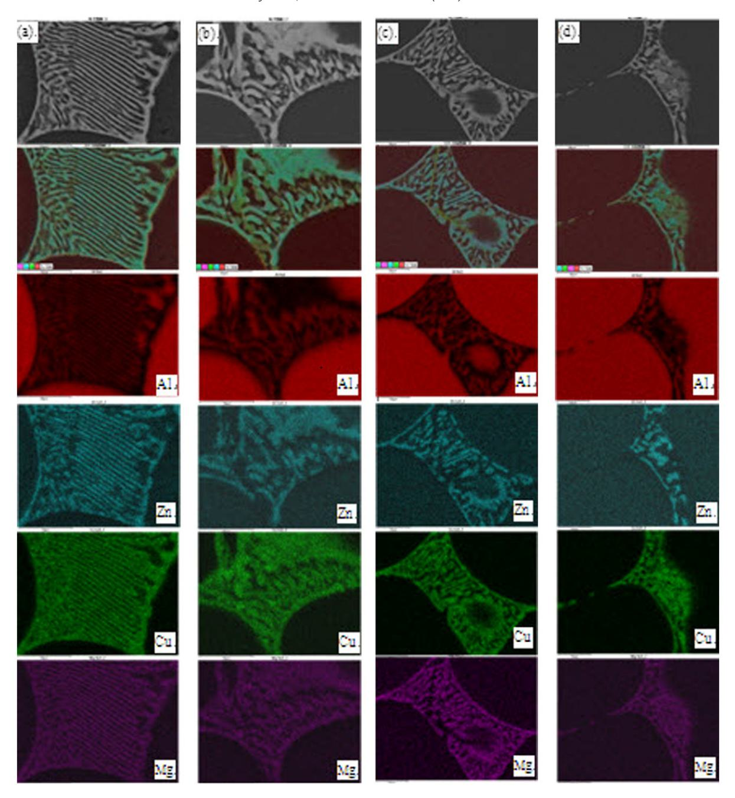
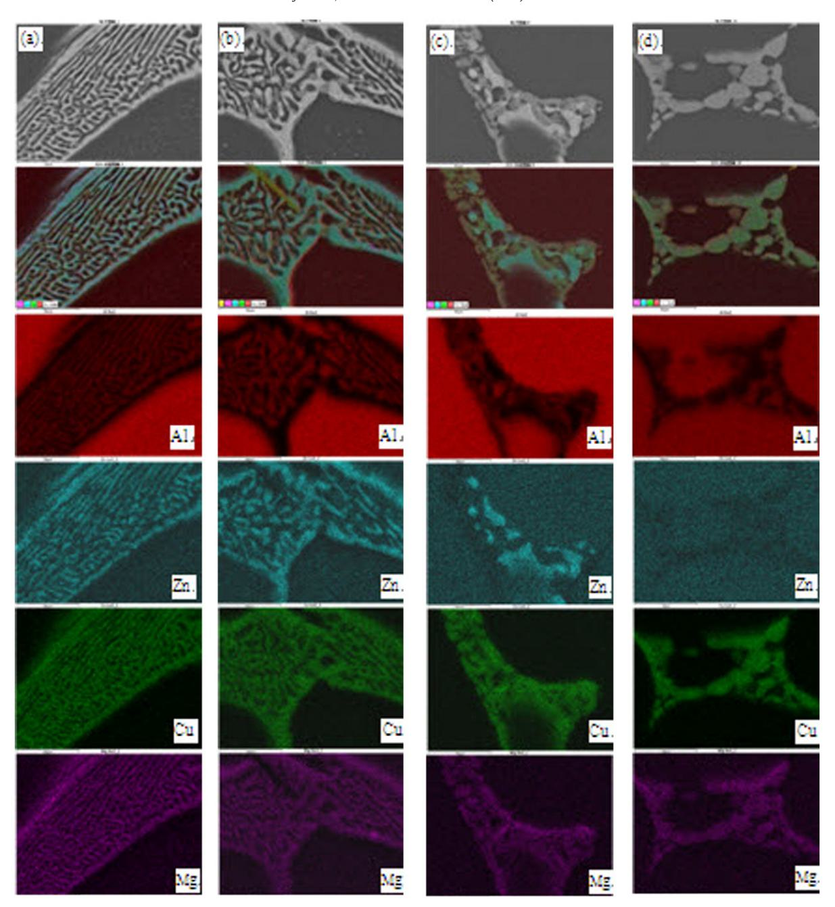
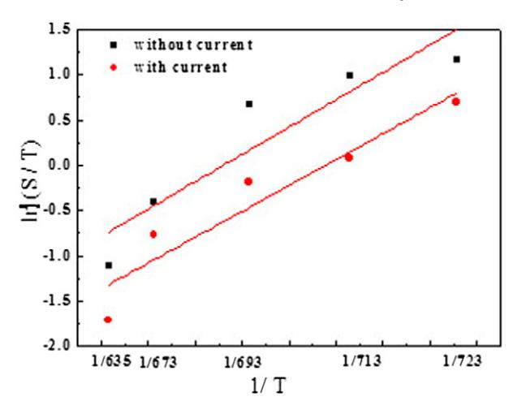

# Materials Characterization

journal homepage: www.elsevier.com/locate/matchar

# Effects of d.c. current on the phase transformation in 7050 alloy during homogenization

P.F. Jia, Y.H. Cao, Y.D. Geng, L.Z. He ⁎, N. Xiao, J.Z. Cui

Key Lab of Electromagnetic Processing of Materials, Ministry of Education, Northeastern University, Shenyang 110819, China

#### article info abstract

Article history: Received 2 April 2014 Received in revised form 5 July 2014 Accepted 12 July 2014 Available online 15 July 2014

Keywords: 7050 alloy Direct electric current Homogenization Properties Phase transformation

Evolutions of properties and morphologies of secondary phases in 7050 alloy homogenized with direct electric current were studied in detail by conductivity measurement, tensile test and energy dispersive X-ray microanalysis. With increasing temperature, the conductivity decreases, and while the ultimate tensile strength, yield strength and elongation of 7050 alloy increase in alloy homogenized with direct electric current, and reaches the saturation values at 440 °C/2 h. During homogenization, the brighter white AlZnMgCu phase having (weight ratio %) 12.1–15.2Mg, 27.2–32.1Al, 20.9–26.2Cu and 31.4–34.4Zn gradually transforms to the gray phase having (weight ratio %) 10.3–15.1Mg, 41.4–53.7Al, 22.9–35.2Cu and 5.8–13.1Zn and then to the dark gray phase having (weight ratio %) 10.6–14.2 Mg, 38.2–54.9Al, 23.3–44Cu, and 3.6–9.2Zn. With the application of direct electric current, the elemental diffusion network becomes profuse, the amount of gray phase increases, the diffusion of Zn accelerates, the apparent activation of the transformation from AlZnMgCu to Al2MgCu decreases from 125.52 kJ/mol for the alloy homogenized without direct electric current to 118.82 kJ/mol, and the area fraction of secondary phase decreases by 38% at 450 °C.

© 2014 Elsevier Inc. All rights reserved.

#### 1. Introduction

7050 Alloy has high strength and fracture toughness, low density and good corrosion resistance, and is widely used in aerospace industries [\[1\].](#page-5-0) The attractive combination of properties of 7050 alloy is attributed to its high ratios of Zn/Mg, Cu/Mg and alloying element content, which in turn leads to the difficulty of processing the alloy. The commonly observed secondary phases in as-cast Al–Zn–Mg–Cu alloy are η (MgZn2), T (Al2Mg3Zn3) or T (Al32(Mg,Zn)49), M (Mg(Zn2AlCu)), S (Al2MgCu) and A17Cu2Fe [\[2](#page-5-0)–5]. The type and intrinsic characteristics of secondary phases are decided by the alloy composition, solidification manner and heat treatment condition. Many constituents remain in the alloy after subsequent homogenization and processing [6–[11\],](#page-5-0) owing to the proximity of composition to the limit of solid solubility in these alloys, which can deteriorate the age hardenability, aid crack initiation and propagation and cause variable properties. A phase transformation of primary particle from Mg(Zn,Cu,Al)2 phase to Al2CuMg phase was found in Al–Zn–Mg–Cu alloy homogenized at 460 °C [\[9\]](#page-5-0). Chen et al. [\[10\]](#page-5-0) revealed that η phase dissolved completely and T and S phases remained in 7055 alloy after pretreatment at 450 °C for 35 h.

The electric and magnetic fields, as the effective external fields, were verified to have effects on ferromagnetic and non-ferromagnetic materials, and provide us new approaches to material preparations and property controls. Many works investigated the influences of the electric and magnetic fields on the phase transformations in metals and alloys including: (1) phase stability [\[12,13\],](#page-5-0) (2) phase morphology [\[14,15\],](#page-5-0) (3) grain refinement [\[16\],](#page-5-0) (4) the formation and growth of intermetallic compound by interfacial diffusion reactions [\[17](#page-5-0)–19], (5) recrystallization [\[20](#page-5-0)–26], (6) phase dissolution during homogenization [\[7,](#page-5-0) 27–[29\],](#page-5-0) and (7) phase precipitation during aging [30–[32\].](#page-5-0) X. T. Liu et al. [\[19\]](#page-5-0)found that the alternating magnetic field accelerated the nucleation and growth of intermetallic compounds in Al–Cu diffusion couple. Conrad and his coworkers [\[24](#page-5-0)–26] discovered that a high density (~105 A/cm2 ) d.c. electric current pulse (~100 μs duration) significantly accelerated the recrystallization process of the cold worked Cu, Al and Ni3Al during annealing. The magnitude of the effects of electro-pulse on the recrystallization depended on the alloy impurity level and the cold work degree. Molodov et al. [\[21,22\]](#page-5-0) found that the recrystallization incubation time significantly decreased in cold-rolled 3103 alloy by applying a 17 T high magnetic field. The high magnetic field of 12 T could promote the dissolution both T and S in Al–Zn–Mg–Cu alloy during homogenization [\[7,8\].](#page-5-0) Zhou et al. [\[27\]](#page-5-0) found that the electric field promoted the transformation of S phase from type I to type II. W. Liu et al. [\[28,30\]](#page-5-0) found that the electric field accelerated the dissolution of secondary phase and the removal of interdendritic segregation during homogenization, and even suppressed the nucleation of δ′ phase during artificial aging. In the present work, evolutions of the conductivity, tensile properties and chemical composition of secondary phase during

⁎ Corresponding author. E-mail address: [helizi@epm.neu.edu.cn](mailto:helizi@epm.neu.edu.cn) (L.Z. He).

homogenization with application of d.c. current density of 250 A/cm2 were studied in detail by FESEM and EDS. The aim is to provide an efficient way for the heat treatment of Al–Zn–Mg–Cu alloy in situ production.

#### 2. Experimental

The composition of 7050 alloy used in this work is (wt.%) Al–6.4Zn– 2.22Mg–2.24Cu–0.11Zr–0.04Si–0.08Fe–0.10Mn–0.04Cr–0.05Ni–0.06Ti, and was produced by semi-continuous cast with the ingot size of 400 mm × 1400 mm. Five types of homogenization conditions were conducted without or with applying d.c. current: (1) 380 °C/2 h, (2) 400 °C/2 h, (3) 420 °C/2 h, (4) 440 °C/2 h and (5) 450 °C/2 h, and followed by air cooling. Samples with size of 10 mm × 20 mm × 580 mm were placed at the center of the rectangular heating chamber. A stable d.c. current with density of 250 A/cm2 was applied during homogenization. The heating rate is 5 °C/min. A wind blowing device was used to maintain the temperature variation of sample within ±3 °C.

The conductivity of alloy at each condition was determined by the measurements of five specimens using a Fischer Sigmascope SMP10 type machine. Tensile specimens with a gauge diameter of 8 mm and a length of 30 mm were machined from the homogenized rods, and then tensile tested at room temperature using a universal testing instrument SHIMADZU AG-X 100 kN operating at a constant crosshead speed of 1.0 mm/min. The tensile properties at each condition were the average value of four specimens.

Samples for microstructural observations were prepared by the standard metallographic methods and examined on Zeiss Ultra Plus 60 type Field Emission Scanning Electron Microscopy (FESEM) equipped with an Oxford AZTEC 50 type energy dispersive X-ray analyzer. The area fraction of secondary phase in as-cast alloy and the alloy homogenized at different temperatures was measured by the average of fifteen SEM photographs, and was calculated using ImageJ software.

## 3. Results and Discussion

### 3.1. Evolutions of Properties During Homogenization with d.c. Current

The properties of 7050 alloy homogenized without or with d.c. current are shown in Fig. 1. The conductivity of as-cast alloy is 44.9% IACS, and decreases by 6% after the as-cast alloy is homogenized at 380 °C/2 h with d.c. current, and then decreases gradually with increasing temperature, and finally reaches a stable value at 440 °C/2 h (Fig. 1a). The conductivity is lower than those of the alloy homogenized without d.c. current at the same temperature. The ultimate tensile strength, yield strength and elongation of as-cast alloy are 311.4 MPa, 247 MPa, and 4.1%, respectively, and increase by 12%, 3.9% and 38%, respectively, when the as-cast alloy is homogenized at 380 °C/2 h with application of d.c. current, and then increase gradually with increasing temperature, and finally reach the saturation values at 440 °C/2 h (Fig. 1b). The ultimate tensile strength, yield strength and elongation are higher than those of alloy homogenized without d.c. current at the same temperature.

## 3.2. Evolutions of Secondary Phases During Homogenization with d.c. Current

The typical as-cast microstructure of 7050 alloy consists of a cored dendritic structure of primary α(Al) surrounded by interdendritic secondary phases [\[33\]](#page-5-0). The secondary phases in as-cast alloy normally contain α(Al), T, S and Al7Cu2Fe identified by XRD and EDS analysis. The quaternary phase T has the stoichiometry of Al4Mg2ZnCu and Al3Mg3 Zn2Cu2, and contains (wt.%) 13–18.2 Mg, 25–41Al, 17.4–25.1Cu and 26–31.7Zn. S phase with a quite small amount has a composition of (wt.%) 11.6 Mg, 46.8Al, 38.7Cu and 2.9Zn. During conventional homogenization, the region within T phase having much lower Cu, Mg and Zn

Fig. 1. The properties of alloy homogenized with d.c. current: (a) conductivity; (b) tensile properties. Solid symbols are for samples homogenized without d.c current, hollow symbols are for samples homogenized with d.c. current.

contents dissolves into the matrix. At the same time, the elemental diffusion cell network appears due to the diffusion of Zn from the light gray cell interior to the white cell wall, with the same Mg and Cu contents as those of T phase [\[33\]](#page-5-0). With increasing temperature, the network becomes fading when the light gray cell interior transforms to gray phase and then to the dark gray phase, and finally disappears when the composition of the dark gray phase approaches to the equilibrium S phase.

SEM images ([Fig. 2](#page-2-0)) display the changes in the morphologies of secondary phase in the alloy homogenized at different temperatures with d.c. current. The brighter white cell networks are clearly observed within T phase in the secondary electron images [\(Fig. 2](#page-2-0)a, c, e and g), which are formed by the elemental diffusion during the transformation from T to S and also observed in alloy homogenized without d.c. current [\[33\]](#page-5-0). It should be noted that the networks are more than those in alloy homogenized without d.c. current at the same temperature. The secondary phases having white or different gray level contrasts are seen in the backscattered electron images [\(Fig. 2b](#page-2-0), d, f and h). With increasing temperature, the amount and the size of white phase decrease, while the amount of gray phase increases. The gray phase becomes coarse when the temperature is ≥420 °C. The amount of the gray phase is higher than that in alloy homogenized without d.c. current at the same temperature.

The changes of the compositions of the phases within T phase (according to the contrast: brighter white, gray and dark gray) with temperature in alloy homogenized with d.c. current are given in [Table 1](#page-2-0). The brighter white phase normally contains (wt.%) 12.1–15.2Mg, 27.2–32.1Al, 20.9–26.2Cu and 31.4–34.4Zn, and its composition changes little at different temperatures, and is the same as that of T phase (wt.%: 13–18.2Mg,

Fig. 2. FESEM backscattered electron images of 7050 alloy homogenized without and with d.c. current: (a) and (b) 380 °C/2 h; (c) and (d) 420 °C/2 h; (e) and (f) 440 °C/2 h; and (g) and (h) 450 °C/2 h.

25–41Al, 17.4–25.1Cu and 26–31.7Zn) in as-cast and the alloy homogenized without d.c. current. The composition of T phase reported in literatures generally falls: (wt.%) 19.1–35Mg, 15.3–27.2Al, 13.1–26Cu and 23–37.6Zn [\[3](#page-5-0)–5] or (at.%) 32.4–35.9Mg, 14.2–36.9Al, 7.5–20.4Cu and 20–41.3Zn [\[3,34,35\].](#page-5-0) The composition of T phase in the present work is consistent with that reported by Mondal et al. [\[3\].](#page-5-0) In the present work, the phase having Zn content higher than 10 wt.% or 6 at.% with similar Mg and Cu contents is called T-base phase. The gray and dark gray phases have the composition ranges of (wt.%) 10.3–15.1Mg, 41.4–53.7Al, 22.9– 35.2Cu, and 5.8–13.1Zn and 10.6–14.2Mg, 38.2–54.9Al, 23.3–44Cu, and 3.6–9.2Zn. It can be seen that the compositions of these phases have no obvious change during homogenization without or with d.c. current.

Table 1 Chemical compositions of secondary phases in 7050 alloy homogenized with d.c. current (wt.%).

|            |    | Mg   | Al   | Cu   | Zn   | Phase contrast | Closest phase |
|------------|----|------|------|------|------|----------------|---------------|
| 380 °C/2 h | 1  | 12.1 | 30.6 | 23   | 34.4 | Bright white   | T             |
|            | 2  | 10.3 | 53.7 | 22.9 | 13.1 | Gray           | T-base        |
|            | 3  | 12.6 | 54.9 | 23.3 | 9.2  | Dark gray      | S-base        |
| 420 °C/2 h | 4  | 15.2 | 27.2 | 26.2 | 31.4 | Bright white   | T             |
|            | 5  | 13   | 41.4 | 35.2 | 10.4 | Gray           | T-base        |
|            | 6  | 11.2 | 48.3 | 33.1 | 7.4  | Dark gray      | S-base        |
| 440 °C/2 h | 7  | 14.5 | 32.1 | 20.9 | 32.5 | Bright white   | T             |
|            | 8  | 12.6 | 52   | 28.2 | 7.2  | Gray           | S-base        |
|            | 9  | 10.6 | 52   | 31   | 6.4  | Dark gray      | S-base        |
| 450 °C/2 h | 10 | 15.1 | 45.6 | 33.5 | 5.8  | Gray           | S-base        |
|            | 11 | 14.2 | 38.2 | 44   | 3.6  | Dark gray      | S-base        |

With increasing temperature, the difference in the chemical compositions between the gray and dark gray phases reduces, and is smaller than that in alloy homogenized without d.c. current. The composition of the dark gray phase finally approaches the equilibrium S phase at 440 °C. The gray phase contains Zn higher than 6 at.%, and is still T-base phase when the temperature is ≤420 °C, and changes to S-base phase when the temperature is ≥440 °C.

The main element distributions of Al, Zn, Mg, and Cu in secondary phases of 7050 alloy homogenized at different temperatures without and with d.c. current are shown in [Figs. 3 and 4](#page-3-0). With increasing temperature, elements Zn, Mg and Cu within T phase gradually dissolve into the neighboring matrix. The diffusion of Zn is fastest among the three elements, and Zn content increases significantly at the neighboring matrix of T phase when the temperature is 440 °C.With application of d.c. current, Zn diffusion enhances especially at 450 °C, Zn nearly disappears and only Cu and Mg remain within the initial secondary phase.

The above results indicates that the diffusion velocity of Zn is higher than those of Mg and Cu, and the transformation from T to S phase is mainly controlled by the diffusion of Cu, which is also reported by Deng [\[36\]](#page-6-0). The d.c. current obviously accelerates the phase transformation in 7050 alloy during homogenization.

# 3.3. Evolutions of the Area Fractions of T and S During Homogenization with d.c. Current

The evolutions of the area fraction of secondary phase in alloy homogenized at different temperatures with d.c. current are listed in [Table 2.](#page-4-0) Since the amount of Al7Cu2Fe phase is very small, and the

Fig. 3. FESEM backscattered electron images and the main element distributions of Al, Zn, Cu and Mg in the second phase of 7050 alloy homogenized without d.c. current: (a) 380 °C/2 h; (b) 420 °C/2 h; (c) 440 °C/2 h; and (d) 450 °C/2 h.

change of it is little during homogenization because of its high melting temperature, and thus Al7Cu2Fe phase is ignored in the measurement of the area fraction of secondary phases. The area fraction of the secondary phase reduces 7.04% at 380 °C, and then reduces gradually to 3.2% at 450 °C. The area fraction of T phase decreases gradually from 4.7% at 380 °C to 2.39% at 420 °C, and then decreases rapidly to 0.49% at 450 °C. The area fraction of S phase increases obviously at 440 °C, and while decreases slightly at 450 °C due to the coarsening and dissolution of S phase according to SEM observations. The relative volume fraction f(S/T) is used to evaluate the level of the transformation from T to S. It can be seen that the transformation from T to S becomes significant when the temperature is ≥ 440 °C.

A lot of coarse secondary phases T and S and Al7Cu2Fe at grain and interdendritic grain boundaries precipitated as eutectic structures with α(Al) matrix during alloy solidification. Srivatsan [\[37\]](#page-6-0) reported that the interface between the coarse secondary phase and the matrix is easily ripped first at the tensile stress, and acts as a premature microcrack, and then links up along grain boundaries, and thus causes low strengths and elongation of as-cast alloy.

During homogenization with d.c. current, the dissolution of secondary phase is accelerated, and more elements Zn, Mg and Cu dissolve into the neighboring matrix, secondary phase evolves to smaller and more favorable shape particle, which is beneficial to the uniform deformation of alloy and early fracture is avoided, and thus the elongation and yield strength are greatly improved due to solid solution hardening [\[38\],](#page-6-0) and the electrical conductivity decreases because of the ability of scattering electron increases [\[39\]](#page-6-0).

Fig. 4. FESEM backscattered electron images and the main element distributions of Al, Zn, Cu and Mg in the second phase of 7050 alloy homogenized with d.c. current: (a) 380 °C/2 h; (b) 420 °C/2 h; (c) 440 °C/2 h; and (d) 450 °C/2 h.

# 3.4. The Transformation Activation Energy of T Phase

Normally, the kinetics under isothermal conditions can be obtained by resistivity measurement, and under non-isothermal conditions by differential scanning calorimetry (DSC) techniques [\[40\].](#page-6-0) In the present work, the relative volume fraction f(S/T) can be given by Arrhenius equation [\[41\]](#page-6-0):

$$f_{(S/T)} = f_0 \exp\left[-Q_{(S/T)}/(RT)\right]$$
 (1)

where, f0 is a constant, Q(S/T) is the apparent activation energy transformed from T to S (kJ/mol), R is the universal gas constant (8.314 J/mol·K), and T is the absolute temperature (K).

By taking logarithms and rearranging, Eq. (1) can be written as:

$$ln(f_{(S/T)}) = lnf_0 - Q_{(S/T)}/RT.$$
(2)

Table 2 The area fraction of secondary phase in alloy homogenized with d.c. current.

|                 | 380 °C/2 h | 400 °C/2 h | 420 °C/2 h | 440 °C/2 h | 450 °C/2 h |
|-----------------|------------|------------|------------|------------|------------|
| Secondary phase | 7.04%      | 6.39%      | 5.26%      | 5.07%      | 3.2%       |
| T phase         | 4.7%       | 3.32%      | 2.39%      | 1.61%      | 0.49%      |
| S phase         | 2.34%      | 3.07%      | 2.87%      | 3.46%      | 2.71%      |
| f(S/T)          | 0.5        | 0.92       | 1.2        | 2.15       | 5.53       |

Fig. 5. Plot of determination of activation energy of the transformation from T to S in 7050 alloy homogenized without and with d.c. current.

The value of Q(S/T) determined from the data in [Table 2](#page-4-0) employing Eq. [\(2\)](#page-4-0) is plotted as the ln(f(S/T)) − 1 / T curves in Fig. 5. The apparent activation energies Q(S/T) of the transformation from T to S are 125.52 kJ/ mol for the alloy homogenized without d.c. current and 118.82 kJ/mol for the alloy homogenized with d.c. current. It can be seen that the d.c. current decreases the apparent activation energies Q(S/T) of the transformation from T to S. The d.c. current promotes the elemental diffusion networks, and accelerates the phase transformation and dissolution, and thus decreases conductivity and increases σb, σ0.2 and δ.

It should be noted that the conventional homogenization temperature of 7050 alloy is between 450 °C and 470 °C, the area fraction of the residual phase reduces by 38% with the application of d.c. current during homogenization. The results of the present work will provide the useful information for improving the homogenization efficiency of Al–Zn–Mg–Cu alloy.

### 4. Conclusions

- (1) The conductivity decreases by 6%, and while σb, σ0.2 and δ increase by 12%, 3.9% and 38%, respectively, when the as-cast alloy homogenized at 380 °C/2 h with application of d.c. current, and finally reach the saturation values at 440 °C/2 h. The conductivity is lower and while σb, σ0.2 and δ are higher than those of the alloy homogenized without d.c. current at the same temperature.
- (2) During homogenization with d.c. current, more profuse elemental diffusion networks are observed, the brighter white T phase transforms to the gray phase and then to the dark gray phase with increasing temperature. Significant diffusion of Zn happens when the temperature is 440 °C. Only Cu and Mg remain within the secondary phase when temperature is 450 °C.
- (3) The area fraction of T phase decreases to 0.49% at 450 °C. The area fraction of S phase increases obviously at 440 °C, and while decreases slightly at 450 °C due to the coarsening and dissolution of S phase. The amount of the gray phase is higher than that in alloy homogenized without d.c. current at the same temperature.
- (4) The d.c. current decreases the apparent activation energies Q(S/T) of the transformation from T to S during homogenization.

#### Acknowledgments

The authors would like to thank the Fundamental Research Funds for State Basic Research Development Program of China (2012CB723307), National Natural Science Foundation of China (Grant nos. 51171044 and 51174058) and the Chinese Post-doctorate Science Fund (20100471455) for their financial support of this research.

# References

- [1] [M. Nakai, E. Takehiko, New aspects of development of high strength Al alloys for](http://refhub.elsevier.com/S1044-5803(14)00220-4/rf0005) [aerospace applications, Mater. Sci. Eng. A 285 \(2002\) 62](http://refhub.elsevier.com/S1044-5803(14)00220-4/rf0005)–68.
- [2] [H.C. Yu, M.P. Wang, X.F. Sheng, Z. Li, L.B. Chen, Q. Lei, C. Chen, Y.L. Jia, Z. Xiao, W.](http://refhub.elsevier.com/S1044-5803(14)00220-4/rf0010) [Chen, H.G. Wei, H. Zhang, X. Fan, Y.G. Wang, Microstructure and tensile properties](http://refhub.elsevier.com/S1044-5803(14)00220-4/rf0010) [of large-size 7055 aluminum billets fabricated by spray forming rapid solidi](http://refhub.elsevier.com/S1044-5803(14)00220-4/rf0010)fication [technology, J. Alloys Compd. 578 \(2013\) 208](http://refhub.elsevier.com/S1044-5803(14)00220-4/rf0010)–214.
- [3] [C. Mondal, A.K. Mukhopadhyay, On the nature of T\(Al2Mg3Zn3\) and S\(Al2CuMg\)](http://refhub.elsevier.com/S1044-5803(14)00220-4/rf0015) [phases present in as-cast and annealed 7055 aluminum alloy, Mater. Sci. Eng. A](http://refhub.elsevier.com/S1044-5803(14)00220-4/rf0015) [391 \(2005\) 367](http://refhub.elsevier.com/S1044-5803(14)00220-4/rf0015)–376.
- [4] [L.L. Rokhlin, T.V. Dobatkina, N.R. Bochvar, E.V. Lysova, Investigation of phase equilibria](http://refhub.elsevier.com/S1044-5803(14)00220-4/rf0020) in alloys of the Al–Zn–Mg–Cu–Zr–[Sc system, J. Alloys Compd. 367 \(2004\) 10](http://refhub.elsevier.com/S1044-5803(14)00220-4/rf0020)–16.
- [5] [J.D. Robson, Microstructural evolution in aluminium alloy 7050 during processing,](http://refhub.elsevier.com/S1044-5803(14)00220-4/rf0025) [Mater. Sci. Eng. A 382 \(2004\) 112](http://refhub.elsevier.com/S1044-5803(14)00220-4/rf0025)–121.
- [6] [H.J. Wang, J. Xu, Y.L. Kang, M.G. Tang, Z.F. Zhang, Study on inhomogeneous charac](http://refhub.elsevier.com/S1044-5803(14)00220-4/rf0030)[teristics and optimize homogenization treatment parameter for large size DC ingots](http://refhub.elsevier.com/S1044-5803(14)00220-4/rf0030) of Al–Zn–Mg–[Cu alloys, J. Alloys Compd. 585 \(2014\) 19](http://refhub.elsevier.com/S1044-5803(14)00220-4/rf0030)–24.
- [7] [L.Z. He, X.H. Li, P. Zhu, Y.P. Guo, J.Z. Cui, Effects of high magnetic](http://refhub.elsevier.com/S1044-5803(14)00220-4/rf0035) field on the [evolutions of constituent phases in 7085 aluminum alloy during homogenization,](http://refhub.elsevier.com/S1044-5803(14)00220-4/rf0035) [Mater. Charact. 71 \(2012\) 19](http://refhub.elsevier.com/S1044-5803(14)00220-4/rf0035)–23.
- [8] [L.Z. He, X.H. Li, J.Z. Cui, Effect of high magnetic](http://refhub.elsevier.com/S1044-5803(14)00220-4/rf0040) field on phase transformation of 7055 [alloy during homogenization, Adv. Mater. Res. 189](http://refhub.elsevier.com/S1044-5803(14)00220-4/rf0040)–193 (2011) 4472–4476.
- [9] [X.G. Fan, D.M. Jiang, Q.C. Meng, B. Zhang, T. Wang, Evolution of eutectic structures in](http://refhub.elsevier.com/S1044-5803(14)00220-4/rf0045) Al–Zn–Mg–[Cu alloys during heat treatment, Trans. Nonferrous Met. Soc. China 16](http://refhub.elsevier.com/S1044-5803(14)00220-4/rf0045) [\(2006\) 577](http://refhub.elsevier.com/S1044-5803(14)00220-4/rf0045)–581.
- [10] [K.H. Chen, H.W. Liu, Z. Zhang, S. Li, R.I. Todd, The improvement of constituent](http://refhub.elsevier.com/S1044-5803(14)00220-4/rf0050) [dissolution and mechanical properties of 7055 aluminum alloy by stepped heat](http://refhub.elsevier.com/S1044-5803(14)00220-4/rf0050) [treatments, J. Mater. Process. Technol. 142 \(2003\) 190](http://refhub.elsevier.com/S1044-5803(14)00220-4/rf0050)–196.
- [11] [X.M. Li, M.J. Starink, Effect of compositional variations on characteristics of coarse](http://refhub.elsevier.com/S1044-5803(14)00220-4/rf0055) [intermetallic particles in overaged 7000 aluminium alloys, Mater. Sci. Technol. 17](http://refhub.elsevier.com/S1044-5803(14)00220-4/rf0055) [\(2001\) 1324](http://refhub.elsevier.com/S1044-5803(14)00220-4/rf0055)–1328.
- [12] [G.M. Ludtka, R.A. Jaramillo, R.A. Kisner, D.M. Nicholson, J.B. Wilgen, G. Mackiewicz-](http://refhub.elsevier.com/S1044-5803(14)00220-4/rf0060)[Ludtka, P.N. Kalu, In situ evidence of enhanced transformation kinetics in a medium](http://refhub.elsevier.com/S1044-5803(14)00220-4/rf0060) [carbon steel due to a high magnetic](http://refhub.elsevier.com/S1044-5803(14)00220-4/rf0060) field, Scr. Mater. 51 (2004) 171–174.
- [13] [Y.D. Zhang, C. Esling, J.S. Lecomte, C.S. He, X. Zhao, L. Zuo, Grain boundary characteristics](http://refhub.elsevier.com/S1044-5803(14)00220-4/rf0065) [and texture formation in a medium carbon steel during its austenitic decomposition in](http://refhub.elsevier.com/S1044-5803(14)00220-4/rf0065) a high magnetic fi[eld, Acta Mater. 53 \(2005\) 5213](http://refhub.elsevier.com/S1044-5803(14)00220-4/rf0065)–5221.
- [14] [M. Shimotomai, K. Maruta, Aligned two-phase structures in Fe](http://refhub.elsevier.com/S1044-5803(14)00220-4/rf0070)–C alloys, Scr. Mater. [42 \(2000\) 499](http://refhub.elsevier.com/S1044-5803(14)00220-4/rf0070)–503.
- [15] [D.A. Molodov, P.J. Konijnenberg, Grain boundary and grain structure control](http://refhub.elsevier.com/S1044-5803(14)00220-4/rf0075) [through application of a high magnetic](http://refhub.elsevier.com/S1044-5803(14)00220-4/rf0075) field, Scr. Mater. 54 (2006) 977–981.
- [16] [G.H. Feng, S.X. Zhou, G. Yang, Z.C. Lu, Effect of stable magnetic](http://refhub.elsevier.com/S1044-5803(14)00220-4/rf0080) field on grain refinement of low carbon Mn–[Nb steel, J. Iron Steel Res. 12 \(2000\) 27](http://refhub.elsevier.com/S1044-5803(14)00220-4/rf0080)–30.
- [17] [C.M. Chen, S.W. Chen, Electric current effects on Sn/Ag interfacial reactions, J. Electron.](http://refhub.elsevier.com/S1044-5803(14)00220-4/rf0085) [Mater. 28 \(1999\) 902](http://refhub.elsevier.com/S1044-5803(14)00220-4/rf0085)–906.
- [18] [S.W. Chen, C.M. Chen, W.C. Liu, Electric current effects upon the Sn/Cu and Sn/Ni](http://refhub.elsevier.com/S1044-5803(14)00220-4/rf0090)
- [interfacial reactions, J. Electron. Mater. 27 \(1998\) 1193](http://refhub.elsevier.com/S1044-5803(14)00220-4/rf0090)–1199. [19] [X.T. Liu, J.Z. Cui, F.X. Yu, Effect of an alternating magnetic](http://refhub.elsevier.com/S1044-5803(14)00220-4/rf0095) field on the phase formation in Al–[Cu couple, J. Mater. Sci. 39 \(2004\) 2935](http://refhub.elsevier.com/S1044-5803(14)00220-4/rf0095)–2936.
- [20] [Y. Wu, X. Zhao, C.S. He, Z.P. Zhao, L. Zuo, C. Esling, Effects of electric](http://refhub.elsevier.com/S1044-5803(14)00220-4/rf0100) field on [recrystallization texture evolution in cold-rolled high-purity aluminum sheet](http://refhub.elsevier.com/S1044-5803(14)00220-4/rf0100) [during annealing, Trans. Nonferrous Met. Soc. China 1 \(7\) \(2007\) 143](http://refhub.elsevier.com/S1044-5803(14)00220-4/rf0100)–147.
- [21] [D.A. Molodov, S. Bhaumik, X. Molodova, G. Gottstein, Magnetically enhanced recrys](http://refhub.elsevier.com/S1044-5803(14)00220-4/rf0105)[tallization in an aluminum alloy, Scr. Mater. 55 \(2006\) 995](http://refhub.elsevier.com/S1044-5803(14)00220-4/rf0105)–998.
- [22] [D.A. Molodov, S. Bhaumik, X. Molodova, G. Gottstein, Annealing behavior of cold](http://refhub.elsevier.com/S1044-5803(14)00220-4/rf0110) [rolled aluminum alloy in a high magnetic](http://refhub.elsevier.com/S1044-5803(14)00220-4/rf0110) field, Scr. Mater. 54 (2006) 2161–2164.
- [23] [L.Z. He, Y.H. Cao, X.T. Liu, H.T. Zhang, P. Wang, C. Lu, Y.P. Guo, J.Z. Cui, In](http://refhub.elsevier.com/S1044-5803(14)00220-4/rf0115)fluences of [magnetic annealing on the grain growth in a cryoECAPed 1050 aluminum alloy,](http://refhub.elsevier.com/S1044-5803(14)00220-4/rf0115) [Mater. Charact. 84 \(2013\) 188](http://refhub.elsevier.com/S1044-5803(14)00220-4/rf0115)–195.
- [24] [H. Conrad, N. Karam, S. Mannan, Effect of prior cold work on the in](http://refhub.elsevier.com/S1044-5803(14)00220-4/rf0120)fluence of electric [current pulses on the recrystallization of copper, Scr. Metall. 18 \(1984\) 275](http://refhub.elsevier.com/S1044-5803(14)00220-4/rf0120)–280.
- [25] [H. Conrad, Z. Guo, A.F. Sprecher, Effect of an electric](http://refhub.elsevier.com/S1044-5803(14)00220-4/rf0125) field on the recovery and recrys[tallization of Al and Cu, Scr. Metall. Mater. 23 \(1989\) 821](http://refhub.elsevier.com/S1044-5803(14)00220-4/rf0125)–823.
- [26] [H. Conrad, Z. Guo, A.F. Sprecher, Effects of electropulse duration and frequency on](http://refhub.elsevier.com/S1044-5803(14)00220-4/rf0130) [grain growth in Cu, Scr. Metall. Mater. 24 \(1990\) 359](http://refhub.elsevier.com/S1044-5803(14)00220-4/rf0130)–362.
- [27] [M.Z. Zhou, D.Q. Yi, D.Y. Yin, T.R. Hong, D.Y. Huang, Effect of electric](http://refhub.elsevier.com/S1044-5803(14)00220-4/rf0135) field on kinetics [of formation of S phase in 2E12 aluminum alloy, Trans. Nonferrous Met. Soc. China](http://refhub.elsevier.com/S1044-5803(14)00220-4/rf0135) [20 \(2010\) 1290](http://refhub.elsevier.com/S1044-5803(14)00220-4/rf0135)–1293.
- [28] W. Liu, K.M. Liang, Y.K. Zhong, J.Z. Cui, Infl[uence of homogenization treatment in an](http://refhub.elsevier.com/S1044-5803(14)00220-4/rf0140) electric field on the workability of 1420 Al–[Li alloy during hot rolling, J. Mater. Sci.](http://refhub.elsevier.com/S1044-5803(14)00220-4/rf0140) [Lett. 15 \(1996\) 1918](http://refhub.elsevier.com/S1044-5803(14)00220-4/rf0140)–1920.
- [29] [C.S. He, Y.D. Zhang, Y.N. Wang, X. Zhao, L. Zuo, C. Esling, Texture and microstructure](http://refhub.elsevier.com/S1044-5803(14)00220-4/rf0200) [development in cold-rolled interstitial free \(IF\) steel sheet during electric](http://refhub.elsevier.com/S1044-5803(14)00220-4/rf0200) field
- [annealing, Scr. Mater. 48 \(2003\) 737](http://refhub.elsevier.com/S1044-5803(14)00220-4/rf0200)–742. [30] [W. Liu, J.Z. Cui, A study on the ageing treatment of 2091 Al](http://refhub.elsevier.com/S1044-5803(14)00220-4/rf0145)–Li alloy with an electric fi[eld, J. Mater. Sci. Lett. 16 \(1997\) 1410](http://refhub.elsevier.com/S1044-5803(14)00220-4/rf0145)–1411.
- [31] K. Jung, H. Conrad, Effects of an electric fi[eld applied during the solution heat treat](http://refhub.elsevier.com/S1044-5803(14)00220-4/rf0150)ment of the Al–Mg–Si–[Cu alloy AA 6111 on the subsequent natural aging kinetics](http://refhub.elsevier.com/S1044-5803(14)00220-4/rf0150) [and tensile properties, Z. Metallkd. 97 \(2006\) 145](http://refhub.elsevier.com/S1044-5803(14)00220-4/rf0150)–149.
- [32] [X.L. Wang, W.B. Dai, R. Wang, X.Z. Tian, X. Zhao, Enhanced phase transformation and](http://refhub.elsevier.com/S1044-5803(14)00220-4/rf0155) [variant selection by electric current pulses in a Cu](http://refhub.elsevier.com/S1044-5803(14)00220-4/rf0155)–Zn alloy, J. Mater. Res. 29 (2014) [975](http://refhub.elsevier.com/S1044-5803(14)00220-4/rf0155)–980.
- [33] [P.F. Jia, Y.H. Cao, Y.D. Geng, L.Z. He, N. Xiao, J.Z. Cui, Studies on the microstructures](http://refhub.elsevier.com/S1044-5803(14)00220-4/rf1000) [and properties in phase transformation of homogenized 7050 alloy, Mater. Sci.](http://refhub.elsevier.com/S1044-5803(14)00220-4/rf1000) [Eng. A 612 \(2014\) 335](http://refhub.elsevier.com/S1044-5803(14)00220-4/rf1000)–342.

- [34] [N.K. Li, J.Z. Cui, Microstructural evolution of high strength 7B04 ingot during homog](http://refhub.elsevier.com/S1044-5803(14)00220-4/rf0160)[enization treatment, Trans. Nonferrous Met. Soc. China 18 \(2008\) 769](http://refhub.elsevier.com/S1044-5803(14)00220-4/rf0160)–773.
- [35] [Y.X. Li, P. Li, G. Zhao, X.T. Liu, J.Z. Cui, The constituents in Al](http://refhub.elsevier.com/S1044-5803(14)00220-4/rf0165)–10Zn–2.5Mg–2.5Cu [aluminum alloy, Mater. Sci. Eng. A 397 \(2005\) 204](http://refhub.elsevier.com/S1044-5803(14)00220-4/rf0165)–208.
- [36] [Y. Deng, Z.M. Yin, F.G. Cong, Intermetallic phase evolution of 7050 aluminum alloy](http://refhub.elsevier.com/S1044-5803(14)00220-4/rf0170) [during homogenization, Intermetallics 26 \(2012\) 114](http://refhub.elsevier.com/S1044-5803(14)00220-4/rf0170)–121.
- [37] [T.S. Srivatsan, S. Anand, D. Veeraghavan, V.K. Vasudevan, The tensile response and](http://refhub.elsevier.com/S1044-5803(14)00220-4/rf0175) fracture behavior of an Al–Zn–Mg–Cu alloy: infl[uence of temperature, J. Mater.](http://refhub.elsevier.com/S1044-5803(14)00220-4/rf0175) [Eng. Perform. 6 \(1997\) 349](http://refhub.elsevier.com/S1044-5803(14)00220-4/rf0175)–358.
- [38] [R.W. Cahn, P. Haasen, Physical Metallurgy, 4th ed. Elsevier, Oxford, 1996](http://refhub.elsevier.com/S1044-5803(14)00220-4/rf0180).
- [39] [E. Batawi, D.G. Morris, M.A. Morris, Effect of small alloying additions on behaviour of](http://refhub.elsevier.com/S1044-5803(14)00220-4/rf0185) rapidly solidified Cu–[Cr alloys, Mater. Sci. Technol. 6 \(1990\) 892](http://refhub.elsevier.com/S1044-5803(14)00220-4/rf0185)–899.
- [40] [K.S. Ghost, N. Gao, Determination of kinetic parameters from calorimetric study of](http://refhub.elsevier.com/S1044-5803(14)00220-4/rf0190) solid state reactions in 7150 Al–Zn–[Mg alloy, Trans. Nonferrous Met. Soc. China 21](http://refhub.elsevier.com/S1044-5803(14)00220-4/rf0190) [\(2011\) 1199](http://refhub.elsevier.com/S1044-5803(14)00220-4/rf0190)–1209.
- [41] [A.K. Gupta, A.K. Jena, M.C. Chaturvedi, A differential technique for the determination of](http://refhub.elsevier.com/S1044-5803(14)00220-4/rf0195) [the activation energy of precipitation reactions from differential scanning calorimetric](http://refhub.elsevier.com/S1044-5803(14)00220-4/rf0195) [data, Scr. Metall. 22 \(1988\) 369](http://refhub.elsevier.com/S1044-5803(14)00220-4/rf0195)–371.