#### Contents lists available at [ScienceDirect](http://www.sciencedirect.com/science/journal/10445803)

## Materials Characterization

journal homepage: [www.elsevier.com/locate/matchar](https://www.elsevier.com/locate/matchar)

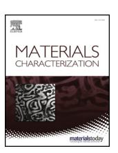

# Influence of homogenization treatment on microstructure and mechanical properties of Al-Zn-Mg alloy extruded by porthole die

Liang Chen[a](#page-0-0) , Shengwei Yuan[a](#page-0-0) , Zhigang Li[a](#page-0-0) , Wei Zheng[b,](#page-0-1)[⁎](#page-0-2) , Guoqun Zhao[a](#page-0-0),[⁎](#page-0-2) , Cunsheng Zhang[a](#page-0-0)

a Key Laboratory for Liquid-Solid Structural Evolution and Processing of Materials (Ministry of Education), Shandong University, Jinan, Shandong 250061, PR China b School of Materials Science and Engineering, Shandong Jianzhu University, Jinan, Shandong 250101, PR China

#### ARTICLE INFO

#### Keywords: Al-Zn-Mg alloy Homogenization Extrusion Microstructure

Corrosion

#### ABSTRACT

The effects of homogenization parameters on microstructure and mechanical properties of Al-Zn-Mg profile extruded by porthole die were investigated. During homogenization treatment, the eutectic phases in as-cast billet dissolved or transformed to S(Al2CuMg) phase, while the compositions of Fe-containing phase varied slightly and only partial of them dissolved. Moreover, the fine dispersoids precipitated during air cooling. The billet hardness was decreased by increasing homogenization temperature. If the water quenching was employed, the precipitation of fine dispersoids was prevented, resulting in strong solution strengthening and relatively high hardness. The extruded profile could be divided into welding zone with fine grained structure and matrix zone with elongated and coarse grains. The quantity of coarse phases in extruded profile continuously decreased with increasing the homogenization temperature, while the fine dispersoids showed the opposite tendency. The hardness in welding zone is always lower than that in matrix zone. The profile extruded from the as-cast billet exhibited the highest tensile strength but the lowest elongation. The coarse phases exhibited stronger strengthening effect than the fine dispersoids, while they are harmful on elongation. After homogenizing the billets or increasing the homogenizing temperature, the corrosion in welding zone was reduced, while the corrosion in matrix zone became more severe.

## 1. Introduction

High strength Al-Zn-Mg alloys are heat treatable, with the advantages of low density, excellent mechanical properties and good corrosion resistance. Currently, Al-Zn-Mg alloys have been widely applied in the fields of aerospace, automobile and mechanical equipment [1–[4\]](#page-10-0). Hot extrusion is the primary plastic forming method on Al alloys, and the Al profiles with a certain cross-section can be efficiently extruded out. In comparison with the solid Al profiles, the hollow ones exhibit broader prospect, since they can reduce the weight in a large extend. As reported by Dong et al. [[5](#page-10-1)] and Chen et al. [[6](#page-10-2)], the porthole die extrusion has high efficiency and high flexibility in producing hollow Al profiles, and it has become an important issue for the researchers and engineers.

In as-cast Al-Zn-Mg alloys, the dendritic segregation and coarse intermetallic phases usually exist due to the rapid solidification [[7](#page-10-3)]. It has been widely reported by the previous researchers that the major intermetallic phases are η(MgZn2), σ(Mg(Zn, Cu, Al)2), S(Al2CuMg), θ(Al2Cu), T(Al2Zn3Mg3) and Fe-rich phases [8–[12\]](#page-10-4). θ phase can only be found in Al-Zn-Mg alloys with high Cu content and low Mg content [[13\]](#page-10-5). Mondal et al. [\[10](#page-10-6)] claimed that Cu could dissolve into T phase to form AlMgZnCu, and Zn could dissolve into S phase to form the quaternary phase. σ phase is thought to have the same crystal structure with η, and it was inferred that Al and Cu substituted the lattice position of Zn in η to form σ phase [\[13](#page-10-5)–15]. Homogenization treatment is usually performed on the as-cast billet, and it can cause the significant variation of second phases. Liu et al. [[16\]](#page-11-0) found that the amount of σ in Al-Zn-Mg-Cu alloy decreased significantly at the initial stage of homogenization, while the transformation from σ to S was difficult to occur because the content of Zn was higher than 8 wt.%. Fan et al. [[14\]](#page-10-7) investigated the homogenization of an Al-Zn-Mg alloy with low Cu content, and found that the S phase transformed from σ would dissolve into α(Al) matrix, while there was almost no change for T phase with the extension of holding time.

During porthole die extrusion, the homogenized billet is firstly split by the bridge into several fresh streams. Then, these streams are solid bonded inside welding chamber under the condition of high temperature and severe deformation. Consequently, several longitudinal weld seams are formed along the whole length of the extruded profile, and the microstructure in welding zone is significantly different with that in

E-mail addresses: [zhengweino1@sdjzu.edu.cn](mailto:zhengweino1@sdjzu.edu.cn) (W. Zheng), [zhaogq@sdu.edu.cn](mailto:zhaogq@sdu.edu.cn) (G. Zhao).

1044-5803/ © 2020 Elsevier Inc. All rights reserved.

⁎ Corresponding authors.

matrix zone [[17,](#page-11-1)[18\]](#page-11-2). Some works has been carried out on the material flow, welding quality and microstructure evolution during porthole die extrusion. Fan et al. [\[19](#page-11-3)] analyzed the microstructure of the material located inside die cavity and extruded profile, by which the material flow behavior was analyzed. Chen et al. [\[20](#page-11-4)] found that complete dynamic recrystallization (DRX) occurred in welding zone, while partial DRX took place in matrix zone. Yu et al. [[17,](#page-11-1)[21\]](#page-11-5) proposed that the welding quality was determined by both metal flow and solid-state bonding, and the welding quality was affected by various factors, such as the depth of welding chamber, billet temperature and extrusion speed. Chen et al. [\[18](#page-11-2)] carried out solution and aging treatments on Al-Zn-Mg profiles extruded by porthole die, and it was found that the η phase completely dissolved into the matrix during solution, while S and Al23CuFe4 phases could not dissolve even with the extension of holding time.

As mentioned above, homogenization treatment is an inter-step between casting and extrusion processes. The significant microstructure evolution should occur during the homogenization of Al-Zn-Mg alloys, which strongly affects the final microstructure and mechanical properties of the extruded profiles [\[22](#page-11-6)]. Till now, the relationships between homogenization and porthole die extrusion of Al-Zn-Mg alloys have not been clarified. Hence, in this study, the Al-Zn-Mg billets were homogenized under various holding temperatures, followed by air cooling and water quenching, respectively. Then, the porthole die extrusion was carried out using the homogenized billets. The evolution of second phase and grain structure in as-cast and homogenized billets were analyzed. Moreover, the microstructure in welding and matrix zones of extruded profile was examined, and the hardness, tensile properties and IGC resistance were tested. The main objective of this study is to clarify the effects of homogenization parameters on the microstructure and mechanical properties of the Al-Zn-Mg alloy extruded by porthole die.

## 2. Experimental procedures

The as-cast Al-5.50Zn-2.35Mg-1.36Cu (wt%) billet was fabricated by means of semi-continuous casting. To determine the temperature range of homogenization, the differential scanning calorimetry (DSC) was conducted. As shown in [Fig. 1](#page-1-0), an obvious endothermic peak is observed at 476.4 °C. According to the previous studies [\[16](#page-11-0),[23](#page-11-7)], the peak should correspond to the melting of the (Al + σ) eutectic. Since the beginning of melting is around 470 °C, one of the holding temperatures was chosen as 465 °C to avoid the overburning of non-equilibrium eutectics. Moreover, in order to make a comparative study, the billets were homogenized under other temperatures. [Table 1](#page-1-1) lists the detailed homogenization parameters used in this study. As is seen, the as-cast billet was named as H-0. The homogenizations were carried out at 385 °C, 425 °C, 465 °C, 485 °C with the identical heating rate of 10 °C/min and the same holding time of 24 h, and they were designated

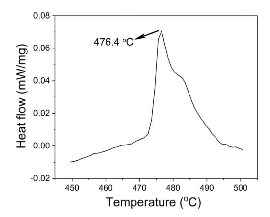

Table 1 Detailed homogenization parameters and cooling methods.

| Billet | Homogenization           | Cooling         |  |  |
|--------|--------------------------|-----------------|--|--|
| H-0    | – (as-cast)              | –               |  |  |
| H-1    | 385 °C + 24 h, 10 °C/min | Air cooling     |  |  |
| H-2    | 425 °C + 24 h, 10 °C/min | Air cooling     |  |  |
| H-3    | 465 °C + 24 h, 10 °C/min | Air cooling     |  |  |
| H-4    | 485 °C + 24 h, 10 °C/min | Air cooling     |  |  |
| H-3W   | 465 °C + 24 h, 10 °C/min | Water quenching |  |  |

as H-1, H-2, H-3 and H-4, respectively. It is noted that the air cooling was employed for the above billets. Another billet was homogenized at 465 °C for 24 h followed by water quenching, and it was named as H-3W. Then, the extrusion billets with the dimension of ϕ40 × 50 mm were machined. The extrusion experiments were carried out using a pressing machine of 200 tons. Only two potholes were designed on the upper die to simplify the complexity. The billet was firstly divided into two streams by the bridge during the porthole die extrusion. Then, two streams were solid boned inside the welding chamber, and the sole longitudinal weld seam was formed in the mid-plane of the extruded profile. Before extrusion experiment, the billet, die and container were heated to 440 °C, and held for 15 min. The ram velocity was kept constant at 0.1 mm/s during the whole extrusion process. All extrusion parameters were set identical for different billets. Accordingly, the profiles extruded by different billets were named as HE-0, HE-1, HE-2, HE-3, HE-4, and HE-3W, respectively.

As shown in [Fig. 2,](#page-2-0) a plate shaped profile with the cross-sectional dimension of 24 × 3 mm was extruded out, and the extrusion ratio was calculated as 17.4. The weld seam locates in the mid-plane of the profile parallel to the extrusion direction (ED). The locations of specimens for microstructure observation, micro-hardness, tensile test and intergranular corrosion (IGC) test are also indicated in [Fig. 2](#page-2-0). For optical microscope (OM) observation, the specimen was grounded and polished to mirror, and then etched in a solution with 5 ml HF and 95 ml H2O. The intermetallic phases were observed by a scanning electron microscopy (SEM) equipped with the device of energy dispersive spectrometer (EDS) using polished specimens without etching. The specimens for electron backscatter diffraction (EBSD) analysis were mechanically polished, and then electropolished in a solution of 10 ml nitric acid and 90 ml methanol at 30 V for 8 s. The scanning step for welding zone of extruded profile was set as 0.3 μm, while it was 2.5 μm for the other specimens. Moreover, the high resolution transmission electron microscopy (HRTEM) was used for observing fine precipitations. The HRTEM specimen was firstly grounded to a thickness around 80 μm, and then double-jet electro in an electrolyte of 30% HNO3 in methanol. The Vickers hardness was tested using a load of 300 g and a dwelling time of 10 s. The tensile tests were carried out at room temperature with a stretching speed of 0.6 mm/min. Both of the specimens along ED and transverse direction (TD) were tested. In order to reveal the corrosion resistance of the extruded profile, IGC tests were carried out in a solution of 57 g sodium chloride, 10 ml hydrogen peroxide and 1000 ml reagent water at 30 °C for 6 h, based on the standard of ASTMG110- 92(2015).

#### 3. Results and discussion

## 3.1. Microstructure of as-cast and as-homogenized billets

[Fig. 3](#page-2-1) shows the results of EBSD analysis, which was conducted to observe the grain structure and texture of the billets. As is seen, all billets exhibit an equiaxed grain structure, and the average grain sizes are 102.2 μm, 98.0 μm, and 100.2 μm for H-0, H-3, H-4, respectively. Moreover, the random texture with low intensity can be observed in all billets. It is concluded that the influence of homogenization parameters on grain size and texture of Al-Zn-Mg billets is slight. Fig. 1. DSC analysis of the as-cast Al-5.50Zn-2.35Mg-1.36Cu billet.

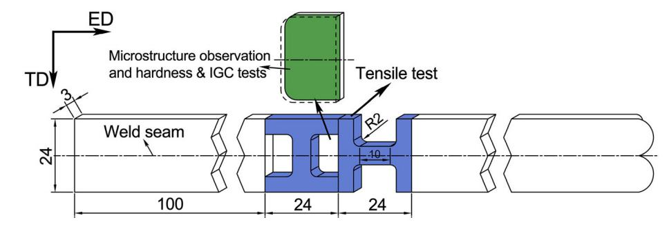

Fig. 2. Schematic diagram of the extruded profile and the locations of specimens (Unit: mm).

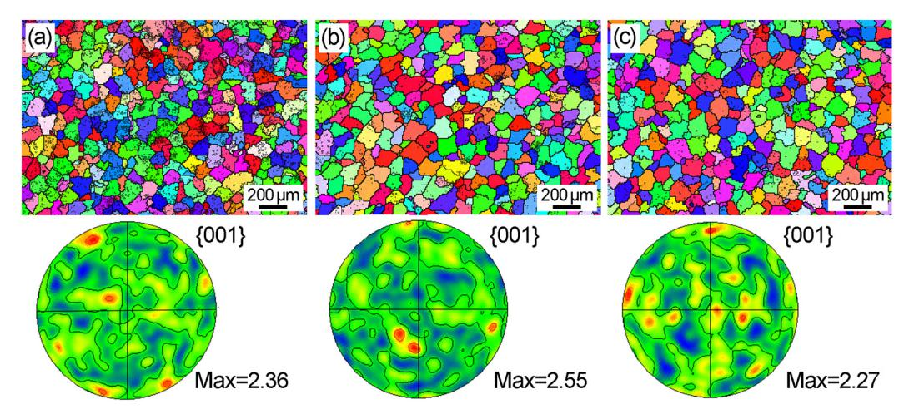

Fig. 3. EBSD maps and pole figures of (a) as-cast billet H-0 and homogenized billets (b) H-3 and (c) H-4.

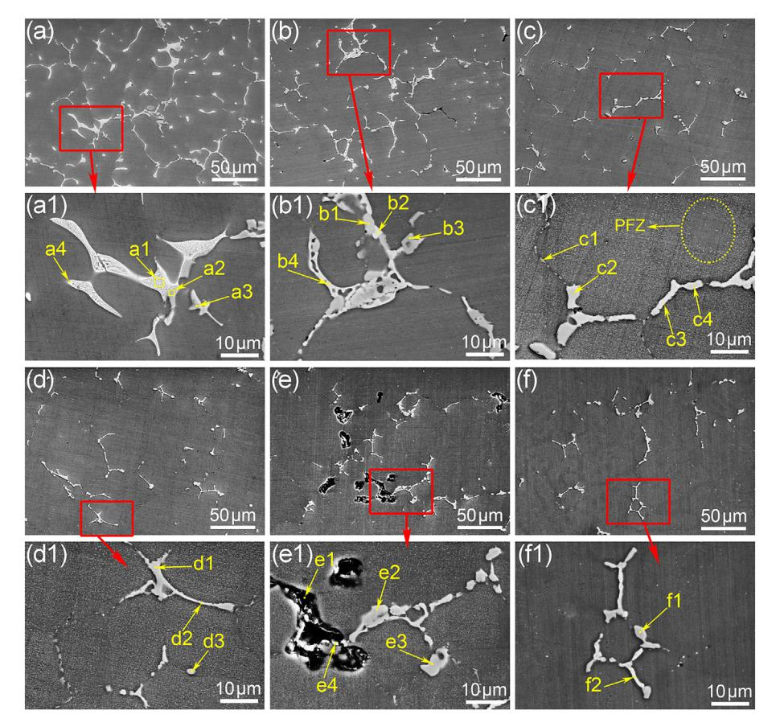

Fig. 4. Second phases of the as-cast and homogenized billets (a) H-0, (b) H-1, (c) H-2, (d) H-3, (e) H-4, (f) H-3W.

Table 2 Chemical compositions (at.%) of the second phases indicated in [Fig. 4.](#page-2-2)

| Point | Al    | Zn    | Cu                                                                 | Mg    | Fe    | Mn   | Cr   | Si   | Phase              |
|-------|-------|-------|--------------------------------------------------------------------|-------|-------|------|------|------|--------------------|
| a1    | 55.44 | 15.03 | 11.09                                                              | 18.45 | –     | –    | –    | –    | σ(Mg(Zn, Cu, Al)2) |
| a2    | 76.24 | 1.48  | 2.5                                                                | –     | 10.43 | 2.21 | 1.7  | 5.39 | Al8(Fe,Mn,Cr)2Si   |
| a3    | 81.67 | 1.81  | 2.93                                                               | 1.15  | 10.96 | 1.48 | –    | –    | Al3(Fe,Cu,Mn,Cr)   |
| a4    | 49.44 | 16.88 | 12.05                                                              | 21.63 | –     | –    | –    | –    | σ(Mg(Zn, Cu, Al)2) |
| b1    | 49.68 | 1.26  | 25.16                                                              | 23.91 | –     | –    | –    | –    | S(Al2CuMg)         |
| b2    | 49.19 | 20.24 | 10.55                                                              | 20.03 | –     | –    | –    | –    | σ(Mg(Zn, Cu, Al)2) |
| b3    | 81.08 | –     | 1.22                                                               | –     | 9.25  | 2.13 | 2.2  | 4.12 | Al8(Fe,Mn,Cr)2Si   |
| b4    | 32.40 | 26.28 | 11.57                                                              | 29.75 | –     | –    | –    | –    | T(Al2Zn3Mg3)       |
| c1    | 88.30 | 6.24  | 0.93                                                               | 4.53  | –     | –    | –    | –    | η(MgZn2)           |
| c2    | 55.08 | –     | 22.10                                                              | 22.82 | –     | –    | –    | –    | S(Al2CuMg)         |
| c3    | 76.06 | –     | 12.85                                                              | –     | 6.85  | 1.01 | –    | 1.35 | Al7Cu2Fe           |
| c4    | 78.22 | –     | 2.12                                                               | –     | 12.34 | 1.86 | –    | 5.47 | Al8(Fe,Mn,Cr)2Si   |
| d1    | 75.34 | –     | 2.6                                                                | –     | 12.93 | 1.28 | –    | 5.08 | Al8(Fe,Mn,Cr)2Si   |
| d2    | 76.06 | –     | 15.08                                                              | –     | 7.18  | 0.78 | –    | 0.9  | Al7Cu2Fe           |
| d3    | 79.6  | –     | 1.48                                                               | –     | 9.53  | 2.1  | 1.48 | 5.8  | Al8(Fe,Mn,Cr)2Si   |
| e1    |       |       | Al: 35.19, O: 46.36, C:11.05, Ca: 2.75, Mg:2.51, Si:0.75, Zn: 0.88 |       |       |      |      |      |                    |
| e2    | 75.37 | –     | 2.26                                                               | –     | 11.03 | 2.63 | 2.07 | 6.63 | Al8(Fe,Mn,Cr)2Si   |
| e3    | 78.17 | 1.23  | 1.73                                                               | –     | 9.05  | 2.21 | 1.57 | 6.05 | Al8(Fe,Mn,Cr)2Si   |
| f1    | 77.84 | 1.69  | 2.48                                                               | –     | 9.43  | 2.18 | 1.37 | 5    | Al8(Fe,Mn,Cr)2Si   |
| f2    | 80.35 | –     | 11.81                                                              | –     | 6.45  | 0.6  | –    | 0.78 | Al7Cu2Fe           |

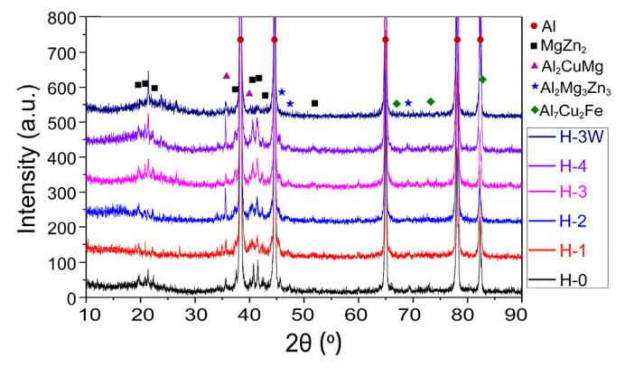

Fig. 5. XRD results of the as-cast and homogenized billets.

The second phases of as-cast and homogenized billets were observed by SEM, and the images are shown in [Fig. 4.](#page-2-2) In as-cast billet H-0, large amount of second phases are observed from [Fig. 4](#page-2-2)(a). Lots of second phases distributed along grain boundaries, and few of them located in grain interior. After homogenization, the second phases gradually dissolved into the matrix. Moreover, fine dispersoids precipitated in grain interior, especially in billets H-2 and H-3 homogenized at high temperature, as shown in the enlarged images of [Fig. 4](#page-2-2)(c1) and (d1). When the homogenization temperature was further enhanced to 485 °C, the typical overburning phenomena such as compounded-melting structure and trigeminal grain boundary were observed in [Fig. 4](#page-2-2)(e) and (e1). The

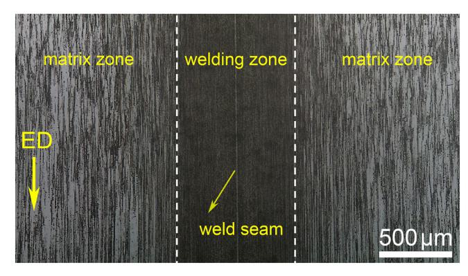

Fig. 7. Optical microstructure of the extruded profile HE-0.

distribution of coarse second phases in water quenched billet H-3W is similar with that of H-3, while the fine dispersoids were not formed due to the rapid cooling, as shown in [Fig. 4](#page-2-2)(f) and (f1).

The chemical compositions of the points indicated in [Fig. 4](#page-2-2) were analyzed by EDS, and the results are listed in [Table 2](#page-3-0). Moreover, XRD analysis was conducted to further identify the phases, and the results are shown in [Fig. 5.](#page-3-1) In [Fig. 4\(](#page-2-2)a1), the main intermetallic phases are lamellar or feathery eutectic phases, and the EDS results implied that these eutectic phases were composed by Al, Zn, Mg, and Cu. According to the XRD results, the main phases of as-cast billet H-0 are α-Al, η, S and T phases, while the AlZnMgCu quaternary phase cannot be identified. She et al. [[24\]](#page-11-8) found that η phase usually exited in the form of

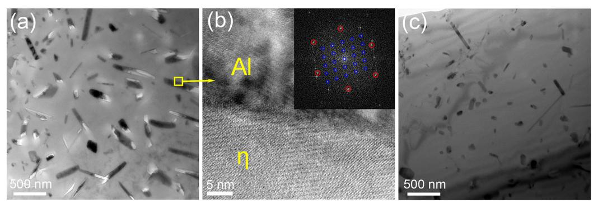

Fig. 6. HRTEM images of the precipitates and the corresponding FFT patterns of billets (a) (b) H-3 and (c) H-3W.

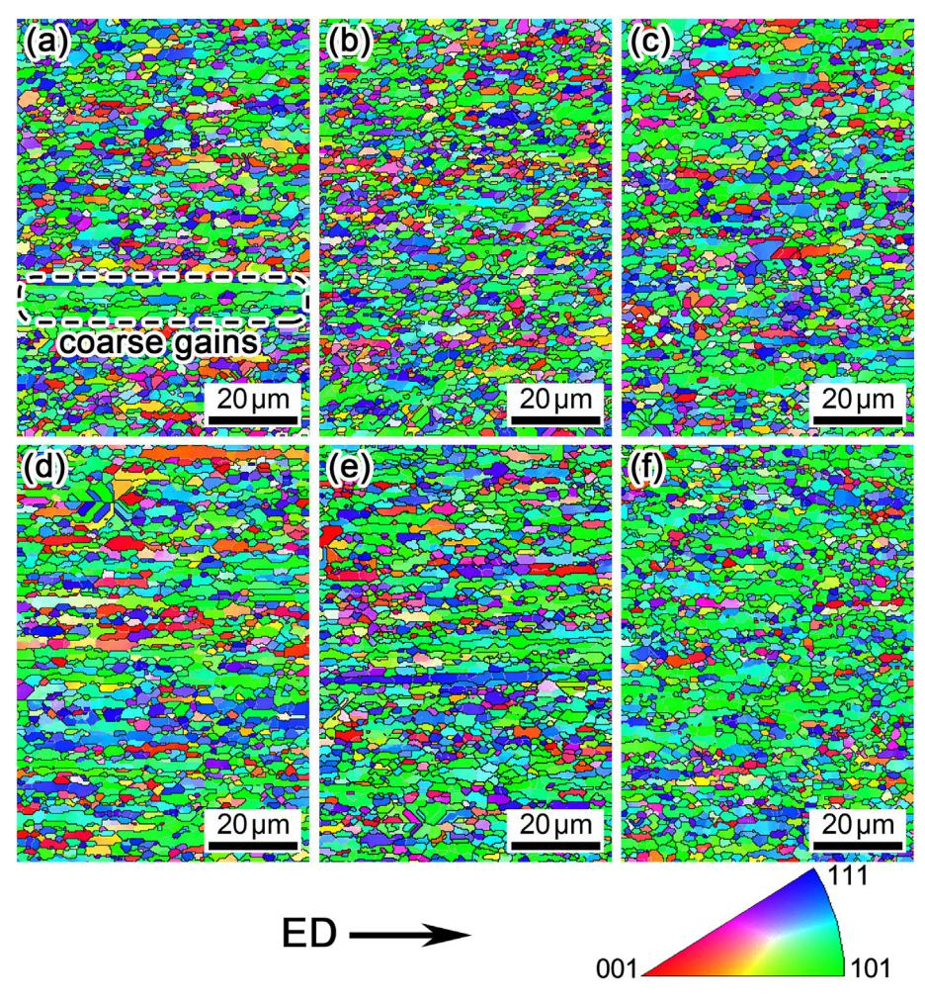

Fig. 8. EBSD maps in welding zones of the extruded profiles (a) HE-0, (b) HE-1, (c) HE-2, (d) HE-3, (e) HE-4, and (f) HE-3W.

eutectic structure in as-cast billet, and Cu and Al atoms could dissolve into η to replace the position of Zn. According to the above analysis, the eutectic phases should be composed by α-Al and σ phase. Mondal et al. [[10\]](#page-10-6) reported that Cu and Zn could dissolve into T and S phases, respectively. Hence, it is difficult to determine the types of these phases based on EDS results. The grey phases marked by a2 and a3 in [Fig. 4](#page-2-2)(a1) are Fe-containing phases, such as Al3(Fe,Cu,Mn,Cr) and Al8(Fe,Cu,Mn,Cr)2Si.

As shown in [Fig. 4\(](#page-2-2)b1), the eutectic structure almost completely dissolved and disappeared in the billet H-1 homogenized at 385 °C for 24 h, while the fraction of grey phase indicated by b1 and b3 increased. Moreover, the grey phases occupied the position of the preexisting eutectic structure. Based on EDS results, the grey phase of b1 should be S, which was transformed from η phase. However, the grey phase of b3 has the similar compositions with Fe-containing phases in H-0, and it is considered to be Al8(Fe,Cu,Mn,Cr)2Si. The white phases indicated by points b2 and b4 in [Fig. 4](#page-2-2)(b1) are composed by Al, Zn, Mg and Cu, and their compositions are similar with the eutectic phase in H-0 except the lower content of Al. Mondal et al. [\[10](#page-10-6)] reported that almost no Zn existed in S phase after homogenization treatment. Hence, these white phases should be T phase with the dissolving of Cu and the undissolved Mg(Zn, Al, Cu)2 phase. Based on above analysis, it is concluded that after homogenization at 385 °C for 24 h, η phase transformed into S, while Fe-containing phases changed slightly. With the increase of homogenization temperature, the amount of intermetallics phases along grain boundaries was gradually reduced. As shown in [Fig. 4](#page-2-2)(c1), most of the white phases without Fe dissolved into matrix, and the Fecontaining phases were remained along grain boundaries. On the other hand, large amount of fine dispersoids precipitated in grain interior. Based on the XRD results and the previous studies [25–[28\]](#page-11-9), these fine dispersoids were mainly η phase, which is further confirmed by the HRTEM results described later. The precipitate free zones (PFZs) inside grain could be observed in H-2, as indicated in [Fig. 4\(](#page-2-2)c1), while the number of PFZs was reduced in H-3 and H-4, as shown in [Fig. 4\(](#page-2-2)d1) and (e1). Moreover, it is noted that some precipitates of η phase with relatively large size distributed along the grain boundaries of H-2, H-3 and H-4, as indicated by point c1 in [Fig. 4](#page-2-2)(c1). In water quenched billet of H-3W, the amount and distribution of coarse second phases were similar with those in billet H-3 which was homogenized under the same condition but with air cooling. However, almost no fine dispersoids of η phase was found in H-3W. According to the XRD results, the η and T phases were also not observed in H-3W. When the homogenization temperature was higher than the melting point of eutectic phase, the EDS results show that C and O are the major elements in the melting holes, which further proves the occurrence of overburning. HRTEM was also carried out to investigate the type of fine dispersoids and the influence of cooling rate on the precipitates. As shown in [Fig. 6](#page-3-2), the precipitates are mainly composed by rod-like and dark block-like precipitates, while the quantity of these precipitates in H-3 and H-3W is obviously different. In [Fig. 6\(](#page-3-2)a), many rod-like precipitates can be observed in H-3, and they were identified as η according to the high magnification image and its corresponding fast Fourier filtering transforms (FFT) pattern shown in [Fig. 6](#page-3-2)(b). However, the quantity of rodlike precipitates is much less in H-3W, as shown in [Fig. 6\(](#page-3-2)c).

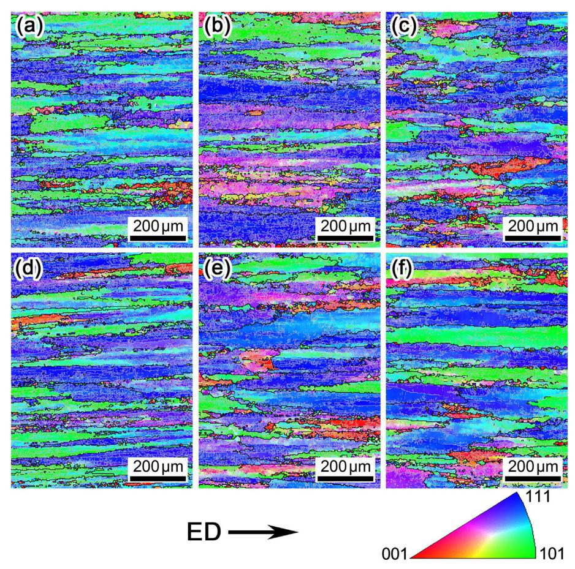

Fig. 9. EBSD maps in matrix zones of the extruded profiles (a) HE-0, (b) HE-1, (c) HE-2, (d) HE-3, (e) HE-4, and (f) HE-3W.

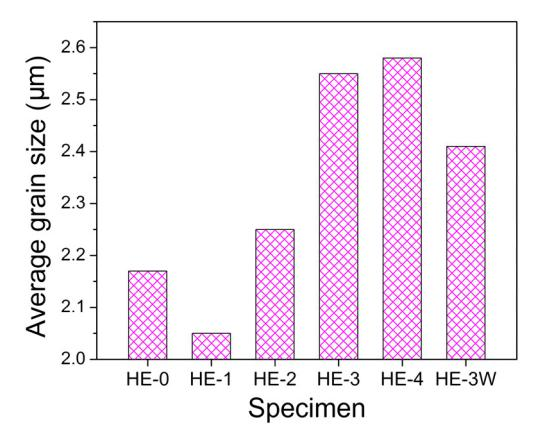

Fig. 10. Average grain size of the welding zones in different extruded profiles.

#### 3.2. Microstructure of the extruded profiles

In order to provide an overall understanding on the microstructure of extruded profile, the OM image of HE-0 is shown in [Fig. 7](#page-3-3). As is seen, the profile extruded by porthole die can be clearly divided into two parts, which were named as welding zone and matrix zone, respectively. An obvious weld seam located in the middle of the welding zone. Then, the EBSD maps of the welding and matrix zones of various profiles are shown in [Figs. 8 and 9,](#page-4-0) respectively. The welding zones of all profiles are composed of fine equiaxed grains, which indicates that the complete DRX took place during the porthole die extrusion. This is because the material in welding zone experienced strong friction with bridge and severe deformation during porthole extrusion. In matrix zone, the coarse and elongated grains are distributed along ED, and only small amount of fine grains was found. This fact is an evidence that sight DRX occurred in matrix zone, since the material in matrix zone suffered lower strain during the porthole die extrusion.

The microstructure in welding zone significantly affects the mechanical properties of extruded profile, since the weld seam is usually the weakest point. The average grain size of welding zone is summarized in [Fig. 10.](#page-5-0) As is seen, the grain size shows an increasing tendency with increasing the homogenization temperature. Vetrano et al. [\[28](#page-11-10)] reported that the particles with the size larger than 1 μm could act as the nucleation sites for DRX. [Fig. 11](#page-6-0) shows the SEM images of welding zones. It is observed that the quantity of particles (> 1 μm) decreased with increasing homogenization temperature, which resulted in the less nucleation sites for DRX and the relatively coarse grain structure. Moreover, the average grain size of HE-0 is larger than that of HE-1. This fact is because of the non-uniform distribution of second phase in as-cast billet, which results in the inhomogeneous occurrence of DRX. Consequently, some coarse elongated grains were remained in the welding zone of HE-0, as marked in [Fig. 8\(](#page-4-0)a).

As shown in [Fig. 11\(](#page-6-0)a), many coarse phases distributed along ED of HE-0 extruded from the as-cast billet. If the billets were homogenized, the quantity of coarse phases in extruded profiles was reduced, and the reducing tendency becomes stronger with increasing homogenization temperature. [Fig. 12](#page-7-0) shows the distribution of second phases in matrix zones. As is seen, the coarse phases in matrix zones mainly distributed on the boundaries of the elongated grains. Moreover, in comparison with the welding zones, the amount of coarse phases in matrix zones was increased, and the coarse phases exhibit a more concentrated distribution along ED. Similarly, the number of coarse phases in matrix zones was also decreased with increasing homogenization temperature.

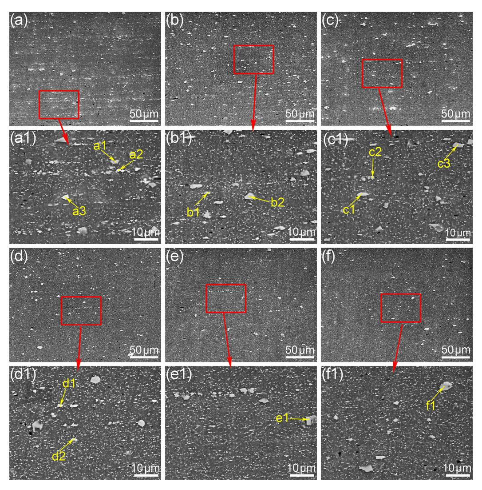

Fig. 11. Second phases in welding zones of the extruded profiles (a) (a1) HE-0, (b) (b1) HE-1, (c) (c1) HE-2, (d) (d1) HE-3, (e) (e1) HE-4, and (f) (f1) HE-3W.

According to the EBSD maps shown in [Fig. 9](#page-5-1), the fine grains in matrix zone also distributed at the same positions with the coarse phases. It is inferred that these fine grains were formed by particle stimulated nucleation (PSN) effect during porthole die extrusion. The less coarse phases in welding zone than that in matrix zone is attribute to the fact that the material in welding zone experienced much more severe plastic deformation, by which some of the coarse phases were broken into finer ones.

It is observed from the enlarged images of [Fig. 11](#page-6-0) that large amount of fine dispersoids uniformly distributed in welding zone. The profile HE-0 extruded from as-cast billet owns the lowest number of fine dispersoids. After homogenizing the billets, the number of fine dispersoids in welding zone greatly increased, and it continually increased with increasing homogenization temperature. Although no fine dispersoids was found in water quenched billet H-3W, these dispersoids were observed in profile HE-3W because of the low cooling rate after extrusion experiment. The variation of fine dispersoids in matrix zone is similar with that in welding zone. Almost no fine dispersoids was observed in matrix zone of HE-0, and large PFZs existed, as shown in [Fig. 12\(](#page-7-0)a1). Moreover, the amount of fine dispersoids increased after homogenizing the billet. The types of the second phases shown in [Figs. 11 and 12](#page-6-0) were analyzed by EDS, and the results are listed in [Tables 3 and 4,](#page-7-1) respectively. The coarse phases mainly consist of Al3(Fe,Cu,Mn,Cr), Al8(Fe,Cu,Mn,Cr)2Si and S phases, and the fine dispersoids are mainly composed by η and T phases.

### 3.3. Mechanical properties

The micro-hardness of the as-cast and homogenized billets is shown in [Fig. 13.](#page-8-0) The as-cast billet H-0 owns the maximum hardness of 143.5 HV. With increasing homogenization temperature, the hardness shows a reducing tendency from H-1 to H-4. The water quenched billet H-3W has higher hardness than the air cooled H-3. Based on [Fig. 4](#page-2-2), it is known that the number of coarse phases decreased greatly until the temperature reached 425 °C, while it was not changed with the further increase of temperature. The above variation of second phases corresponds to the change of hardness in H-0, H-1 and H-2. The quantity and size of both the coarse phases and fine dispersoids in H-2 and H-3 are close, which results in a small difference in hardness between them. In H-3W, almost no fine dispersoids precipitated due to the fast cooling process. However, the solid solution strengthening of H-3W should be strong, and thus H-3W shows the second highest hardness. The overburning in H-4 caused a lowest hardness of 87.6 HV. Based on above analysis, it is concluded that the existence of coarse phases and fine dispersoids can both enhance the hardness, while the strengthening effect of coarse phases is stronger. The solid solution strengthening also has positive effects on hardness, while the overburning has adverse effects on hardness.

The hardness distribution and the average hardness of the welding zone are presented in [Fig. 14.](#page-8-1) The lowest hardness of all profiles always appears at the center of welding zone, viz., the position of weld seam.

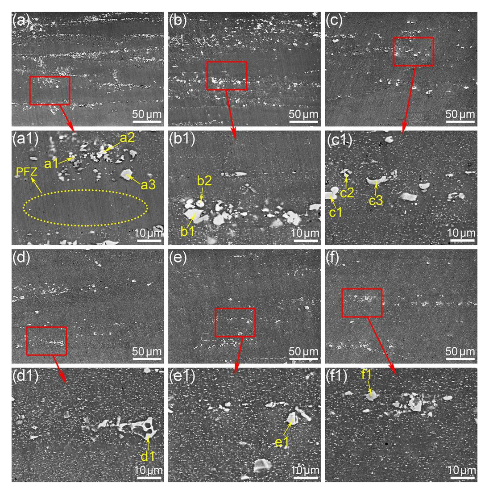

Fig. 12. Second phases in matrix zones of the extruded profiles (a) (a1) HE-0, (b) (b1) HE-1, (c) (c1) HE-2, (d) (d1) HE-3, (e) (e1) HE-4, and (f) (f1) HE-3W.

Table 3 Chemical compositions (at.%) of the second phases indicated in [Fig. 11](#page-6-0).

| Point | Al    | Zn    | Cu    | Mg    | Fe    | Mn   | Cr   | Si   | Phase            |
|-------|-------|-------|-------|-------|-------|------|------|------|------------------|
| a1    | 78.32 | –     | 1.88  | 1.15  | 9.69  | 2.32 | 1.74 | 4.89 | Al8(Fe,Mn,Cr)2Si |
| a2    | 57.33 | 15.7  | 9.32  | 17.65 | –     | –    | –    | –    | T(Al2Zn3Mg3)     |
| a3    | 51.7  | 2.7   | 3.37  | 1.49  | 9.57  | 1.17 | –    | –    | Al3(Fe,Cu,Mn,Cr) |
| b1    | 63.97 | 14.16 | 7.63  | 13.71 | –     | 0.52 | –    | –    | T(Al2Zn3Mg3)     |
| b2    | 78.57 | 1.11  | 2.04  | –     | 9.8   | 2.54 | 1.42 | 4.52 | Al8(Fe,Mn,Cr)2Si |
| c1    | 57.71 | –     | 20.42 | 21.87 | –     | –    | –    | –    | S(Al2CuMg)       |
| c2    | 82.24 | 2.78  | 2.85  | 2.13  | 8.83  | 1.18 | –    | –    | Al3(Fe,Cu,Mn,Cr) |
| c3    | 80.46 | 1.74  | 1.56  | 1.32  | 8.18  | 1.94 | 1.28 | 3.51 | Al8(Fe,Mn,Cr)2Si |
| d1    | 79.59 | –     | 14.64 | –     | 5.77  | –    | –    | –    | Al7Cu2Fe         |
| d2    | 80.43 | 2.79  | 4.12  | 2.04  | 9.41  | 1.21 | –    | –    | Al3(Fe,Cu,Mn,Cr) |
| e1    | 80.67 | 1.73  | 1.67  | 0.79  | 7.26  | 2.14 | 1.06 | 4.69 | Al8(Fe,Mn,Cr)2Si |
| f1    | 78.44 | –     | 3.3   | 0.96  | 12.35 | 1.9  | 0.61 | –    | Al3(Fe,Cu,Mn,Cr) |

Overall, the hardness difference between the profiles is small, this is because that the continuous coarse particles in billets were broken up into smaller and discontinuous ones by extrusion, and the strengthening effects provided by these coarse precipitates were weakened. Moreover, the fine dispersoids could be found in all of the profiles, and the effect of solid solution strengthening is also weakened. Since the density of dispersoids in HE-3W is lower than that in HE-3, which makes the hardness of HE-3W lower than that of HE-3.

The tensile test results of the extruded profiles along ED and TD

directions are shown in [Fig. 15](#page-9-0). As is seen from [Fig. 15\(](#page-9-0)a), the tensile strength along ED is always higher than that along TD due to the influence of weld seam. Moreover, the tensile strength along both directions exhibit the same tendency. The tensile strength of HE-0 is the highest one. With the increase of homogenization temperature, the tensile strength firstly decreased and then increased. The tensile strength of HE-2 is the lowest along both directions. Moreover, HE-3W extruded from water quenched billet also owns a relatively low strength. As shown in [Fig. 15\(](#page-9-0)b), the elongation along ED and TD

Table 4 Chemical compositions (at.%) of the second phases indicated in [Fig. 12](#page-7-0).

| Point | Al    | Zn    | Cu    | Mg    | Fe    | Mn   | Cr   | Si   | Phase            |
|-------|-------|-------|-------|-------|-------|------|------|------|------------------|
| a1    | 39.62 | 22.53 | 13.04 | 24.8  | –     | –    | –    | –    | T(Al2Zn3Mg3)     |
| a2    | 65.66 | –     | 17.26 | 17.07 | –     | –    | –    | –    | S(Al2CuMg)       |
| a3    | 79.07 | 0.82  | –     | –     | 10.59 | 2.55 | 1.99 | 4.98 | Al8(Fe,Mn,Cr)2Si |
| b1    | 77.84 | –     | 1.46  | –     | 11.26 | 2.43 | 1.91 | 5.1  | Al8(Fe,Mn,Cr)2Si |
| b2    | 54.7  | –     | 22.4  | 22.9  | –     | –    | –    | –    | S(Al2CuMg)       |
| c1    | 55.86 | –     | 21.17 | 22.96 | –     | –    | –    | –    | S(Al2CuMg)       |
| c2    | 83.67 | –     | 2.29  | 1.23  | 11.1  | 1.17 | –    | –    | Al3(Fe,Cu,Mn,Cr) |
| c3    | 80.71 | 1.48  | 2.03  | 1.05  | 7.26  | 1.96 | 1.74 | 3.77 | Al8(Fe,Mn,Cr)2Si |
| d1    | 76.27 | –     | 1.98  | –     | 11.55 | 2.69 | 1.57 | 5.93 | Al8(Fe,Mn,Cr)2Si |
| e1    | 80.41 | 1.94  | 2.42  | 1.69  | 8.12  | 1.64 | –    | 3.79 | Al8(Fe,Mn,Cr)2Si |
| f1    | 85.43 | 1.62  | –     | 1.77  | 6.14  | 1.59 | –    | 3.46 | Al8(Fe,Mn,Cr)2Si |

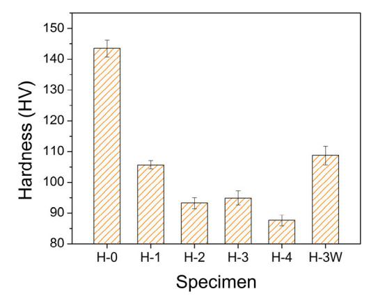

Fig. 13. Hardness of the as-cast and homogenized billets.

directions of HE-0 is the lowest. With increasing homogenization temperature, the elongation continuously increased to HE-3. Since the overburning took place in billet H-4, the elongation of HE-4 suddenly dropped to a lowest value. Finally, it is noted that the elongation of HE-3W is also at a low level.

The main strengthening mechanism of the extruded profiles is precipitation strengthening. According to the previous descriptions on [Figs. 11 and 12](#page-6-0), both the quantity and size of coarse phases in extruded profiles were decreased after homogenizing the billet or increasing the homogenization temperature, while the quantity of fine dispersoids had an opposite tendency. In HE-0, plenty of coarse phases were observed, and they provided a strong strengthening effect, which caused the highest tensile strength of HE-0. In HE-1 and HE-2, the quantity of coarse phases decreased greatly and a separated distribution was observed, which resulted in the decrease of strength. In HE-3 and HE-3W, the quantities of coarse phases are similar to that of HE-2, while much more fine dispersoids were observed. Hence, due to the strengthening effects of fine dispersoids, the strengths of HE-3 and HE-3W are slightly higher than that of HE-2. HE-4 extruded from the billet with overburning microstructure, which has a strong negative effect on the strength. Finally, since the tensile strengths of HE-0 and HE-1 are much higher than the others, it indicates that the strengthening effect of the coarse phases is stronger than that of the fine dispersoids. The reason is that the obstruction ability of coarse phases is greater than that of the smaller phases during the tensile test. On the other hand, the existence of coarse phases is harmful on the elongation of extruded profiles. Consequently, it is observed that the elongation of HE-0 is the lowest, and the elongation becomes better with increasing homogenization temperature.

### 3.4. IGC resistance

The exposed surfaces of the samples immersed in corrosion solution are shown in [Fig. 16.](#page-9-1) It is seen that the welding zone of profile HE-0 extruded by as-cast billet has been severely corroded, while the corrosion of the matrix zone is slight. In HE-1, the corrosion of the welding zone is alleviated, but it is aggravated in matrix zone. With increasing homogenization temperature, the corrosion in welding zone was further alleviated, and it becomes severe in matrix zone. The overburning and water quenching have slight influence on the corrosion of HE-4 and HE-3W. The cross-sections of extruded profiles after immersion in corrosion solution are presented in [Fig. 17](#page-10-8). The maximum corrosion depth can reflect the degree of corrosion. It is obvious that the homogenization treatment has significant effects on the corrosion depth of the profile. Moreover, the degree of corrosion is different in welding and matrix zones, and the variation tendency agrees well with the results shown in [Fig. 16](#page-9-1). In welding zones, the maximum corrosion depth of HE-0 reached 145 μm, and it was obviously decreased by homogenizing the billets or increasing the homogenization temperature. As shown in [Fig. 17\(](#page-10-8)d), the corrosion depth in welding zone of HE-3 is reduced to 25 μm, which is much smaller than the depth of HE-0, HE-1, and HE-2.

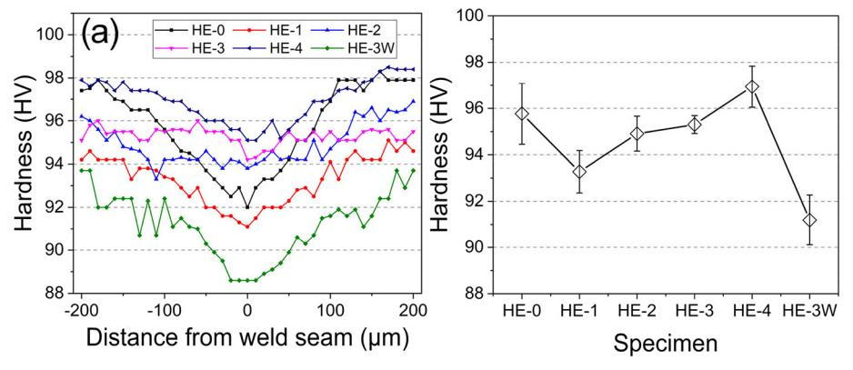

Fig. 14. (a) Hardness distribution across welding zone, and (b) average hardness in welding zone.

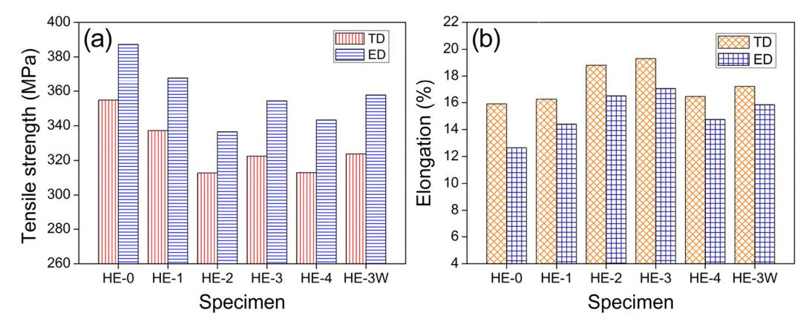

Fig. 15. (a) Tensile strength and (b) elongation of the extruded profiles along ED and TD directions.

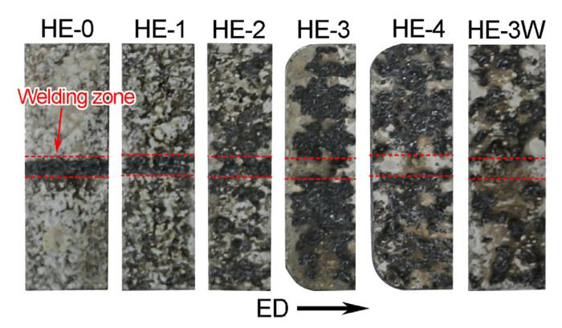

Fig. 16. Exposed surfaces immersed in corrosion solution of the extruded profiles.

As shown in [Fig. 17](#page-10-8)(e) and (f), the corrosion in welding zones of HE-4 and HE-3W almost cannot be observed. The difference of corrosion depth in matrix zones is not as obvious as that in welding zone, while the degree of corrosion varied significantly in different profiles. As is seen from [Fig. 17\(](#page-10-8)a), only few areas in HE-0 had been corroded, while the corroded areas increased after homogenizing billets or increasing homogenization temperature. This phenomenon is also reflected by [Fig. 16](#page-9-1).

As discussed above, the welding zones of HE-3, HE-3W and HE-4 have small quantity of coarse particles, and the matrix zones of HE-0, HE-1 and HE-2 have small quantity of fine dispersoids, and all of these zones show slight corrosion. Moreover, it is observed from [Figs. 11 and](#page-6-0) [12](#page-6-0) that all zones with severe corrosion correspond to those with concentration of both coarse particles and fine dispersoids. Hence, the above results indicate that the corrosion resistance has a close relationship with the second phases. Sun et al. [[29\]](#page-11-11) and Pao et al. [\[30](#page-11-12)] proposed that the intermetallic phase was a most important factor affecting the corrosion resistance of Al-Zn-Mg-Cu alloys. It is mainly attributed to the galvanic interaction between intermetallic phases and matrix, since the intermetallic phases can serve as anode or cathode due to the potential difference with Al matrix in corrosion solution [[31,](#page-11-13)[32](#page-11-14)]. The phases such as Al7Fe2Cu(Mn), Al15(FeMn)3(SiCu), and α-Al (Fe,Cu,Mn)Si have higher Volta potential than those of the matrix and S phase, and they can act as cathodic particles in corrosion environment [[33\]](#page-11-15). Moreover, η is more active than matrix in acidic solution, and η will be more susceptible to be corroded than Al matrix [\[34](#page-11-16)]. Since the hydrogen peroxide was added into the corrosion solution for IGC test, the solution was weak acidic, and η was corroded firstly. In this study, most of the fine dispersoids are composed by η, and the coarse particles are composed by Al3(Fe,Cu,Mn,Cr), Al8(Fe,Cu,Mn,Cr)2Si, Al7Cu2Fe, and S phase. The coarse phases were always the cathodic particles during IGC test, and η phase was anode phase. Hence, the dispersoids around the coarse phases are more susceptible to be corroded. This is the reason that severe corrosion usually took place around the zones where fine dispersoids and coarse phases gathered. Moreover, the fine holes were observed on the cross-section of the corroded specimen, which further verified that they were corroded from fine dispersoids.

## 4. Conclusion

The present study focused on the correlation between homogenization treatment and subsequent porthole die extrusion of an Al-Zn-Mg alloy. The effects of homogenization conditions on the microstructure of the billet and extruded profile were analyzed. The conclusions are drawn as follows:

- (1) The eutectic structures of σ, S, T and Fe-containing phases were the major second phases in as-cast billet. During homogenization treatment, the eutectic phases dissolved or transformed to S phase, while the compositions of Fe-containing phases varied slightly and only partial of them dissolved. The fine dispersoids precipitated during the air cooling process. Moreover, the overburning structure appeared when the temperature reached to 485 °C.
- (2) Based on the microstructure features, the extruded profile could be divided into welding and matrix zones. The welding zone exhibited complete and fine DRXed grain structure, while the matrix zone is mainly composed by elongated grains with few fine grains. The quantity of coarse phases in extruded profile continuously decreased with increasing homogenization temperature, while the fine dispersoids showed the opposite tendency.
- (3) In comparison with the homogenized billets, the hardness of as-cast billet is much higher. Moreover, the hardness of the billet was further decreased by increasing homogenization temperature. If the water quenching was employed, the precipitation of fine dispersoids was prevented, resulting in strong solution strengthening and relatively higher hardness. The hardness of the billet with overburning microstructure was significantly decreased.
- (4) In all extruded profiles, the hardness in welding zone is always lower than that in matrix zone. The profile extruded from as-cast billet exhibited the highest tensile strength but the lowest elongation. The tensile properties of profiles were determined by both the quantity and size of intermetallic particles. The coarse phases exhibited stronger strengthening effect than the fine dispersoids, while they are harmful on the elongation.
- (5) The profile extruded by as-cast billet had severe corrosion in welding zone, and the corrosion in matrix zone was slight. After homogenizing the billets or increasing the homogenization temperature, the corrosion in welding zones was reduced, while the corrosion in matrix zones became more severe. When the

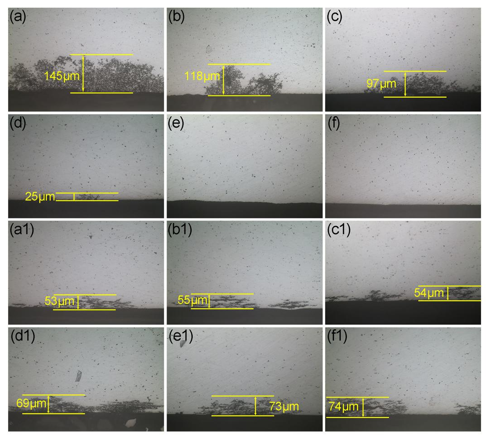

Fig. 17. Corrosion morphology on cross-section of the extruded profiles (a) (a1) HE-0, (b) (b1) HE-1, (c) (c1) HE-2, (d) (d1) HE-3, (e) (e1) HE-4, and (f) (f1) HE-3W. (a)–(f) correspond to the welding zones, and (a1)–(f1) correspond to the matrix zones.

homogenization temperature reached 465 °C, the corrosion in welding zones almost disappeared.

## Declaration of competing interest

The authors declare that they have no known competing financial interests or personal relationships that could have appeared to influence the work reported in this paper.

## Acknowledgements

The authors would like to acknowledge the financial supports from the National Key Research and Development Program of China (2017YFB0306402), National Natural Science Foundation of China (U1708251), and Key Research and Development Program of Shandong Province (2018GGX103041).

## Data availability

The raw/processed data required to reproduce these findings cannot be shared at this time due to technical or time limitations.

## References

- [1] [M. Nakai, T. Eto, New aspect of development of high strength aluminum alloys for](http://refhub.elsevier.com/S1044-5803(19)33423-0/rf0005) [aerospace application, Mater. Sci. Eng. A 35 \(2002\) 62](http://refhub.elsevier.com/S1044-5803(19)33423-0/rf0005)–68.
- [2] [P. Sepehrband, S. Esmaeili, Application of recently developed approaches to mi](http://refhub.elsevier.com/S1044-5803(19)33423-0/rf0010)[crostructural characterization and yield strength modeling of aluminum alloy](http://refhub.elsevier.com/S1044-5803(19)33423-0/rf0010) [AA7030, Mater. Sci. Eng. A 487 \(2008\) 309](http://refhub.elsevier.com/S1044-5803(19)33423-0/rf0010)–315.

- [3] [P.K. Rout, M.M. Ghosh, K.S. Ghosh, Microstructural, mechanical and electro](http://refhub.elsevier.com/S1044-5803(19)33423-0/rf0015)[chemical behaviour of a 7017 Al-Zn-Mg alloy of di](http://refhub.elsevier.com/S1044-5803(19)33423-0/rf0015)fferent tempers, Mater. Charact. [104 \(2015\) 49](http://refhub.elsevier.com/S1044-5803(19)33423-0/rf0015)–60.
- [4] P. Dong, S. Chen, K. Chen, Eff[ects of Cu content on microstructure and properties of](http://refhub.elsevier.com/S1044-5803(19)33423-0/rf0020) [super-high-strength Al-9.3Zn-2.4Mg-xCu-Zr alloy, J. Alloy. Comp. 788 \(2019\)](http://refhub.elsevier.com/S1044-5803(19)33423-0/rf0020) 329–[337.](http://refhub.elsevier.com/S1044-5803(19)33423-0/rf0020)
- [5] [Y. Dong, C. Zhang, G. Zhao, Y. Guan, A. Gao, W. Sun, Constitutive equation and](http://refhub.elsevier.com/S1044-5803(19)33423-0/rf0025) [processing maps of an Al-Mg-Si aluminum alloy: determination and application in](http://refhub.elsevier.com/S1044-5803(19)33423-0/rf0025) [simulating extrusion process of complex pro](http://refhub.elsevier.com/S1044-5803(19)33423-0/rf0025)files, Mater. Des. 92 (2016) 983–997.
- [6] [G. Chen, L. Chen, G. Zhao, C. Zhang, W. Cui, Microstructure analysis of an Al-Zn-mg](http://refhub.elsevier.com/S1044-5803(19)33423-0/rf0030) [alloy during porthole die extrusion based on modeling of constitutive equation and](http://refhub.elsevier.com/S1044-5803(19)33423-0/rf0030) [dynamic recrystallization, J. Alloy. Comp. 710 \(2017\) 80](http://refhub.elsevier.com/S1044-5803(19)33423-0/rf0030)–91.
- [7] [H. Wang, J. Xu, Y. Kang, M. Tang, Z. Zhang, Study on inhomogeneous character](http://refhub.elsevier.com/S1044-5803(19)33423-0/rf0035)[istics and optimize homogenization treatment parameter for large size DC ingots of](http://refhub.elsevier.com/S1044-5803(19)33423-0/rf0035) [Al-Zn-Mg-Cu alloys, J. Alloy. Comp. 585 \(2014\) 19](http://refhub.elsevier.com/S1044-5803(19)33423-0/rf0035)–24.
- [8] [K. Chen, H. Liu, Z. Zhang, S. Li, R.I. Todd, The improvement of constituent dis](http://refhub.elsevier.com/S1044-5803(19)33423-0/rf0040)[solution and mechanical properties of 7055 aluminum alloy by stepped heat](http://refhub.elsevier.com/S1044-5803(19)33423-0/rf0040) [treatments, J. Mater. Process. Technol. 142 \(2003\) 190](http://refhub.elsevier.com/S1044-5803(19)33423-0/rf0040)–196.
- [9] [D. Godard, P. Archambault, E. Aeby-Gautier, G. Lapasset, Precipitation sequences](http://refhub.elsevier.com/S1044-5803(19)33423-0/rf0045) [during quenching of the AA 7010 alloy, Acta Mater. 50 \(2002\) 2319](http://refhub.elsevier.com/S1044-5803(19)33423-0/rf0045)–2329.
- [10] [C. Mondal, A.K. Mukhopadhyay, On the nature of T\(Al2Mg3Zn3\) and S\(Al2CuMg\)](http://refhub.elsevier.com/S1044-5803(19)33423-0/rf0050) [phases present in as-cast and annealed 7055 aluminum alloy, Mater. Sci. Eng. A 391](http://refhub.elsevier.com/S1044-5803(19)33423-0/rf0050) [\(2005\) 367](http://refhub.elsevier.com/S1044-5803(19)33423-0/rf0050)–376.
- [11] [J.D. Robson, Microstructural evolution in aluminium alloy 7050 during processing,](http://refhub.elsevier.com/S1044-5803(19)33423-0/rf0055) [Mater. Sci. Eng. A 382 \(2004\) 112](http://refhub.elsevier.com/S1044-5803(19)33423-0/rf0055)–121.
- [12] [L.L. Rokhlin, T.V. Dobatkina, N.R. Bochvar, E.V. Lysova, Investigation of phase](http://refhub.elsevier.com/S1044-5803(19)33423-0/rf0060) [equilibria in alloys of the Al-Zn-Mg-Cu-Zr-Sc system, J. Alloy. Comp. 367 \(2004\)](http://refhub.elsevier.com/S1044-5803(19)33423-0/rf0060) 10–[16.](http://refhub.elsevier.com/S1044-5803(19)33423-0/rf0060)
- [13] [W.X. Shu, L.G. Hou, J.C. Liu, C. Zhang, F. Zhang, J.T. Liu, L.Z. Zhuang, J.S. Zhang,](http://refhub.elsevier.com/S1044-5803(19)33423-0/rf0065) Solidifi[cation paths and phase components at high temperatures of high-Zn Al-Zn-](http://refhub.elsevier.com/S1044-5803(19)33423-0/rf0065)Mg-Cu alloys with diff[erent Mg and Cu contents, Metall. Mater. Trans. A 46 \(2015\)](http://refhub.elsevier.com/S1044-5803(19)33423-0/rf0065) 5375–[5392.](http://refhub.elsevier.com/S1044-5803(19)33423-0/rf0065)
- [14] [X. Fan, D. Jiang, Q. Meng, L. Zhong, The microstructural evolution of an Al-Zn-Mg-](http://refhub.elsevier.com/S1044-5803(19)33423-0/rf0070)[Cu alloy during homogenization, Mater. Lett. 60 \(2006\) 1475](http://refhub.elsevier.com/S1044-5803(19)33423-0/rf0070)–1479.
- [15] [X. Yu, J. Sun, Z. Li, C. Li, W. Liu, P. Zhu, Z. Yu, Solidi](http://refhub.elsevier.com/S1044-5803(19)33423-0/rf0075)fication and homogenization [behaviors of Al-9.1 Zn-2.1 Mg-2.2 Cu-0.1 Zr-0.07 Ce alloy, Mater. Res. Express 6](http://refhub.elsevier.com/S1044-5803(19)33423-0/rf0075) [\(2019\) 26574.](http://refhub.elsevier.com/S1044-5803(19)33423-0/rf0075)

- [16] [Y. Liu, D. Jiang, W. Xie, J. Hu, B. Ma, Solidi](http://refhub.elsevier.com/S1044-5803(19)33423-0/rf0080)fication phases and their evolution [during homogenization of a DC cast Al-8.35Zn-2.5Mg-2.25Cu alloy, Mater. Charact.](http://refhub.elsevier.com/S1044-5803(19)33423-0/rf0080) [93 \(2014\) 173](http://refhub.elsevier.com/S1044-5803(19)33423-0/rf0080)–183.
- [17] [J. Yu, G. Zhao, L. Chen, Analysis of longitudinal weld seam defects and investiga](http://refhub.elsevier.com/S1044-5803(19)33423-0/rf0085)[tion of solid-state bonding criteria in porthole die extrusion process of aluminum](http://refhub.elsevier.com/S1044-5803(19)33423-0/rf0085) alloy profi[les, J. Mater. Process. Technol. 237 \(2016\) 31](http://refhub.elsevier.com/S1044-5803(19)33423-0/rf0085)–47.
- [18] [G. Chen, L. Chen, G. Zhao, C. Zhang, Microstructure evolution during solution](http://refhub.elsevier.com/S1044-5803(19)33423-0/rf0090) treatment of extruded Al-Zn-Mg profi[le containing a longitudinal weld seam, J.](http://refhub.elsevier.com/S1044-5803(19)33423-0/rf0090) [Alloy. Comp. 729 \(2017\) 210](http://refhub.elsevier.com/S1044-5803(19)33423-0/rf0090)–221.
- [19] [X.H. Fan, D. Tang, W.L. Fang, D.Y. Li, Y.H. Peng, Microstructure development and](http://refhub.elsevier.com/S1044-5803(19)33423-0/rf0095) [texture evolution of aluminum multi-port extrusion tube during the porthole die](http://refhub.elsevier.com/S1044-5803(19)33423-0/rf0095) [extrusion, Mater. Charact. 118 \(2016\) 468](http://refhub.elsevier.com/S1044-5803(19)33423-0/rf0095)–480.
- [20] [G. Chen, L. Chen, G. Zhao, B. Lu, Investigation on longitudinal weld seams during](http://refhub.elsevier.com/S1044-5803(19)33423-0/rf0100) [porthole die extrusion process of high strength 7075 aluminum alloy, Int. J. Adv.](http://refhub.elsevier.com/S1044-5803(19)33423-0/rf0100) [Manuf. Tech. 91 \(2016\) 1897](http://refhub.elsevier.com/S1044-5803(19)33423-0/rf0100)–1907.
- [21] [J. Yu, G. Zhao, W. Cui, C. Zhang, L. Chen, Microstructural evolution and mechanical](http://refhub.elsevier.com/S1044-5803(19)33423-0/rf0105) [properties of welding seams in aluminum alloy pro](http://refhub.elsevier.com/S1044-5803(19)33423-0/rf0105)files extruded by a porthole die under diff[erent billet heating temperatures and extrusion speeds, J. Mater. Process.](http://refhub.elsevier.com/S1044-5803(19)33423-0/rf0105) [Technol. 247 \(2017\) 214](http://refhub.elsevier.com/S1044-5803(19)33423-0/rf0105)–222.
- [22] [S. Yuan, L. Chen, J. Tang, G. Zhao, C. Zhang, J. Yu, Correlation between homo](http://refhub.elsevier.com/S1044-5803(19)33423-0/rf0110)[genization treatment and subsequent hot extrusion of Al-Mg-Si alloy, J. Mater. Sci.](http://refhub.elsevier.com/S1044-5803(19)33423-0/rf0110) [54 \(2019\) 9843](http://refhub.elsevier.com/S1044-5803(19)33423-0/rf0110)–9856.
- [23] [L. He, X. Li, P. Zhu, Y. Cao, Y. Guo, J. Cui, E](http://refhub.elsevier.com/S1044-5803(19)33423-0/rf0115)ffects of high magnetic field on the [evolutions of constituent phases in 7085 aluminum alloy during homogenization,](http://refhub.elsevier.com/S1044-5803(19)33423-0/rf0115) [Mater. Charact. 71 \(2012\) 19](http://refhub.elsevier.com/S1044-5803(19)33423-0/rf0115)–23.
- [24] [H. She, D. Shu, W. Chu, J. Wang, B. Sun, Microstructural aspects of second phases in](http://refhub.elsevier.com/S1044-5803(19)33423-0/rf0120) [as-cast and homogenized 7055 aluminum alloy with di](http://refhub.elsevier.com/S1044-5803(19)33423-0/rf0120)fferent impurity contents, [Metall. Mater. Trans. A 44 \(2013\) 3504](http://refhub.elsevier.com/S1044-5803(19)33423-0/rf0120)–3510.
- [25] [S.E. Kervee, P. Pourshayan, F. Nasrollahnezhad, S.K. Moghanaki, M. Kazeminezhad,](http://refhub.elsevier.com/S1044-5803(19)33423-0/rf0125)

- [R.E. Logé, S. Nobakht, Non-isothermal aging of a high-Zn-containing Al-Zn-Mg-Cu](http://refhub.elsevier.com/S1044-5803(19)33423-0/rf0125) [alloy: microstructure and mechanical properties, Mater. Sci. Technol. 34 \(2018\)](http://refhub.elsevier.com/S1044-5803(19)33423-0/rf0125) 688–[697.](http://refhub.elsevier.com/S1044-5803(19)33423-0/rf0125)
- [26] [P. Priya, D.R. Johnson, M.J.M. Krane, Precipitation during cooling of 7XXX alu](http://refhub.elsevier.com/S1044-5803(19)33423-0/rf0130)[minum alloys, Comput. Mater. Sci. 139 \(2017\) 273](http://refhub.elsevier.com/S1044-5803(19)33423-0/rf0130)–284.
- [27] [S. Guo, Z.L. Ning, M.X. Zhang, F.Y. Cao, J.F. Sun, E](http://refhub.elsevier.com/S1044-5803(19)33423-0/rf0135)ffects of gas to melt ratio on the microstructure of an Al–10.83Zn–3.39Mg–1.22Cu [alloy produced by spray atomi](http://refhub.elsevier.com/S1044-5803(19)33423-0/rf0135)[zation and deposition, Mater. Charact. 87 \(2014\) 62](http://refhub.elsevier.com/S1044-5803(19)33423-0/rf0135)–69.
- [28] [J.S. Vetrano, S.M. Bruemmer, L.M. Pawlowski, I.M. Robertson, In](http://refhub.elsevier.com/S1044-5803(19)33423-0/rf0140)fluence of the [particle size on recrystallization and grain growth in Al-Mg-X alloys, Mater. Sci.](http://refhub.elsevier.com/S1044-5803(19)33423-0/rf0140) [Eng. A 238 \(1997\) 101](http://refhub.elsevier.com/S1044-5803(19)33423-0/rf0140)–107.
- [29] [Y. Sun, Q. Pan, Y. Sun, W. Wang, Z. Huang, X. Wang, Q. Hu, Localized corrosion](http://refhub.elsevier.com/S1044-5803(19)33423-0/rf0145) [behavior associated with Al7Cu2Fe intermetallic in Al-Zn-Mg-Cu-Zr alloy, J. Alloy.](http://refhub.elsevier.com/S1044-5803(19)33423-0/rf0145) [Comp. 783 \(2019\) 329](http://refhub.elsevier.com/S1044-5803(19)33423-0/rf0145)–340.
- [30] [P.S. Pao, C.R. Feng, S.J. Gill, Corrosion fatigue crack initiation in aluminum alloys](http://refhub.elsevier.com/S1044-5803(19)33423-0/rf0150) [7075 and 7050, Corrosion 56 \(2000\) 1022](http://refhub.elsevier.com/S1044-5803(19)33423-0/rf0150)–1031.
- [31] [J. Soltis, Passivity breakdown, pit initiation and propagation of pits in metallic](http://refhub.elsevier.com/S1044-5803(19)33423-0/rf0155) [materials-review, Corros. Sci. 90 \(2015\) 5](http://refhub.elsevier.com/S1044-5803(19)33423-0/rf0155)–22.
- [32] [M. Dumont, W. Lefebvre, B. Doisneau-Cottignies, A. Deschamps, Characterisation of](http://refhub.elsevier.com/S1044-5803(19)33423-0/rf0160) [the composition and volume fraction of](http://refhub.elsevier.com/S1044-5803(19)33423-0/rf0160) η′ and η precipitates in an Al-Zn-Mg alloy by [a combination of atom probe, small-angle X-ray scattering and transmission elec](http://refhub.elsevier.com/S1044-5803(19)33423-0/rf0160)[tron microscopy, Acta Mater. 53 \(2005\) 2881](http://refhub.elsevier.com/S1044-5803(19)33423-0/rf0160)–2892.
- [33] [S. Kumari, S. Wenner, J.C. Walmsley, O. Lunder, K. Nisancioglu, Progress in un](http://refhub.elsevier.com/S1044-5803(19)33423-0/rf0165)[derstanding initiation of intergranular corrosion on AA6005 aluminum alloy with](http://refhub.elsevier.com/S1044-5803(19)33423-0/rf0165) [low copper content, J. Electrochem. Soc. 166 \(2019\) C3114](http://refhub.elsevier.com/S1044-5803(19)33423-0/rf0165)–C3123.
- [34] [A.I. Ikeuba, B. Zhang, J. Wang, E. Han, W. Ke, P.C. Okafor, SVET and SIET study of](http://refhub.elsevier.com/S1044-5803(19)33423-0/rf0170) [galvanic corrosion of Al/MgZn2](http://refhub.elsevier.com/S1044-5803(19)33423-0/rf0170) in aqueous solutions at different pH, J. [Electrochem. Soc. 165 \(2018\) C180](http://refhub.elsevier.com/S1044-5803(19)33423-0/rf0170)–C194.