ELSEVIER

#### Contents lists available at ScienceDirect

### Materials & Design

journal homepage: www.elsevier.com/locate/matdes

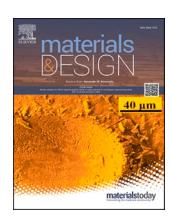

## The evolution mechanism of the second phase during homogenization of Al-Zn-Mg-Cu aluminum alloy

Rensong Huang a, Hongfu Yang a, Shanju Zheng a,\*, Mengnie Li a,\*, Hui Wang d, Yonghua Duan a,\*, Chongfeng Yue b, Chun Yang c

- a Faculty of Material Science and Engineering, Kunming University of Science and Technology, Kunming 650093, China
- b Beijing Cisri-nmt Engineering Technology Co., Ltd., Beijing 100081, China
- c AVIC Touchstone Testing Innovation (Dachang) Co., Ltd., Beijing 100081, China
- d Inner Mongolia Zhongsheng Engineering Technology Co., Ltd., Alashan 750300, China

#### ARTICLE INFO

# Keywords: Al-Zn-Mg-Cu aluminum alloy Homogenization Phase evolution Phase composition Atomic diffusion

#### ABSTRACT

The evolution mechanism of the second phase in the homogenization process of Al-Zn-Mg-Cu aluminum alloy was thoroughly investigated. The results revealed that the phase transition of Mg(Zn, Cu, Al) $_2$  to S(Al $_2$ CuMg) occurs due to the interdiffusion between Zn and Al atoms at the interface during homogenization at 420 °C for 15 to 30 min. Additionally, the dissolution of S(Al $_2$ CuMg) into the Al- matrix is governed by the interdiffusion of (Mg, Cu atoms) and Al atoms. Notably, the  $\theta$ (Al $_2$ Cu) phase plays a crucial role as an intermediate transition phase facilitating the dissolution of S(Al $_2$ CuMg) into the Al- matrix. These findings significantly contribute to our understanding of the complex processes involved in the phase transformations during the homogenization of the Al-Zn-Mg-Cu aluminum alloy.

#### 1. Introduction

Aluminum alloys from the Al-Zn-Mg-Cu series are classified as heat treatable deformation-strengthened aluminum alloys, known for their high strength, good corrosion resistance, and excellent fatigue resistance [1–4]. These properties make them highly suitable for applications in the aerospace, rail transit, and automobile industries. The manufacturing process for Al-Zn-Mg-Cu aluminum alloy includes alloy composition design, direct casting, homogenization treatment, rolling deformation, solution treatment, quenching treatment, and aging treatment [5–7]. It is important to note that the previous manufacturing process can have a significant impact on the subsequent manufacturing process.

Previous studies [8,9] have demonstrated that as-cast Al-Zn-Mg-Cu alloys contain several phases, including Al- matrix, Mg(Zn, Cu, Al)2, S (Al2CuMg), Al7Cu2Fe, Mg2Si, and  $\theta$ (Al2Cu). The high melting point phases Al7Cu2Fe and Mg2Si can be fragmented and dispersed along grain boundaries through deformation [10,11]. The residue of Mg(Zn, Cu, Al)2 and S(Al2CuMg) phases can deteriorate the corrosion resistance of the alloy [12–16]. Previous studies [17,18] have found that the Mg(Zn, Cu, Al)2 phase can be eliminated, while the addition of Nd and Ce elements

can reduce the content of S(Al2CuMg) phase in the alloy [19,20]. However, previous studies have also shown that the Mg(Zn, Cu, Al)2 phase can evolve into the S(Al2CuMg) phase [21–24]. However, there is also a study [25] that reported that Al-Zn-Mg-Cu alloy with high Zn content does not undergo phase transformation. In our previous investigation [26], it was discovered that employing a two-stage homogenization process effectively eliminated the Mg(Zn, Cu, Al)2 and the S (Al2CuMg) phases. This resulted in a substantial enhancement in the concentration of Mg elements within the Al- matrix. The transformation from the Mg(Zn, Cu, Al)2 phase into the S(Al2CuMg) phase, as well as the dissolution of both phases into the Al- matrix, has piqued considerable interest. Previous studies [27-33] have reported that Zn in the Mg(Zn, Cu, Al)2 phase diffuses into the Al- matrix, leading to the formation of the S(Al2CuMg) phase at their interface. Additionally, it has been suggested that the Al7Cu2Fe phase in the alloy might act as a potential factor for nucleation of the S(Al2CuMg) phase. The growth rate of the S (Al2CuMg) phase, as indicated by previous research [34–39], primarily depends on the diffusion of Cu and Zn atoms.

The primary objective of this research is to explore the driving force behind the transformation of the Mg(Zn, Cu, Al)2 phase into the S (Al2CuMg) phase and to unravel the intricate process of the dissolution

E-mail addresses: zhengshanju1@163.com (S. Zheng), limengnie@163.com (M. Li), duanyh@kust.edu.cn (Y. Duan).

\* Corresponding authors.

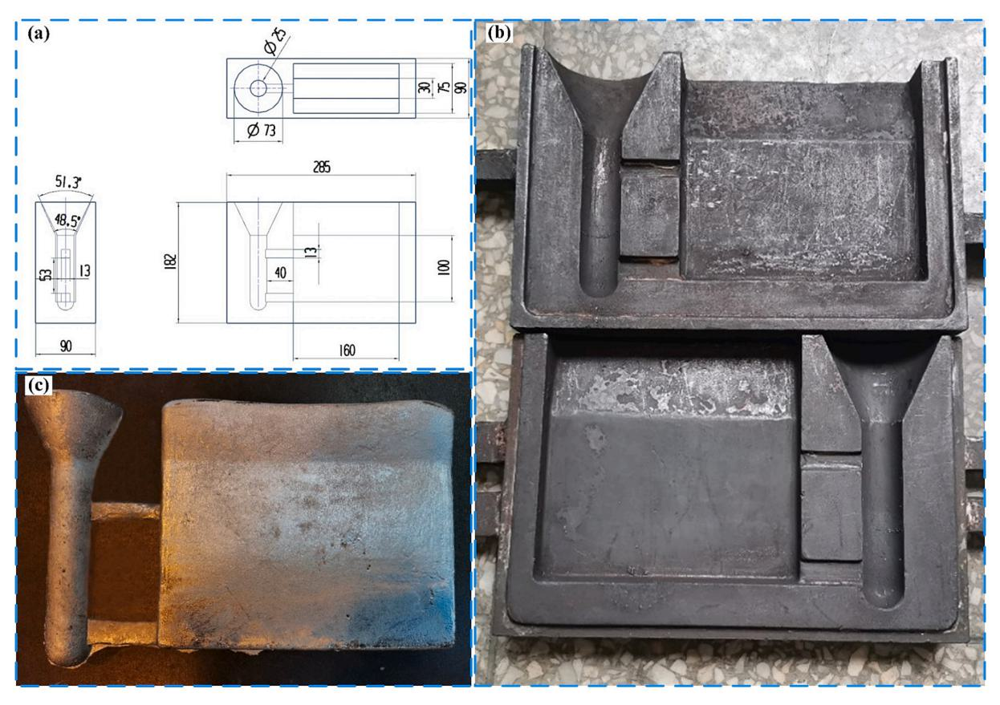

**Fig. 1.** The dimensions and physical appearance of the iron mold, and physical appearance of the alloy after solidification and demoulding.

**Table 1**  Chemical composition of cast alloy (wt.%).

| Elements    | Zn   | Mg   | Cu   | Zr    | Cr     | Mn     | Ti     | Fe    | Si     | Al   |
|-------------|------|------|------|-------|--------|--------|--------|-------|--------|------|
| Composition | 6.43 | 2.21 | 2.15 | 0.177 | 0.0357 | 0.0977 | 0.0508 | 0.105 | 0.0138 | Bal. |

**Table 2**  The homogenization parameters of the cast alloy.

| Parameters | 5 min | 0.25 h | 0.5 h | 2 h  | 36 h | 54 h | 72 h |
|------------|-------|--------|-------|------|------|------|------|
| 380 ◦C     | –     | –      | –     | –    | 380/ | 380  | 380/ |
|            |       |        |       |      | 36   | /54  | 72   |
| 390 ◦C     | –     | –      | –     | –    | 390/ | 390  | 390/ |
|            |       |        |       |      | 36   | /54  | 72   |
| 400 ◦C     | –     | –      | –     | –    | 400  | 400/ | 400/ |
|            |       |        |       |      | /36  | 54   | 72   |
| 420 ◦C     | 420/  | 420/   | 420/  | 420/ | 420  | 420/ | 420/ |
|            | 5     | 0.25   | 0.5   | 2    | /36  | 54   | 72   |
| 430 ◦C     | –     | –      | –     | –    | 430  | 430  | 430/ |
|            |       |        |       |      | /36  | /54  | 72   |

of both phases into the Al- matrix. This investigation aims to offer valuable insights to fellow researchers in the field, facilitating a deeper understanding of the dissolution mechanisms of the Mg(Zn, Cu, Al)2 and S(Al2CuMg) phases. By shedding light on these processes, our study can provide essential guidance for future research endeavors in this area.

#### **2. Experimental and materials**

The Al-Zn-Mg-Cu alloy was prepared through melting in a medium frequency induction furnace and casting into an iron mold. The dimensions of the iron mold are presented in Fig. 1(a), and its physical appearance is illustrated in Fig. 1(b). Prior to casting, the iron mold is

preheated to 100 ◦C, and the casting temperature is precisely maintained at 700 ◦C ± 3 ◦C. The ingot is then subjected to natural air cooling, and Fig. 1(c) displays the physical appearance of the ingot after solidification and demolding. The starting materials used were pure Al (99.9 %), as well as Al-30 %Zn, Al-50 %Mg, Al-50 %Cu, Al-50 %Cr, Al-10 %Mn, Al-10 %Ti, and Al-10 %Zr master alloy. Table 1 presents the chemical composition of the Al-Zn-Mg-Cu alloy.

The homogenization samples were taken from the same ingot. The heat treatment furnace used in this study was a self-made programcontrolled high-flux furnace with a temperature control error of ± 1 ◦C. A heating rate of 60 ◦C/h was employed in this experiment. After homogenization, the samples were cooled to room temperature using cold water to achieve the desired high-temperature microstructure. The homogenization parameters are presented in Table 2.

Phase identifications in the samples were examined by X-ray diffraction analysis (XRD) with Cu Kα radiation on PW2273/00 diffractometers. Phases transition temperatures of samples were determined using a NETZSCH STA 449 F3 differential scanning calorimeter (DSC). The samples were heated from 20 ◦C to 700 ◦C with a heating rate of 10 ◦C/min. To obtain TEM samples, the as-cast and homogenized samples were first cut into thin slices with a thickness of 1 mm using wire cutting, then manually ground to less than 70 μm, and finally thinned using a plasma thinner. A FEI Tecnai G2 F20 transmission electron microscope (TEM) coupled with energy dispersive X-ray (EDX) operating at 200 kV was used to observe the microstructure of the sample and obtain the selected area electron diffraction (SAED) pattern

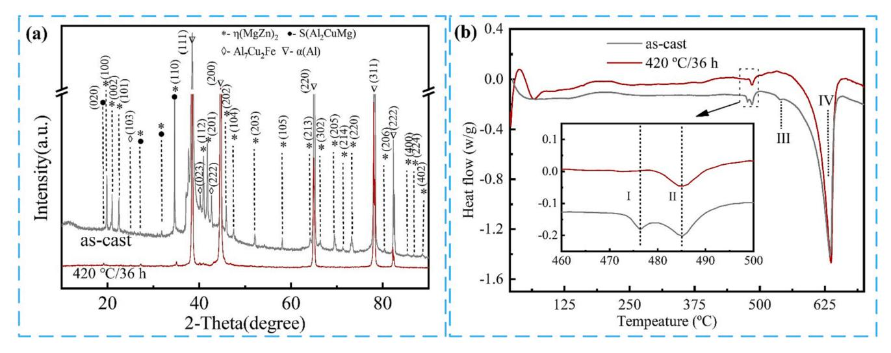

**Fig. 2.** The XRD patterns and DSC curves of as-cast and 420 ◦C/36 h homogenized alloys. (a) XRD patterns; (b) DSC curves.

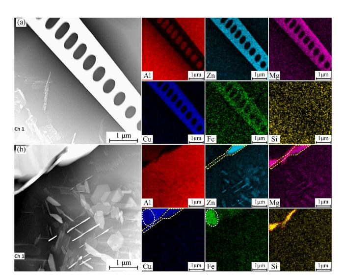

**Fig. 3.** The mapping results of microstructure of the as-cast alloy: (a) The zone of nonequilibrium eutectic structure; (b) The zones of non-equilibrium eutectic structure and Al- matrix.

of the second phase, which allowed for the identification and determination of the crystal structure of the phase under investigation. The microstructure's morphology was characterized using a JSMe7800F scanning electron microscope (SEM).

#### **3. Results and discussion**

#### *3.1. The XRD patterns and DSC curves*

Building upon our previous investigations [\[26,40\],](#page-10-0) our attention was directed towards the analysis of the alloy in its homogenized state at 420 ◦C for 36 h, during which both the Mg(Zn, Cu, Al)2 phase and the S (Al2CuMg) phase coexist. Fig. 2 shows the XRD patterns and DSC curves of as-cast and 420 ◦C/36 h homogenized alloys. From Fig. 2(a), the X-ray diffraction (XRD) analysis revealed the presence of diffraction peaks corresponding to the Al- matrix, η(MgZn2) phase, and Al7Cu2Fe phase in the as-cast alloy. However, upon homogenization at 420 ◦C for 36 h, a new diffraction peak emerged in the XRD spectrum, attributed to the formation of the S(Al2CuMg) phase in the alloy, indicating a phase transformation compared to the as-cast alloy.

From Fig. 2(b), the DSC curves of the as-cast alloy exhibit four distinct endothermic peaks. These include endothermic peak I, corresponding to the low-melting eutectic phase, observed at 476.36 ◦C; endothermic peak II at 485.19 ◦C; endothermic peak III attributed to the Al7Cu2Fe phase at 540.18 ◦C; and endothermic peak IV associated with the Al- matrix at 633.5 ◦C. After subjecting the alloy to treatment at 420 ◦C for 36 h, no significant peak I is evident in the DSC curve, indicating a change in the low-melting eutectic phase. However, peak II remains present, indicating its persistence even after the treatment.

#### *3.2. The microstructure of as-cast alloy*

#### *3.2.1. The mapping analysis of as-cast microstructure*

Fig. 3 depicts the mapping analysis of the nonequilibrium eutectic structures and Al- matrix. From Fig. 3 (a), the nonequilibrium eutectic structures exhibit a lamellar morphology and are rich in Zn, Mg, Cu, and Fe elements.

In Fig. 3 (b), the yellow dotted line zone shows an enrichment of Zn, Mg, and Cu elements, the white dotted line ellipse zone displays an enrichment of Cu and Fe elements, while the red dotted line zone indicates an enrichment of Mg and Si elements within the nonequilibrium eutectic structure. Moreover, the precipitates demonstrate a noticeable enrichment of Zn and Mg elements.

#### *3.2.2. Identification of the second phase*

[Fig. 4](#page-3-0) presents the selected area electron diffraction (SAED) analysis of the second phase in the as-cast alloy. From [Fig. 4](#page-3-0) (a), the SAED pattern of zone A demonstrates that the η(MgZn)2 phase possesses a hexagonal crystal structure. The selected area electron diffraction (SAED) patterns from regions B and C display a consistent orientational relationship between the η(MgZn)2 phase and the Al- matrix within the lamellae: η(MgZn)2 (2 13 0) // Al- matrix (211).

From [Fig. 4](#page-3-0) (d), the SAED pattern of zone D shows that the η(MgZn2) phase has a hexagonal crystal structure. Moreover, this SAED pattern also reveals the orientation relationship between the η(MgZn2) phase and the Al- matrix: η(MgZn2) (02 2 3) // Al- matrix (1 35). The SAED pattern of zone E shown in [Fig. 4](#page-3-0) (e) indicates that the Al7Cu2Fe phase has a tetragonal crystal structure, and the SAED pattern of zone F reveals the orientation relationship between the Al7Cu2Fe phase and the Almatrix: Al7Cu2Fe (3 9 7) // Al- matrix (611). Lastly, the SAED pattern of zone G demonstrates that the Mg2Si phase possesses a face-centered cubic crystal structure. According to previous studies [\[41,42\]](#page-10-0), it has been noted that when η(MgZn2) contains additional Al and Cu elements, it is commonly referred to as Mg(Zn, Cu, Al)2. Therefore, the phase

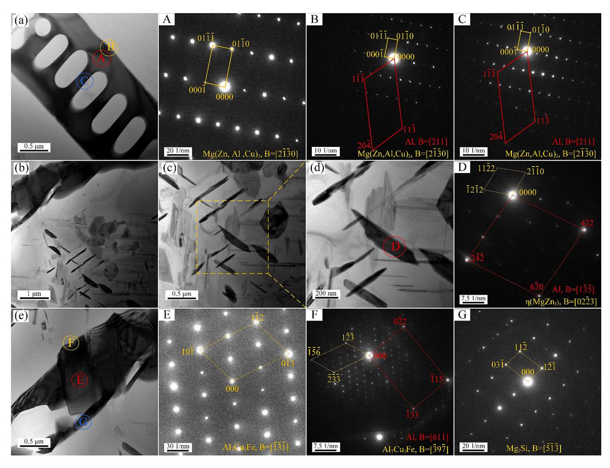

**Fig. 4.** Analysis of selected area diffraction pattern of the second phase in as-cast alloy: Images A, B, C, D, E, F and G represent the selected area electron diffraction (SAED) patterns corresponding to regions A, B, C, D, E, F and G, respectively, in the TEM images (a), (b), (c), (d) and (e).

exhibiting an enrichment of Zn, Mg, and Cu elements in [Fig. 3](#page-2-0)(a) corresponds to the Mg(Zn, Cu, Al)2 phase. To summarize, the as-cast alloy microstructure contains several phases including the Al- matrix, Mg(Zn, Cu, Al)2, Al7Cu2Fe, Mg2Si, and precipitates η(MgZn2) phases. The Mg (Zn, Cu, Al)2 and η(MgZn2) phases share a hexagonal crystal structure.

#### *3.3. Microstructure of the homogenization sample*

#### *3.3.1. Mapping analysis of the homogenization microstructure*

[Fig. 5](#page-4-0) displays the mapping analysis of the homogenization microstructure at 420 ◦C for 36 h. It can be observed that most nonequilibrium eutectic structures are enriched with Mg and Cu elements. Homogenization treatment at 420 ◦C for 36 h has significantly reduced the enrichment of Zn element, as compared to [Fig. 3](#page-2-0). Only a small portion of the nonequilibrium eutectic structure remains enriched in Zn, as indicated by the yellow dotted line zone in [Fig. 5](#page-4-0) (a).

Moreover, the precipitates η(MgZn2) phase in the Al- matrix has been eliminated. A few black phases, rich in Mg and Si, are embedded in the nonequilibrium eutectic structure enriched in Mg and Cu, as shown by the white dotted ellipse zone in [Fig. 5](#page-4-0) (a). A small amount of eutectic structure is still rich in Cu and Fe elements, as indicated by the red dotted line zone in [Fig. 5](#page-4-0) (b). In [Fig. 5](#page-4-0) (c), there exists a second phase enriched in Cu elements between the phase enriched in Cu and Mg elements and the Al- matrix. The degree of enrichment of Al, Zn and Mg elements for the second phase is very similar to that of the Al- matrix.

#### *3.3.2. Identification of the second phase*

[Fig. 6](#page-4-0) shows the EDX analysis of the second phase in homogenization 420 ◦C for 36 h. The chemical compositions of the labeled spots are

presented in [Table 3](#page-5-0). According to [Table 3](#page-5-0), it can be observed that the atomic ratio of Mg to Si for the identified phases A and K is approximately 2:1. This finding suggests that the marked phases A and K are Mg2Si phases.

The marked phases D, H, I and J reveal an average atomic percentage of Al, Cu and Mg as 45.07 %, 15.11 %, and 36.46 %, respectively, indicating that the marked points D, H, I and J correspond to S (Al2CuMg) phases. The labeled phase F is Al7Cu2Fe phase. The atomic ratio of Al to Cu for the identified phase G is approximately 2:1. This finding suggests that the marked phase G are θ(Al2Cu) phase. Additionally, the marked phase B is enriched with Zn, Cu and Mg elements.

[Fig. 7](#page-5-0) illustrates the analysis of the selected area electron diffraction (SAED) pattern of the second phase in 420 ◦C for 36 h homogenization alloy. From [Fig. 7](#page-5-0) (a), the SAED pattern of zone A confirms that the Mg2Si phase has a face centered cubic crystal structure. [Fig. 7](#page-5-0) (b) shows that the SAED pattern of zone C confirms that the S(Al2CuMg) phase has an orthorhombic crystal structure.

Moreover, [Fig. 7](#page-5-0) (b) also shows that the SAED pattern of zone D corresponds to the face-centered cubic crystal structure of the Al- matrix. Notably, [Fig. 7](#page-5-0) (c) indicates that the SAED pattern of zone E corresponds to the θ(Al2Cu) phase, which has a tetragonal crystal structure. Furthermore, the SAED patterns of zone F in [Fig. 7](#page-5-0) (d) demonstrates that the Al7Cu2Fe phase has a tetragonal crystal structure. Most importantly, both the S(Al2CuMg) and θ(Al2Cu) phases were found to be newly formed in the homogenization alloy. Moreover, in the SAED pattern of area B shown in [Fig. 7\(](#page-5-0)a), two distinct sets of selected area electron diffraction spots are observed. The forthcoming TEM line scan results will furnish compelling evidence to substantiate that the regions enriched with Zn, Mg, and Cu elements correspond to the Mg(Zn, Cu,

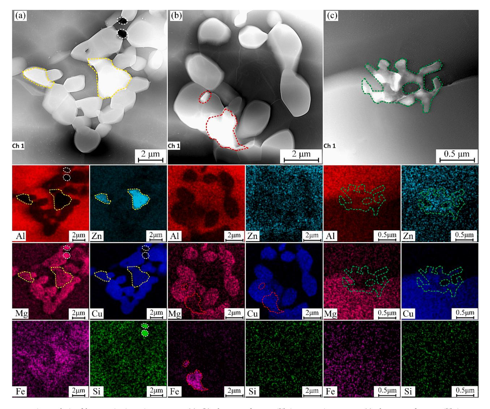

**Fig. 5.** Mapping analysis of homogenization microstructure: (a), (b) The zone of nonequilibrium eutectic structure; (c) The zones of non-equilibrium eutectic structure and Al- matrix.

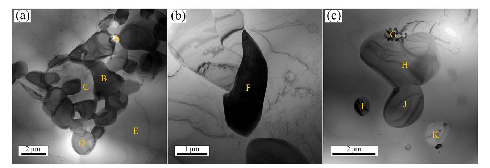

**Fig. 6.** EDX analysis of the second phases in homogenized microstructure.

**Table 3**  The EDX analysis results of the second phase in [Fig. 6](#page-4-0) (at.%).

| Phase marks | Al    | Zn    | Mg    | Cu    | Fe    | Si    | Zr   | Cr   | Mn   | Ti   | Indentified phase |
|-------------|-------|-------|-------|-------|-------|-------|------|------|------|------|-------------------|
| A           | 0.05  | 0.16  | 62.87 | 0.52  | 0.74  | 35.64 | 0.00 | 0.02 | 0.00 | 0.00 | Mg2Si             |
| B           | 9.71  | 49.10 | 10.19 | 29.01 | 1.87  | 0.00  | 0.10 | 0.00 | 0.00 | 0.01 | –                 |
| C           | 89.94 | 7.79  | 0.03  | 1.27  | 0.78  | 0.17  | 0.02 | 0.00 | 0.00 | 0.01 | Al- matrix        |
| D           | 39.10 | 1.47  | 15.50 | 42.79 | 1.08  | 0.01  | 0.04 | 0.01 | 0.00 | 0.00 | S(Al2CuMg)        |
| E           | 93.75 | 4.71  | 0.00  | 0.69  | 0.48  | 0.28  | 0.02 | 0.00 | 0.06 | 0.00 | Al- matrix        |
| F           | 54.24 | 2.30  | 0.01  | 26.17 | 16.62 | 0.10  | 0.00 | 0.05 | 0.51 | 0.01 | Al7Cu2Fe          |
| G           | 60.21 | 5.60  | 4.98  | 27.78 | 1.08  | 0.00  | 0.12 | 0.18 | 0.03 | 0.02 | θ(Al2Cu)          |
| H           | 42.47 | 1.26  | 17.40 | 37.86 | 0.94  | 0.04  | 0.03 | 0.01 | 0.00 | 0.00 | S(Al2CuMg)        |
| I           | 59.05 | 2.44  | 13.03 | 24.52 | 0.71  | 0.18  | 0.03 | 0.02 | 0.00 | 0.00 | S(Al2CuMg)        |
| J           | 39.64 | 1.02  | 17.50 | 40.67 | 0.96  | 0.20  | 0.00 | 0.00 | 0.00 | 0.00 | S(Al2CuMg)        |
| K           | 0.03  | 0.07  | 65.54 | 0.07  | 0.42  | 33.86 | 0.00 | 0.00 | 0.01 | 0.00 | Mg2Si             |

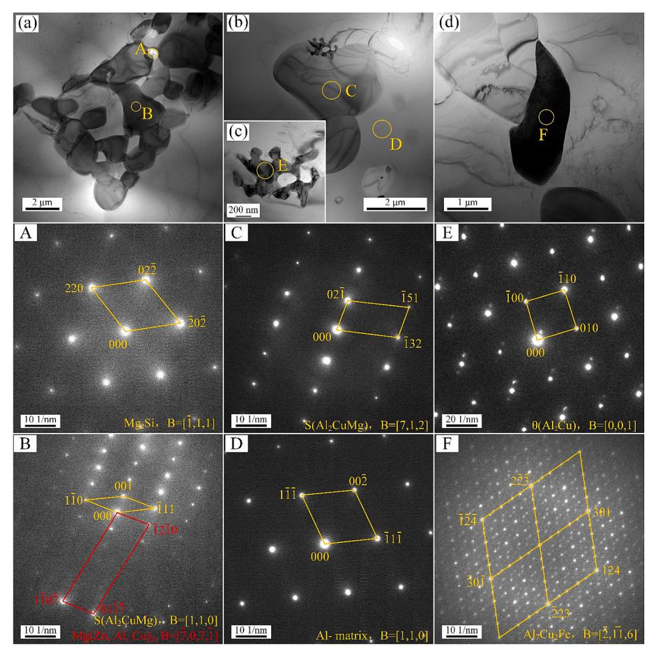

**Fig. 7.** The selected area diffraction pattern of the second phases in 420 ◦C for 36 h homogenization alloy: images A, B, C, D, E, and F represent the selected area electron diffraction (SAED) patterns corresponding to regions A, B, C, D, E, and F, respectively, in the TEM images (a), (b), (c) and (d).

Al)2 phase.

#### *3.4. Second phase evolution during homogenization*

[Fig. 8](#page-6-0) displays the line scanning analysis results of the 420 ◦C for 36 h homogenized Al-Zn-Mg-Cu aluminum alloy. The yellow line indicates the scanning position, and the arrow indicates the scanning direction. [Table 4](#page-7-0) shows the atomic average percentage of the second phase in the homogenized Al-Zn-Mg-Cu alloy. Line 1 shows the elemental distribution of the Zn, Mg, and Cu-enriched phase and S(Al2CuMg) phase. From the scanning results of Line 1, the atomic average percentage content of the enriched Zn, Mg and Cu element phase is close to the alloy composition of the Mg(Zn, Cu, Al)2 phase, refer to the previous research report [\[27\]](#page-10-0). Therefore, the phase enriched in Zn, Mg and Cu elements is

the Mg(Zn, Cu, Al)2 phase.

[Fig. 9](#page-7-0) illustrates the evolution process of the Mg(Zn, Cu, Al)2 phase into the S(Al2CuMg) phase during homogenization. In [Fig. 9](#page-7-0) (a), the Mg (Zn, Cu, Al)2 phase is distributed in a lamellar morphology within the Almatrix. Combined with the results of line scan 2 in [Table 4,](#page-7-0) in comparison to the Mg(Zn, Cu, Al)2 phase, the atomic average percentage of Zn, Mg and Cu in the Al- matrix decreased from 26.17 ± 7.07 at.% to 8.03 ± 0.98 at.%, 26.01 ± 4.50 at.% to 3.15 ± 0.72 at.%, and 16.95 ± 4.3 at.% to 0.33 ± 0.13 at.%, respectively. Conversely, the atomic average percentage of Al within the Al- matrix increases substantially from 30.85 ± 7.47 at.% to 88.48 ± 1.24 at.%. This results in a difference in element concentration at the interface between the Mg(Zn, Cu, Al)2 phase and the Al- matrix.

Throughout the entire heating and holding process of the sample, it is

*Materials & Design 235 (2023) 112395 R. Huang et al.* 

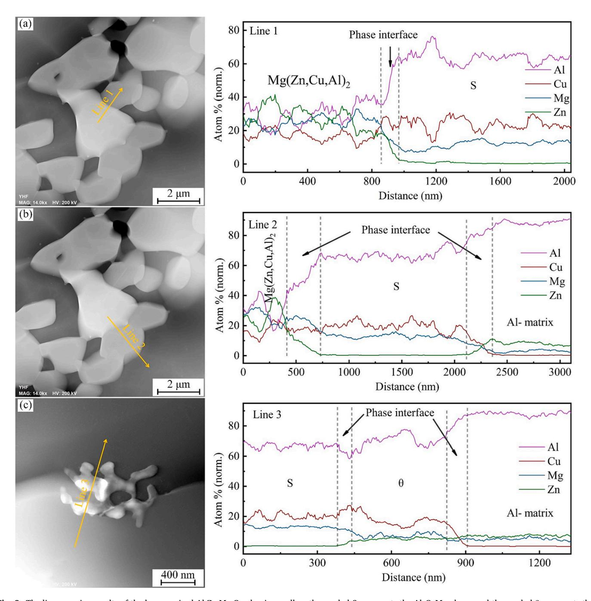

**Fig. 8.** The line scanning results of the homogenized Al-Zn-Mg-Cu aluminum alloy, the symbol S represents the Al2CuMg phase, and the symbol θ represents the Al2Cu phase.

**Table 4**  The atomic average percentage of the second phase in the alloy homogenized at 420 ◦C for 36 h (at.%).

| Elements | Al      | Cu      | Mg      | Zn      | Phases     |
|----------|---------|---------|---------|---------|------------|
| Line 1   | 30.39 ± | 17.41 ± | 24.93 ± | 27.31 ± | Mg(Zn, Cu, |
|          | 6.27    | 3.69    | 3.46    | 6.51    | Al)2       |
|          | 63.78 ± | 23.93 ± | 11.67 ± | 0.66 ±  | S(Al2CuMg) |
|          | 3.75    | 3.60    | 2.25    | 0.49    |            |
| Line 2   | 30.85 ± | 16.95 ± | 26.01 ± | 26.17 ± | Mg(Zn, Cu, |
|          | 7.47    | 4.30    | 4.50    | 7.07    | Al)2       |
|          | 67.14 ± | 19.66 ± | 12.77 ± | 0.40 ±  | S(Al2CuMg) |
|          | 3.32    | 3.12    | 1.55    | 0.18    |            |
|          | 88.48 ± | 0.33 ±  | 3.15 ±  | 8.03 ±  | Al- matrix |
|          | 1.24    | 0.13    | 0.72    | 0.98    |            |
| Line 3   | 66.82 ± | 19.87 ± | 13.06 ± | 0.30 ±  | S(Al2CuMg) |
|          | 1.60    | 1.99    | 0.67    | 0.11    |            |
|          | 71.17 ± | 16.45 ± | 7.34 ±  | 5.14 ±  | θ(Al2Cu)   |
|          | 3.33    | 2.58    | 1.38    | 0.67    |            |
|          | 88.06 ± | 0.18 ±  | 4.89 ±  | 7.03 ±  | Al- matrix |
|          | 1.23    | 0.10    | 0.77    | 0.60    |            |

observed that Zn atoms within the Mg(Zn, Cu, Al)2 phase exhibit a higher tendency to diffuse with the Al atoms present in the Al- matrix at their interface. This observation gains further support from the data obtained from Line scan 1 in Table 4, wherein it is evident that the S (Al2CuMg) phase, resulting from the phase transition, displays the most significant difference in atomic average percentages between Al and Zn when compared to the initial Mg(Zn, Cu, Al)2 phase. Similar interdiffusion phenomena have been reported in previous studies [\[43\]](#page-10-0). To reveal the conditions under which phase evolution occurs, the as-cast samples were carried out at 420 ◦C under the conditions of homogenization and holding for 5 min, 15 min, 30 min and 120 min. [Fig. 10](#page-8-0) shows the microstructures resulting of four different homogenization times at 420 ◦C. From [Fig. 10,](#page-8-0) no phase transition was observed in the microstructures that underwent homogenization and incubation at 420 ◦C for 5 and 15 min.

However, when the homogenization time was extended to 30 min, a phase transition was observed in the microstructure. This suggests that the duration required for the phase transition during homogenization lies between 15 min and 30 min. As the Zn atoms of the Al- matrix migrate to the center of the Al- matrix, the Mg(Zn, Cu, Al)2 phase at the interface gains Al atoms while losing Zn atoms. Consequently, a part of the Mg(Zn, Cu, Al)2 phase near the interface evolves into the S (Al2CuMg) phase. A distinct phase interface is formed between the two phases, as shown in Fig. 9(d) and 10(d). The rate of interfacial reactions controls phase evolution, as reported by previous studies [\[44\].](#page-10-0)

When subjecting the sample to a continuous supply of heat (ranging from 380 ◦C to 400 ◦C), a noticeable phenomenon occurs: the interface between the Mg(Zn, Cu, Al)2 and S(Al2CuMg) phases undergoes continuous migration towards the Mg(Zn, Cu, Al)2 phase. This migration results in the formation of a distinctive microstructure where the two phases coexist. This is clearly illustrated in Fig. 9(e), Fig. 9(f), and [Fig. 11](#page-8-0).

[Fig. 12](#page-9-0) depicts the dissolution process of the S(Al2CuMg) phase into the Al- matrix during homogenization. From [Fig. 12\(](#page-9-0)a), a concentration difference in elements is observed at the interface between the S (Al2CuMg) phase and the Al- matrix. The data presented in Table 4, which provides supporting evidence.

To investigate the interdiffusion between Mg and Cu atoms in the S (Al2CuMg) phase and Al atoms in the Al- matrix, and the S(Al2CuMg) phase dissolves into the Al- matrix. We conducted a comprehensive study. This involved observing the microstructures of six sets of homogenized samples. The results of these observations are effectively displayed in [Fig. 13](#page-9-0). From [Fig. 13](#page-9-0), after subjecting the sample to a 420 ◦C environment for 72 h, a noteworthy observation was made. The gray S(Al2CuMg) phase underwent dissolution and merged into the Almatrix, leading to the disruption of the previous lamellar morphology. These findings are in agreement with the schematic diagram depicted in [Fig. 12](#page-9-0)(c).

At 430 ◦C, with an increase in the holding time from 36 h to 72 h, a notable transformation occurred. The lamellar microstructure, characterized by the coexistence of the Mg(Zn, Cu, Al)2 and S(Al2CuMg) phases, began to dissolve into the Al- matrix simultaneously. As a consequence, the lamellar morphology was severely disrupted, ultimately leading to the formation of a chain-bead-like microstructure. The observed evolution of the microstructure can be attributed to the

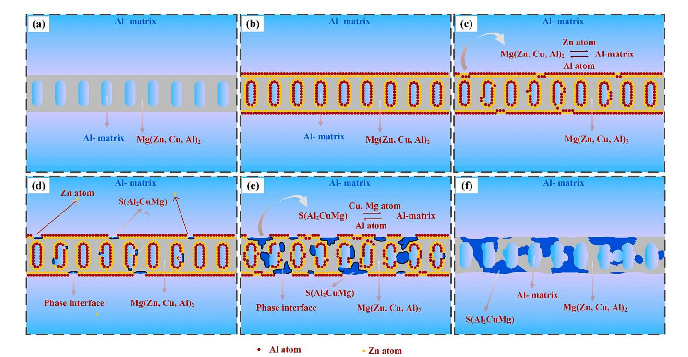

**Fig. 9.** The schematic diagram of the evolution of Mg(Zn, Cu, Al)2 phase into S(Al2CuMg) phase during homogenization.

*Materials & Design 235 (2023) 112395 R. Huang et al.* 

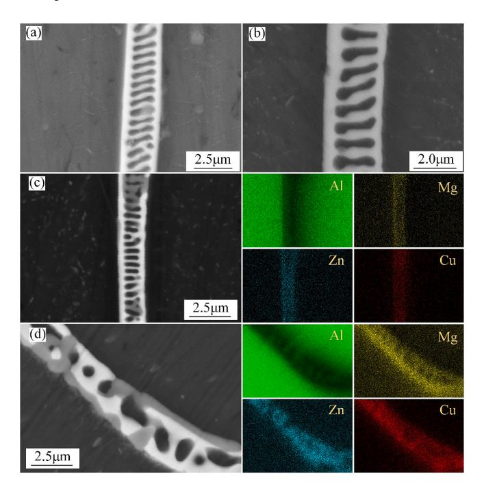

**Fig. 10.** The microstructures resulting of three different homogenization times at 420 ◦C. (a) 5 min; (b) 15 min; (c) 30 min; and (d) 120 min.

interdiffusion of Mg and Cu atoms within the S(Al2CuMg) phase, as well as Al atoms within the Al- matrix, occurring during the homogenization process at high temperatures. This interdiffusion process is a critical factor that influences the transformation and ultimately leads to the formation of the chain-bead-like microstructure.

In addition to the dissolution of the S(Al2CuMg) phase resulting from the diffusion of Mg and Cu atoms into the Al- matrix, there is evidence to suggest an intermediate step in this process. The dissolution of the S (Al2CuMg) phase appears to first evolve into θ(Al2Cu) phase before further dissolving into the Al- matrix. In this evolution process, the θ(Al2Cu) phase plays a crucial role as a transition phase. Because at this time, the Al atoms in the Al- matrix and the Mg atoms in the S(Al2CuMg) phase diffused each other, and the low temperature of 420 ◦C limits the

diffusion of Cu element into the Al- matrix. The tissue morphology showed in [Fig. 8\(](#page-6-0)c) and the data from Line 3 in [Table 4](#page-7-0) lend support to the existence of this particular evolution pathway. This observation provides valuable insights into the intricate transition mechanism that occurs during the interdiffusion of S(Al2CuMg) with the Al- matrix under moderate homogenization temperatures of 420 ◦C. This mechanism provides a plausible explanation for the results obtained in prior investigations [\[45,46\]](#page-10-0). While Cu atoms are involved in the dissolving of the S(Al2CuMg) phase, it is important to note that they do not dictate the evolution of the Mg(Zn, Cu, Al)2 phase into the S(Al2CuMg) phase.

#### **4. Conclusions**

The evolution mechanism of the second phase in the homogenization process of Al-Zn-Mg-Cu aluminum alloy was thoroughly investigated, yielding the following noteworthy findings: Firstly, the microstructure of the as-cast Al-Zn-Mg-Cu alloy consists of an Al- matrix, Mg(Zn, Cu, Al)2, Al7Cu2Fe, precipitates η(MgZn2), and Mg2Si. Secondly, during the homogenization treatment at 420 ◦C for 15 to 30 min, the Mg(Zn, Cu, Al)2 phase undergoes a transformation into the S(Al2CuMg) phase through the interdiffusion of Zn and Al atoms at the interface. Moreover, two distinct evolution mechanisms govern the dissolution of S (Al2CuMg) into the Al- matrix: (a) Dissolution at the interface, facilitated by the interdiffusion of (Mg, Cu atoms) and Al atoms. (b) Formation of the θ(Al2Cu) as an intermediate transition phase through the interdiffusion of Mg and Al atoms. Subsequently, the interdiffusion of Cu and Al atoms leads to the dissolution of S(Al2CuMg) into the Al- matrix.

Data availability statement

The raw and processed data required to reproduce these findings cannot be shared at this moment due to technical and time limitations. Data availability Data will be made available on request.

#### **Declaration of Competing Interest**

The authors declare that they have no known competing financial interests or personal relationships that could have appeared to influence the work reported in this paper.

#### **Data availability**

The authors do not have permission to share data.

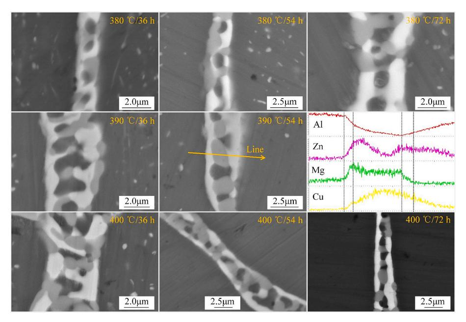

**Fig. 11.** The microstructures resulting of different homogenization temperatures and holding times.

*Materials & Design 235 (2023) 112395 R. Huang et al.* 

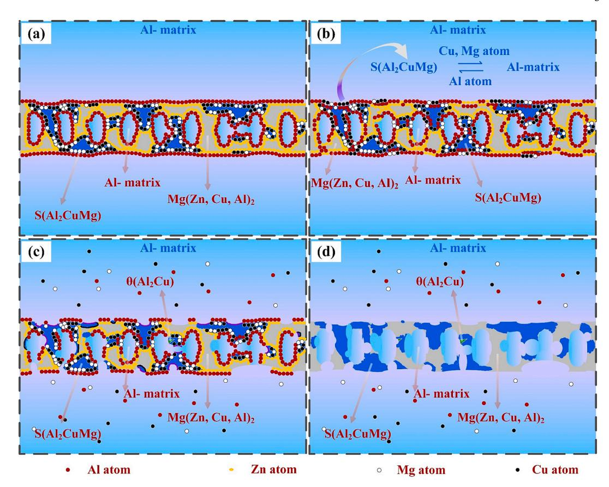

**Fig. 12.** The schematic diagram of the direct dissolution of the S(Al2CuMg) phase into the Al- matrix during homogenization.

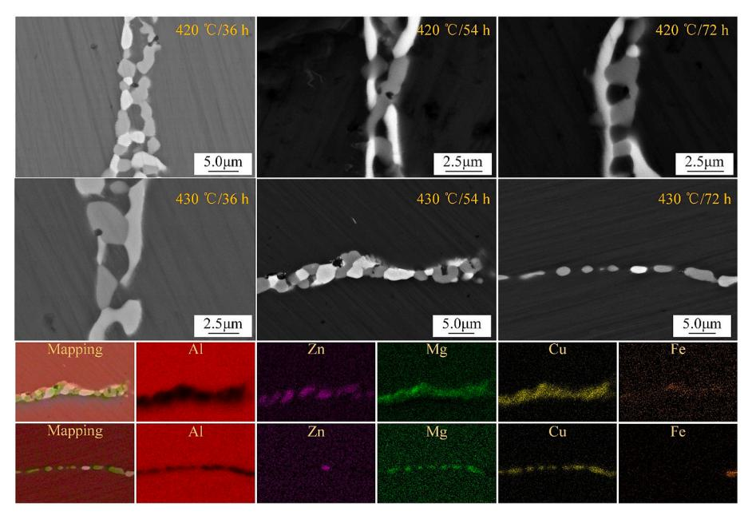

**Fig. 13.** The microstructures resulting of different homogenization temperatures and holding times.

#### **Acknowledgments**

This work was financially supported by the Key Research Development Program of Yunnan Province (Grant numbers 202103AA080017 and CBN21281004A), Yunnan Ten Thousand Talents Plan Young & Elite Talents Project (Grant number YNWR-QNBJ-2020-020), the Innovation Team Cultivation Project of Yunnan Province (Grant number 202005AE160016), the Yunnan Fundamental Research Projects (Grant No. 202101AU070152), and Chuoli Chengcai Training Program of KUST Faculty of Materials Science and Engineering (CLXYCLCC20230701).

#### **References**

- [1] D.L. Yuan, S.Y. Chen, K.H. Chen, L.P. Huang, J.Y. Chang, L. Zhou, Y.F. Ding, Correlations among stress corrosion cracking, grain-boundary microchemistry, and Zn content in high Zn-containing Al-Zn-Mg-Cu alloys, Trans. Nonferr. Met. Soc. China 31 (2021) 2220–2231, [https://doi.org/10.1016/S1003-6326\(21\)65650-9](https://doi.org/10.1016/S1003-6326(21)65650-9).
- [2] B. Zhou, B. Liu, S.G. Zhang, The Advancement of 7XXX Series Aluminum Alloys for Aircraft Structures: A Review, Metals 11 (2021) 718, [https://doi.org/10.3390/](https://doi.org/10.3390/met11050718)  [met11050718](https://doi.org/10.3390/met11050718).
- [3] T. Subroto, D.G. Eskin, A. Miroux, K. Ellingsen, M. M'Hamdi, L. Katgerman, Semisolid constitutive parameters and failure behavior of a cast AA7050 alloy, Metall. Mater. Trans. A 52 (2021) 871–888, [https://doi.org/10.1007/s11661-020-06112-](https://doi.org/10.1007/s11661-020-06112-5)  [5.](https://doi.org/10.1007/s11661-020-06112-5)
- [4] K.Z. He, Z.M. Tan, X. Zheng, X.M. Zhang, K.C. Zhou, Microstructure and mechanical properties of DC cast 7065 aluminum alloy, J. Phys.: Conf. Ser. 1906 (2021) 012051, 10.1088/1742-6596/1906/1/012051.
- [5] H.J. Wang, J. Xu, Y.L. Kang, M.O. Tang, Z.F. Zhang, Study on inhomogeneous characteristics and optimize homogenization treatment parameter for large size DC ingots of Al-Zn-Mg-Cu alloys, J. Alloy. Compd. 585 (2014) 19–24, [https://doi.org/](https://doi.org/10.1016/j.jallcom.2013.09.139)  [10.1016/j.jallcom.2013.09.139](https://doi.org/10.1016/j.jallcom.2013.09.139).
- [6] A. Ghosh, M. Ghosh, G. Shankar, On the role of precipitates in controlling microstructure and mechanical properties of Ag and Sn added 7075 alloys during artificial ageing, Mater. Sci. Eng. A 738 (2018) 399–411, [https://doi.org/10.1016/](https://doi.org/10.1016/j.msea.2018.09.109)  [j.msea.2018.09.109.](https://doi.org/10.1016/j.msea.2018.09.109)
- [7] Y.L. Zhang, H.F. Yang, P. Sun, R.S. Huang, S.J. Zheng, Y.H. Duan, M.N. Li, Effect of aging time on precipitation of MgZn2 and microstructure and properties of 7075 aluminum alloy, J. Mater. Eng. Perform. (2023), [https://doi.org/10.1007/s11665-](https://doi.org/10.1007/s11665-023-08426-y)  [023-08426-y](https://doi.org/10.1007/s11665-023-08426-y).
- [8] R. Ghiaasiaan, X.C. Zeng, S. Shankar, Controlled diffusion solidification (CDS) of Al-Zn-Mg-Cu (7050): microstructure, heat treatment and mechanical properties, Mater. Sci. Eng. A 594 (2014) 260–277, [https://doi.org/10.1016/j.](https://doi.org/10.1016/j.msea.2013.11.087)  [msea.2013.11.087.](https://doi.org/10.1016/j.msea.2013.11.087)
- [9] W.X. Shu, L.G. Hou, J.C. Liu, C. Zhang, F. Zhang, J.T. Liu, L.Z. Zhuang, J.S. Zhang, Solidification paths and phase components at high temperatures of high-Zn Al-Zn-Mg-Cu alloys with different Mg and Cu contents, Metall. Mater. Trans. A 46 (2015) 5375–5392, [https://doi.org/10.1007/s11661-015-3050-x.](https://doi.org/10.1007/s11661-015-3050-x)
- [10] H.F. Yang, R.S. Huang, Y.L. Zhang, S.J. Zheng, M.N. Li, S. Koppala, P. Kemacheevakul, J. Sannapaneni, Effect of rolling deformation and passes on microstructure and mechanical properties of 7075 aluminum alloy, Ceram. Int. 49 (2023) 1165–1177,<https://doi.org/10.1016/j.ceramint.2022.09.093>.
- [11] P. Sun, H.F. Yang, R.S. Huang, Y.L. Zhang, S.J. Zheng, M.N. Li, S. Koppala, The effect of rolling temperature on the microstructure and properties of multi pass rolled 7A04 aluminum alloy, J. Mater. Res. Technol. 25 (2023) 3200–3211, <https://doi.org/10.1016/j.jmrt.2023.06.123>.
- [12] P.X. Dong, S.Y. Chen, K.H. Chen, Effects of Cu content on microstructure and properties of super-high-strength Al-9.3Zn-2.4Mg-xCu-Zr alloy, J. Alloys Compd. 788 (2019) 329 - 337, 10.1016/j.jallcom.2019.02.228.
- [13] F.X. Song, X.M. Zhang, S.D. Liu, N.M. Han, D.F. Li, Anisotropy of localized corrosion in 7050–T7451 Al alloy thick plate, Trans. Nonferr. Met. Soc. China 23 (2013) 2483–2490, [https://doi.org/10.1016/S1003-6326\(13\)62758-2.](https://doi.org/10.1016/S1003-6326(13)62758-2)
- [14] W.R. Hou, W.B. Ji, Z.H. Zhang, J.X. Xie, X.L. Cheng, The effect of homogenization temperature on the corrosion resistance of extruded 7050 Al-alloy bars, J. Mater. Process. Technol. 214 (2014) 635–640, [https://doi.org/10.1016/j.](https://doi.org/10.1016/j.jmatprotec.2013.11.009)  [jmatprotec.2013.11.009](https://doi.org/10.1016/j.jmatprotec.2013.11.009).
- [15] L. Jiang, Z.H. Zhang, H.D. Fu, S.Y. Huang, D.W. Zhuang, J.X. Xie, Corrosion behavior and mechanism of Al-Zn-Mg-Cu alloy based on the characterization of the secondary phases, Mater Charact 189 (2022), 111974, [https://doi.org/10.1016/j.](https://doi.org/10.1016/j.matchar.2022.111974)  [matchar.2022.111974.](https://doi.org/10.1016/j.matchar.2022.111974)
- [16] D.K. Xu, N. Birbilis, D. Lashansky, P.A. Rometsch, B.C. Muddle, Effect of solution treatment on the corrosion behaviour of aluminium alloy AA7150: Optimisation for corrosion resistance, Corrosion Sci. 53 (2011) 217–225, [https://doi.org/](https://doi.org/10.1016/j.corsci.2010.09.015)  [10.1016/j.corsci.2010.09.015](https://doi.org/10.1016/j.corsci.2010.09.015).
- [17] H. She, D. Shu, W. Chu, J. Wang, Baode Sun, Microstructural aspects of second phases in as-cast and homogenized 7055 aluminum alloy with different impurity contents, Metall. Mater. Trans. A 44A (2013) 3504–3510, [https://doi.org/](https://doi.org/10.1007/s11661-013-1709-8) [10.1007/s11661-013-1709-8.](https://doi.org/10.1007/s11661-013-1709-8)
- [18] D. Ma, C.J. Xu, C. Guo, X.Q. Wu, J. Tian, Z.M. Zhang, S. Remennik, D. Shechtman, The evolution of Al2CuMg phase during two-stage homogenisation for 7055 aluminium alloy, Mater. Sci. Technol. 39 (2023) 1187–1198, [https://doi.org/](https://doi.org/10.1080/02670836.2022.2163743)  [10.1080/02670836.2022.2163743](https://doi.org/10.1080/02670836.2022.2163743).
- [19] Y.X. Dai, L.M. Yan, J.P. Hao, Microstructure and intermetallic phase evolution during the homogenization of an Al-Zn-Mg-Cu-Zr-Nd aluminum alloy, Adv. Eng. Mater. 25 (2023) 2201288, [https://doi.org/10.1002/adem.202201288.](https://doi.org/10.1002/adem.202201288)
- [20] X.G. Fan, D.M. Jiang, Q.C. Meng, L. Zhong, The microstructural evolution of an Al-Zn-Mg-Cu alloy during homogenization, Mater. Lett. 60 (2006) 1475–1479, <https://doi.org/10.1016/j.matlet.2005.11.049>.
- [21] X.X. Yu, J. Sun, Z.T. Li, H. Dai, H.J. Fang, J.F. Zhao, D.F. Yin, Solidification behavior and elimination of undissolved Al2CuMg phase during homogenization in Ce-modified Al-Zn-Mg-Cu alloy, Rare Met. 39 (2020) 9, [https://doi.org/10.1007/](https://doi.org/10.1007/s12598-018-1172-1) [s12598-018-1172-1](https://doi.org/10.1007/s12598-018-1172-1).
- [22] X.Y. Lv, E.J. Guo, Z.H. Li, G.J. Wang, Research on microstructure in as-cast 7A55 aluminum alloy and its evolution during homogenization, Rare Met. 30 (2011) 664–668, [https://doi.org/10.1007/s12598-011-0446-7.](https://doi.org/10.1007/s12598-011-0446-7)

- [23] N.K. Li, J.Z. Cui, Microstructural evolution of high strength 7B04 ingot during homogenization treatment, Trans. Nonferr. Met. Soc. China 18 (2008) 769–773, [https://doi.org/10.1016/S1003-6326\(08\)60132-6.](https://doi.org/10.1016/S1003-6326(08)60132-6)
- [24] J.T. Liu, Y.A. Zhang, X.W. Li, Z.H. Li, B.Q. Xiong, J.S. Zhang, Phases and microstructures of high Zn-containing Al-Zn-Mg-Cu alloys, Rare Met. 35 (2016) 380–384, [https://doi.org/10.1007/s12598-014-0222-6.](https://doi.org/10.1007/s12598-014-0222-6)
- [25] Y. Liu, D.M. Jiang, W.L. Xie, J. Hu, Boran Ma, Solidification phases and their evolution during homogenization of a DC cast Al-8.35Zn-2.5Mg-2.25Cu alloy, Mater. Charact. 93 (2014) 173 - 183, 10.1016/j.matchar.2014.04.004.
- [26] R.S. Huang, H.F. Yang, L. Wan, S.J. Zheng, M.N. Li, Sivasankar Koppala, Effect of homogenization process on microstructure of Al-Zn-Mg-Cu aluminum alloys, Adv. Eng. Mater. 2201854 (2023) 1–15, [https://doi.org/10.1002/adem.202201854.](https://doi.org/10.1002/adem.202201854)
- [27] C. Mondal, A.K. Mukhopadhyay, On the nature of T(Al2Mg3Zn3) and S(Al2CuMg) phases present in as-cast and annealed 7055 aluminum alloy, Mater. Sci. Eng. A 391 (2005) 367–376, <https://doi.org/10.1016/j.msea.2004.09.013>.
- [28] L. Chen, S.W. Yuan, Z.G. Li, W. Zheng, G.Q. Zhao, C.S. Zhang, Influence of homogenization treatment on microstructure and mechanical properties of Al-Zn-Mg alloy extruded by porthole die, Mater Charact 161 (2020), 110148, [https://doi.](https://doi.org/10.1016/j.matchar.2020.110148)  [org/10.1016/j.matchar.2020.110148](https://doi.org/10.1016/j.matchar.2020.110148).
- [29] P.F. Jia, Y.H. Cao, Y.D. Geng, L.Z. Hen, N. Xiao, J.Z. Cui, Studies on the microstructures and properties in phase transformation of homogenized 7050 alloy, Mater. Sci. Eng. A 612 (2014) 335–342, [https://doi.org/10.1016/j.](https://doi.org/10.1016/j.msea.2014.06.027)  [msea.2014.06.027](https://doi.org/10.1016/j.msea.2014.06.027).
- [30] G.Y. Yang, H.S. Meng, S.J. Liu, Y.H. Qi, W.Q. Jie, Microstructures and room temperature mechanical properties of Al-6.3Zn-2.8Mg-1.8Cu casting aluminum alloy, Acta Metall. Sin. 48 (2013) 211 - 219, 10.3724/SP.J.1037.2011.00579.
- [31] L.Z. He, X.H. Li, J.Z. Cui, Effect of high magnetic field on phase transformation of 7055 alloy during homogenization, Adv. Mater. Res. 189–193 (2011) 4472–4476, <https://doi.org/10.4028/www.scientific.net/AMR.189-193.4472>.
- [32] Y. Deng, Z.M. Yin, F.G. Cong, Intermetallic phase evolution of 7050 aluminum alloy during homogenization, Intermetallics 26 (2012) 114–121, [https://doi.org/](https://doi.org/10.1016/j.intermet.2012.03.006)  [10.1016/j.intermet.2012.03.006.](https://doi.org/10.1016/j.intermet.2012.03.006)
- [33] J.D. Robson, Microstructural evolution in aluminium alloy 7050 during processing, Mater. Sci. Eng. A 382 (2004) 112–121, [https://doi.org/10.1016/j.](https://doi.org/10.1016/j.msea.2004.05.006) [msea.2004.05.006](https://doi.org/10.1016/j.msea.2004.05.006).
- [34] A. Ghosh, M. Ghosh, R. Kalsar, Influence of homogenisation time on evolution of eutectic phases, dispersoid behaviour and crystallographic texture for Al-Zn-Mg-Cu-Ag alloy, J. Alloys Compound. 802 (2019) 276–289, [https://doi.org/10.1016/j.](https://doi.org/10.1016/j.jallcom.2019.06.091)  [jallcom.2019.06.091.](https://doi.org/10.1016/j.jallcom.2019.06.091)
- [35] A. Ghosh, M. Ghosh, A.H. Seikh, N.H. Alharthi, Phase transformation and dispersoid evolution for Al-Zn-Mg-Cu alloy containing Sn during homogenization, J. Mater. Res. Technol. 9 (1) (2020) 1–12, [https://doi.org/10.1016/j.](https://doi.org/10.1016/j.jmrt.2019.08.055)  [jmrt.2019.08.055.](https://doi.org/10.1016/j.jmrt.2019.08.055)
- [36] D. Xu, Z.H. Li, G.J. Wang, X.W. Li, X.Y. Lv, Y.A. Zhang, Y.Q. Fan, B.Q. Xiong, Phase transformation and microstructure evolution of an ultra-high strength Al-Zn-Mg-Cu alloy during homogenization, Mater Charact 131 (2017) 285–297, [https://doi.org/](https://doi.org/10.1016/j.matchar.2017.07.011)  [10.1016/j.matchar.2017.07.011](https://doi.org/10.1016/j.matchar.2017.07.011).
- [37] P.F. Jia, Y.H. Cao, Y.D. Geng, L.Z. He, N. Xiao, J.Z. Cui, Effects of d.c. current on the phase transformation in 7050 alloy during homogenization, Mater Charact 96 (2014) 21–27, <https://doi.org/10.1016/j.matchar.2014.07.017>.
- [38] Y.L. Deng, L. Wan, L.H. Wu, Y.Y. Zhang, X.M. Zhang, Microstructural evolution of Al-Zn-Mg-Cu alloy during homogenization, J. Mater. Sci. 46 (2011) 875–881, <https://doi.org/10.1007/s10853-010-4828-2>.
- [39] A. Ghosh, M. Ghosh, Microstructure and texture development of 7075 alloy during homogenization, Phil. Mag. 98 (2018) 1470–1490, [https://doi.org/10.1080/](https://doi.org/10.1080/14786435.2018.1439596)  [14786435.2018.1439596.](https://doi.org/10.1080/14786435.2018.1439596)
- [40] R.S. Huang, M.N. Li, H.F. Yang, S.M. Lu, H.N. Zuo, S.J. Zheng, Y.H. Duan, X. H. Yuan, Effects of Mg contents on microstructures and second phases of as-cast Al-Zn-Mg-Cu alloys, J. Mater. Res. Technol. 21 (2022) 2105–2117, [https://doi.org/](https://doi.org/10.1016/j.jmrt.2022.10.050)  [10.1016/j.jmrt.2022.10.050.](https://doi.org/10.1016/j.jmrt.2022.10.050)
- [41] F.H. Gao, G. Zhao, W.M. Bian, N. Tian, TEM in-situ investigation on nonequilibrium eutectics in semicontinuous casting ingot of Al-6.2Zn-2.3Mg-2.3Cu super-high strength aluminum alloy, Mater. Sci. Forum 638 - 642 (2010) 384 - 389, 10.4028/www.scientific.net/MSF.638-642.384.
- [42] T. Marlaud, A. Deschamps, F. Bley, W. Lefebvre, B. Baroux, Influence of alloy composition and heat treatment on precipitate composition in Al-Zn-Mg-Cu alloys, Acta Mater. 58 (2010) 248–260, <https://doi.org/10.1016/j.actamat.2009.09.003>.
- [43] Z.P. Wang, J.W. Geng, P.K. Xia, Y.G. Li, W. Chen, X.F. Li, M.L. Wang, D. Chen, H. W. Wang, Phase transformation from η phase to S phase at grain boundary during annealing in rapidly-solidified Al-Zn-Mg-Cu alloy, Mater Charact 195 (2023), 112531, [https://doi.org/10.1016/j.matchar.2022.112531.](https://doi.org/10.1016/j.matchar.2022.112531)
- [44] P. Priya, D.R. Johnson, M.J.M. Krane, Modeling phase transformation kinetics during homogenization of aluminum alloy 7050, Computational, Mater. Sci. 138 (2017) 277–287, <https://doi.org/10.1016/j.commatsci.2017.06.043>.
- [45] F.L. Zhai, L.P. Wang, X. Gao, Y.C. Feng, S.C. Zhao, L. Wang, Phase evolution of a novel Al-Zn-Mg-Cu-Zr-Sm alloy during homogenization annealing treatment, Mater. Res. Express 7 (2020), 076518, [https://doi.org/10.1088/2053-1591/](https://doi.org/10.1088/2053-1591/aba6bf)  [aba6bf](https://doi.org/10.1088/2053-1591/aba6bf).
- [46] L.Z. He, X.H. Li, P. Zhu, Y.H. Cao, Y.P. Guo, J.Z. Cui, Effects of high magnetic field on the evolutions of constituent phases in 7085 aluminum alloy during homogenization, Mater Charact 71 (2012) 19–23, [https://doi.org/10.1016/j.](https://doi.org/10.1016/j.matchar.2012.05.014)  [matchar.2012.05.014](https://doi.org/10.1016/j.matchar.2012.05.014).